# Mapa da Stack Tecnológica de IA Local (2026)

> Documento parte da Etapa 2/5 da proposta. Mapeia (sem recomendar) as camadas tecnológicas atuais para deploy on-premises / nuvem privada de LLMs em empresa com dados sensíveis. Maio/2026.

## Visão geral em 8 camadas

```
+------------------------------------------------------------------+
| 8. Aplicação / Frontend                                          |
|    Open WebUI, LibreChat, AnythingLLM, Big-AGI, Continue.dev,    |
|    Tabby, Cline, Roo, BionicGPT, agentes próprios                |
+------------------------------------------------------------------+
| 7. Frameworks de Aplicação                                       |
|    LangChain/LangGraph, LlamaIndex, Haystack, DSPy,              |
|    Semantic Kernel, Spring AI                                    |
+------------------------------------------------------------------+
| 6. Guardrails / Segurança                | 5. Observabilidade /  |
|    Llama Guard 3, NeMo Guardrails,       |    FinOps             |
|    Guardrails AI, Microsoft Presidio,    |    Langfuse,          |
|    Lakera/ProtectAI                      |    Phoenix Arize,     |
|                                          |    LangSmith,         |
|                                          |    OTel GenAI         |
+------------------------------------------------------------------+
| 4. Gateway LLM (multi-provider, quotas, semantic cache)          |
|    LiteLLM, Portkey, Kong AI Gateway, Envoy AI Gateway           |
+------------------------------------------------------------------+
| 3. RAG / Recuperação                                             |
|    Vector stores: Qdrant, Milvus, Weaviate, pgvector,            |
|                   Elastic/OpenSearch, Chroma                     |
|    Embedding: BGE-M3, Qwen3-Embedding, Granite-Embedding,        |
|               Nomic-v2, E5                                       |
|    Reranker:  BGE-reranker, Qwen3-Reranker                       |
+------------------------------------------------------------------+
| 2. Orquestração / Plataforma                                     |
|    Kubernetes + KServe + GPU Operator                            |
|    Ray Serve / KubeRay                                           |
|    OpenShift AI / RHEL AI / llm-d                                |
|    NVIDIA NIM / Triton Inference Server                          |
+------------------------------------------------------------------+
| 1. Runtime de Inferência (model server)                          |
|    vLLM, SGLang, TensorRT-LLM, TGI, llama.cpp, Ollama,           |
|    LMDeploy, llamafile, MLC-LLM                                  |
+------------------------------------------------------------------+
| 0. Hardware / Aceleradores                                       |
|    NVIDIA H100/H200/B100/B200, A100, L40S; AMD MI300X/MI325X;    |
|    Intel Gaudi 3; CPU/Apple Silicon (POC/edge)                   |
+------------------------------------------------------------------+
```

## Diagrama mermaid (fluxo de uma requisição corporativa)

```mermaid
flowchart LR
    U[Usuário interno] --> FE[Frontend: Open WebUI / LibreChat / IDE]
    FE --> GW[Gateway LLM: LiteLLM/Portkey<br/>quotas, RBAC, semantic cache]
    GW --> GR1[Guardrails IN: Llama Guard 3 / Presidio / Prompt Guard]
    GR1 --> APP[Framework de App: LangGraph / LlamaIndex]
    APP --> EMB[Embedding API: BGE-M3 / Granite-Emb]
    EMB --> VS[(Vector Store + ACL<br/>Qdrant / Milvus / pgvector)]
    VS --> RR[Reranker: BGE / Qwen3-Reranker]
    RR --> LLM[Runtime: vLLM / SGLang]
    LLM --> GR2[Guardrails OUT: Llama Guard / Presidio]
    GR2 --> OBS[Observabilidade: Langfuse / OTel GenAI]
    OBS --> FE
```



## Tabela-resumo: tecnologias por camada

| Camada | Open source de produção | Comercial / suportado | Notas para empresa sensível |
|--------|-------------------------|------------------------|------------------------------|
| Runtime | vLLM, SGLang, TGI, llama.cpp | TensorRT-LLM, NIM, Red Hat AI Inference Server | vLLM virou padrão (1,7×–3,2× sobre Ollama). SGLang vence em RAG/multi-turn por RadixAttention. |
| Orquestração | KServe, KubeRay, llm-d | OpenShift AI, NVIDIA AI Enterprise | OpenShift AI consolida vLLM + KServe + InstructLab. llm-d é o caminho oficial multi-nó da vLLM. |
| Gateway | LiteLLM, Envoy AI Gateway | Portkey, Kong AI Gateway | LiteLLM domina self-host por simplicidade. Kong vence throughput (~8k RPS) onde já existe Kong. |
| RAG store | Qdrant, Milvus, Weaviate, pgvector, OpenSearch | Zilliz, Elastic Enterprise | pgvector OK até ~10–100M vetores. Qdrant líder em hybrid search self-hosted. |
| Embeddings | BGE-M3, Qwen3-Embedding (Apache 2.0), Granite-Embedding (Apache 2.0), Nomic-v2 | NV-Embed (NIM), Cohere (API) | Granite-Embedding é o único Apache 2.0 com ISO/IEC 42001. |
| Reranker | BGE-reranker, Qwen3-Reranker | Cohere Rerank (API) | Qwen3-Reranker 8B é estado-da-arte open source em 2026. |
| Modelos chat | Llama 3.3/4, Qwen 3, DeepSeek V3/R1, Mistral Large 2, Granite 4, Gemma 3/4, Phi 4 | Watsonx FMs, Cohere Command, NeMo customs | Granite 4 e Gemma/Phi/Qwen são Apache 2.0. Llama exige check de 700M MAU. |
| Modelos código | Qwen2.5/3-Coder, DeepSeek-Coder V2, Granite-Code, StarCoder 2 | Codestral 25.08 (MNPL) | Codestral é proibido para uso comercial sem licença paga. |
| Frameworks app | LangChain/LangGraph, LlamaIndex, Haystack, DSPy | Semantic Kernel (MS), Spring AI (Pivotal/VMware) | Padrão emergente: LlamaIndex (RAG) + LangGraph (agentes) + DSPy (prompt programáticos). |
| Frontends chat | Open WebUI, LibreChat, AnythingLLM, Big-AGI | BionicGPT, Cohere North, JPMorgan-style custom | Open WebUI tem SSO/OIDC; LibreChat tem LDAP/SSO; AnythingLLM tem RAG por workspace. |
| Frontends IDE | Continue.dev, Tabby, Cline, Roo, OpenHands, Aider | GitHub Copilot Enterprise (cloud), JetBrains AI | Tabby é o mais "appliance" para autocomplete; Continue para chat IDE; Cline/Roo para agentes. |
| Guardrails | Llama Guard 3, NeMo Guardrails, Guardrails AI, Presidio | Lakera Guard, Protect AI, Robust Intelligence | OWASP Top 10 LLM 2025 é a baseline. Defesa em profundidade: input + output + retrieval rails. |
| Observability | Langfuse, Phoenix Arize, OTel GenAI | LangSmith, Datadog LLM, Arize AX | Helicone em maintenance (mar/2026). OTel GenAI ainda experimental. Langfuse é a referência self-host. |
| Fine-tuning | LoRA/QLoRA, Axolotl, Unsloth, PEFT, TRL, InstructLab | Red Hat Training Hub, NVIDIA NeMo Customizer, watsonx Tuning Studio | InstructLab + Granite é o caminho "ISO 42001 friendly". |

## Como ler este diretório

| Arquivo | Conteúdo |
|--------|----------|
| `01-runtimes-inferencia.md` | vLLM, SGLang, TGI, TensorRT-LLM, llama.cpp, Ollama, LMDeploy, llamafile, MLC, Ray Serve, KServe |
| `02-modelos-abertos.md` | Famílias Llama, Qwen, DeepSeek, Mistral, Granite, Phi, Gemma + embeddings + rerankers + multimodal |
| `03-frameworks-aplicacao.md` | LangChain/LangGraph, LlamaIndex, Haystack, DSPy, Semantic Kernel, Spring AI |
| `04-frontends-chat.md` | Open WebUI, LibreChat, AnythingLLM, Big-AGI, Continue.dev, Tabby, Cline, Roo |
| `05-rag-vector-stores.md` | Qdrant, Milvus, Weaviate, pgvector, OpenSearch/Elastic, Chroma + tabela comparativa |
| `06-plataformas-enterprise.md` | OpenShift AI / RHEL AI / InstructLab, NVIDIA NIM/NeMo/Triton, watsonx.ai, Databricks, Anyscale |
| `07-guardrails-seguranca.md` | Llama Guard 3, NeMo Guardrails, Guardrails AI, Presidio, Lakera, OWASP LLM 2025 mapping |
| `08-observabilidade-finops.md` | Langfuse, Phoenix Arize, LangSmith, Helicone, OTel GenAI, Ragas, DeepEval, Promptfoo |
| `09-gateways-llm.md` | LiteLLM, Portkey, Kong AI Gateway, Envoy AI Gateway |
| `10-finetuning-adaptacao.md` | LoRA/QLoRA, Axolotl, Unsloth, PEFT/TRL, InstructLab, DPO/ORPO/GRPO |
| `11-licencas-modelos.md` | Tabela master de licenças e armadilhas (Llama 700M MAU, Codestral MNPL, etc.) |

## Princípios atravessadores observados na pesquisa

1. **vLLM é o pivô**: virou substrato comum a Red Hat (AI Inference Server), NVIDIA NIM (homologa vLLM), Anyscale (Ray Serve LLM com vLLM), llm-d (multi-nó). Divergência principal: **SGLang** ganha onde há prefix sharing pesado (RAG, multi-turn).
2. **Apache 2.0 voltou**: Qwen 3, Granite 4, Gemma 3/4, Phi 4, DeepSeek (MIT) são Apache/MIT — Llama (Community License) e Mistral Large/Codestral (MNPL) ficam para trás em compliance corporativo.
3. **Granite 4 + ISO/IEC 42001** é o único pacote "open + certificação formal" — relevante para áreas reguladas que precisam justificar governança ao auditor.
4. **OWASP LLM 2025** consagrou "Vector & Embedding Weaknesses" (LLM08): retrieval com ACL deixou de ser opcional.
5. **OTel GenAI ainda é experimental** (mar/2026) mas todos os principais (Langfuse, Arize, Datadog) estão alinhados com a spec — investir aí evita lock-in.
6. **InstructLab** é o caminho menos arriscado para customização sem RLHF/DPO complexo, especialmente em jornada Granite + Red Hat.

## Lacunas que ficam para Etapas 3 e 4

- Etapa 3 (exemplos reais): casos públicos JPMorgan, Bloomberg, Bayer, Walmart, Bosch — quem usa o quê de fato.
- Etapa 4 (infra): dimensionamento real de GPU por carga (tokens/dia, latência, concorrência), TCO incluindo redundância e energia, opções AMD/Intel além de NVIDIA, network fabric (InfiniBand/Spectrum-X/Ethernet).

## Fontes consultadas (consolidadas)

- vLLM releases: <https://github.com/vllm-project/vllm/releases>
- vLLM blog (V1 engine): <https://blog.vllm.ai/>
- SGLang vs vLLM: <https://particula.tech/blog/sglang-vs-vllm-inference-engine-comparison>
- llm-d (vLLM multi-node): <https://llm-d.ai/blog/production-grade-llm-inference-at-scale-kserve-llm-d-vllm>
- Red Hat AI Inference Server: <https://developers.redhat.com/products/red-hat-ai/inference-server>
- NVIDIA NIM: <https://www.nvidia.com/en-us/ai-data-science/products/nim-microservices/>
- IBM Granite 4: <https://www.ibm.com/new/announcements/ibm-granite-4-0-hyper-efficient-high-performance-hybrid-models>
- Granite 4 ISO 42001: <https://digital.nemko.com/news/ibm-granite-40-first-iso-42001-certified-open-source-ai>
- BentoML overview: <https://www.bentoml.com/blog/navigating-the-world-of-open-source-large-language-models>
- OWASP GenAI: <https://genai.owasp.org/>
- OTel GenAI conventions: <https://opentelemetry.io/docs/specs/semconv/gen-ai/>
