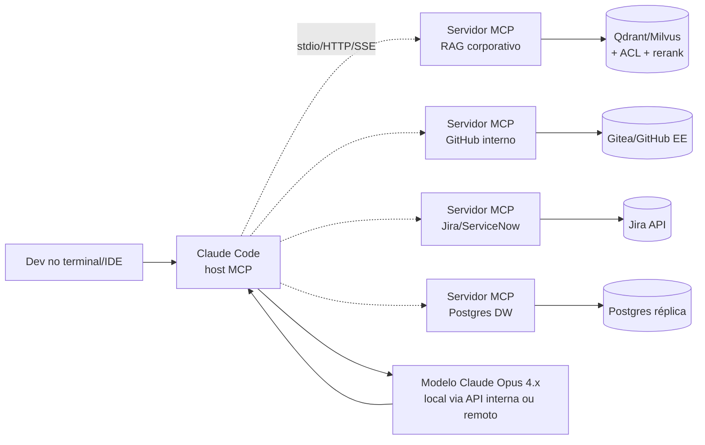

# MCP — Fundamentos e arquitetura para uso corporativo

> Mapa do Model Context Protocol (MCP) com foco em deploys empresariais e na integração com Claude Code. Não substitui a especificação oficial; sintetiza as decisões que importam para o desenho interno.

## O que é MCP

Model Context Protocol é um **protocolo aberto** publicado por Anthropic em 2024 e amplamente adotado em 2025–2026 por Anthropic, OpenAI, Google, Microsoft e os principais frameworks de agentes. Padroniza como um **cliente de IA (host)** descobre e invoca **capacidades** (tools, resources, prompts) expostas por **servidores** externos.

Analogia útil: MCP está para agentes de IA assim como **LSP** (Language Server Protocol) está para IDEs. Um servidor MCP é escrito uma vez e usado por qualquer cliente compatível (Claude Code, Claude Desktop, Cursor, Continue, Cline, agentes próprios via SDK).

### Três primitivas

| Primitiva | O que é | Exemplo no contexto corporativo |
|-----------|---------|----------------------------------|
| **Tool** | Função invocável pelo modelo. Tem schema JSON e retorna resultado. | `rag.search(query, top_k=10)` retorna chunks com citação |
| **Resource** | Conteúdo legível identificado por URI (lazy, sob demanda). | `kb://policies/seguranca-da-informacao.md` |
| **Prompt** | Template parametrizável que o cliente pode oferecer ao usuário. | `/runbook-incidente sev=2 sistema=billing` |

Tools dominam o uso prático (95%+ dos servidores expõem só tools). Resources são úteis quando o cliente quer "anexar" documentos. Prompts ainda têm adoção tímida.

## Arquitetura e fluxo



O modelo (Claude) decide **quando** chamar uma tool e **com quais argumentos**, com base na descrição da tool. O host (Claude Code) executa a chamada, recebe o resultado, devolve ao modelo. O modelo então gera a resposta final, podendo encadear novas chamadas.

## Transportes

Dois transportes oficiais relevantes em 2026:

| Transporte | Quando usar | Trade-offs |
|------------|-------------|------------|
| **stdio** (subprocess local) | Servidor roda na mesma máquina que o cliente. Default para devs locais. | Mais simples; sem auth (confia no SO); não compartilhável entre máquinas. |
| **HTTP / Streamable HTTP** (sucessor do SSE) | Servidor remoto, compartilhado entre vários usuários/máquinas. | Exige OAuth 2.1 (spec jun/2025); permite escalar horizontalmente; é o caminho enterprise. |

A spec de 2025 marcou SSE puro como deprecated em favor de **Streamable HTTP**, que tolera reconexão e proxy reverso melhor. Servidores empresariais devem oferecer HTTP.

## Escopos de configuração no Claude Code

Claude Code armazena configuração MCP em três níveis (importante para governança):

| Escopo | Onde | Para que serve | Quem controla |
|--------|------|-----------------|---------------|
| **local** | `~/.claude.json` (sob o path do projeto) | Servidores privados ao dev | Dev individual |
| **project** | `.mcp.json` na raiz do repo | Compartilhado pelo time, versionado em git | Tech Lead do repo |
| **user** | `~/.claude.json` (global) | Servidores estáveis entre projetos (GitHub, Slack, RAG corporativo) | Dev / política interna |

Recomendação corporativa: **servidores de plataforma (RAG, observabilidade, secrets) em escopo user via política**; **servidores específicos ao repo em escopo project** versionados; deixar escopo local apenas para experimentação.

Comandos essenciais:

```bash
# Adicionar (stdio, escopo user)
claude mcp add --scope user rag-corporativo -- /opt/mcp/rag-server --config /etc/rag.toml

# Adicionar (HTTP remoto)
claude mcp add --transport http --scope user rag-corp https://mcp.empresa.local/rag

# Listar servidores registrados e ver qual está conectado
claude mcp list

# Testar um servidor sem subir o agente completo
claude mcp test rag-corporativo
```

## SDKs e bibliotecas

| Linguagem | SDK oficial / dominante | Estado 2026 |
|-----------|--------------------------|--------------|
| Python | `fastmcp` (open source, adotado pelo MCP) + `mcp` (SDK ref) | Padrão de facto; menor boilerplate |
| TypeScript / Node | `@modelcontextprotocol/sdk` | Maduro; recomendado para servers que já vivem em stack Node |
| Go | `mcp-go` (comunidade) | Bom para binários standalone air-gapped |
| Rust | `rmcp` (oficial) | Usado em servidores high-throughput (Qdrant publica via Rust) |
| Java/Kotlin | `mcp-java` | Útil para integração com stack Spring AI existente |

**Recomendação default**: `fastmcp` em Python para iteração rápida; TypeScript se o consumidor primário é VS Code/extensão. Detalhado em [`05-construir-mcp-interno.md`](./05-construir-mcp-interno.md).

## Inspector e debugging

Anthropic mantém o **MCP Inspector** — UI de inspeção que conecta a um servidor (stdio ou HTTP), lista as tools/resources, permite chamar manualmente com payloads de teste. Equivalente a um Postman para MCP.

```bash
npx @modelcontextprotocol/inspector /opt/mcp/rag-server
```

Uso recomendado: rodar Inspector em CI para validar contrato das tools antes do merge; é mais rápido que escrever testes e-2-e via cliente real.

## Diferenças importantes vs. function calling tradicional

| Tema | Function calling clássico (OpenAI/Anthropic tools API) | MCP |
|------|---------------------------------------------------------|-----|
| Onde vive a tool | Dentro do código da app que faz a chamada de modelo | Em servidor externo, possivelmente noutra linguagem/processo |
| Quem descreve o schema | App envia tool definition em cada request | Servidor declara; cliente descobre via `tools/list` |
| Reuso entre clientes | Não (cada app reimplementa) | Sim (escreve uma vez, plugga em N hosts) |
| Auth de servidor | App é responsável | OAuth 2.1 padronizado (HTTP) |
| Discovery dinâmica | Difícil | Nativa (servidores podem listar/atualizar tools em runtime) |

MCP **não substitui** function calling do modelo — ele **organiza** a definição/execução das tools.

## Riscos do protocolo a conhecer

1. **Prompt injection via descrição de tool**: o nome/descrição da tool entra no contexto do modelo. Um servidor malicioso (ou comprometido) pode injetar instruções. **Mitigação**: aprovar servidores em allowlist, code review da descrição, sandbox de servidores não confiáveis. Detalhado em [`06-seguranca-governanca.md`](./06-seguranca-governanca.md).
2. **Token de OAuth com escopo amplo**: spec permite, mas o cliente pode pedir muito. **Mitigação**: políticas least-privilege; expiração curta; revogação centralizada.
3. **Latência cumulativa**: uma tarefa do agente pode encadear 5–15 chamadas MCP. Servidores lentos viram a cauda. **Mitigação**: SLO P95 < 500ms para tools de retrieval; cache no servidor MCP.
4. **Versionamento de schema**: alterar a assinatura de uma tool quebra clientes em produção. **Mitigação**: versionar o nome (`rag.search.v2`); manter v1 por janela definida.

## Onde Claude Code se encaixa

Claude Code é um cliente MCP de primeira classe — instalado via CLI, Desktop, IDE extensions (VS Code, JetBrains) e Web. Suporta os três escopos, stdio + HTTP, OAuth 2.1, plugins e Agent Skills. A Etapa 4 (Caso 4) já mapeou alternativas open source de coding assistant; **MCP é o que permite tratar Claude Code, Continue, Cline e agentes próprios como intercambiáveis na camada de tool-calling**.

Para detalhes sobre integração com a base de conhecimento, ver [`02-rag-via-mcp.md`](./02-rag-via-mcp.md).

## Referências

- Especificação oficial: <https://modelcontextprotocol.io/specification>
- Anthropic Docs (Claude Code): <https://docs.anthropic.com/en/docs/claude-code/mcp>
- 2026 MCP Roadmap (blog oficial): <https://blog.modelcontextprotocol.io/posts/2026-mcp-roadmap/>
- FastMCP: <https://github.com/jlowin/fastmcp>
- Inspector: <https://github.com/modelcontextprotocol/inspector>
- Red Hat — Building effective AI agents with MCP (jan/2026): <https://developers.redhat.com/articles/2026/01/08/building-effective-ai-agents-mcp>
