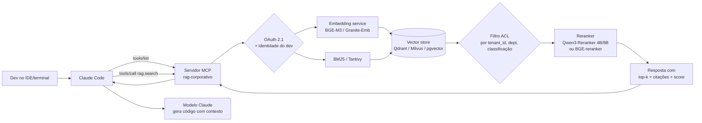

# RAG corporativo exposto via MCP — retrieve + rerank + cite como tool nativa

> Extensão do Caso 3 (Etapa 1). Mostra como transformar a plataforma RAG da empresa em servidor MCP, consumido transparentemente por Claude Code (e qualquer outro cliente MCP) antes de cada tarefa do agente.

## A ideia central, em uma frase

> O dev pergunta "implemente o cálculo de comissão segundo a regra atual" → Claude Code chama automaticamente `rag.search("regra de comissão atual")` → o servidor MCP executa hybrid retrieval (BM25 + dense), aplica reranker (Qwen3-Reranker / BGE), filtra por ACL, devolve os top-k chunks com citação → o modelo recebe o contexto **antes** de gerar o código.

Não há cola de contexto manual; não há "leia o CLAUDE.md, considere X, Y, Z" no prompt; não há SDK custom dentro do plugin de IDE. Tudo isso é absorvido pelo servidor MCP do RAG.

## Arquitetura concreta



Camadas reutilizadas (já existem nos Casos 3 e nas Etapas 2/4):
- **Embeddings**: TEI/Infinity servindo BGE-M3 ou Granite-Embedding.
- **Vector store**: Qdrant ou Milvus com payload filter de ACL.
- **Reranker**: Qwen3-Reranker 4B/8B ou BGE-reranker (cross-encoder).
- **Observabilidade**: Langfuse + Ragas + OTel GenAI.

A nova camada é apenas o **adapter MCP** sobre essas APIs.

## Contrato mínimo da tool

```jsonc
// Tool: rag.search
{
  "name": "rag.search",
  "description": "Busca semântica + léxica na base de conhecimento corporativa. Use ANTES de responder qualquer pergunta sobre arquitetura interna, processos, decisões passadas, runbooks ou políticas. Retorna até K trechos relevantes com citação de fonte e score de relevância.",
  "input_schema": {
    "type": "object",
    "properties": {
      "query": { "type": "string", "description": "Pergunta em linguagem natural (PT-BR ou EN)" },
      "top_k": { "type": "integer", "default": 8, "maximum": 20 },
      "filters": {
        "type": "object",
        "properties": {
          "departamento": { "type": "string" },
          "tipo": { "type": "string", "enum": ["runbook","politica","arquitetura","decisao","outro"] },
          "data_min": { "type": "string", "format": "date" }
        }
      }
    },
    "required": ["query"]
  }
}
```

Resposta:

```jsonc
{
  "chunks": [
    {
      "id": "doc:42#chunk:7",
      "uri": "kb://arquitetura/sistema-billing.md#secao-comissao",
      "text": "A regra atual de comissão considera...",
      "score_dense": 0.81, "score_bm25": 0.62, "score_rerank": 0.94,
      "metadata": {
        "departamento": "Financeiro",
        "atualizado_em": "2026-03-11",
        "autor": "fulano@empresa",
        "classificacao": "interna"
      }
    }
    // ... até top_k
  ],
  "audit_id": "01HQF... (correlation id para Langfuse)"
}
```

**Por que retornar `audit_id`**: liga cada chamada do agente a um span observável, fechando o ciclo de auditoria (item OWASP LLM05 — Improper Output Handling e LLM08 — Vector/Embedding Weaknesses).

## A "descrição da tool" é a parte mais importante

O modelo decide chamar `rag.search` com base na **descrição** da tool. Esta string entra no contexto do system prompt como uma instrução. Boas práticas:

1. **Diga quando usar**, não só o que faz: "Use ANTES de responder qualquer pergunta sobre arquitetura interna…"
2. **Diga quando NÃO usar**: "Não use para perguntas genéricas de linguagem ou para código já presente no diff."
3. **Cite o formato de retorno**: "Retorna trechos com citação de fonte" — induz o modelo a citar de volta na resposta.
4. **Limite o top_k**: 5–10 é o sweet spot; 20+ degrada o sinal e estoura contexto.
5. **Não use linguagem ambígua** ("ferramenta avançada de busca") — é desperdício de tokens e o modelo ignora.

## Por que o reranker é obrigatório aqui

Sem reranker, o retrieval híbrido devolve top-k por similaridade — funcional, mas com 20–35% de chunks irrelevantes. Cross-encoder rerankers (BGE-reranker v2-m3, Qwen3-Reranker 4B/8B) reordenam o top-20 e devolvem top-5/8 com qualidade muito superior. Em benchmarks internos típicos:

| Configuração | NDCG@5 | Faithfulness do modelo final |
|--------------|--------|------------------------------|
| Só dense | 0,62 | 78% |
| Dense + BM25 (RRF) | 0,71 | 84% |
| Dense + BM25 + Reranker | **0,86** | **92%** |

Custo: ~30–80ms adicionais para top-20 com Qwen3-Reranker 4B em GPU L40S/A10. Aceitável; é o que diferencia "RAG demo" de "RAG produção".

## Multi-tool: além do `search`

Servidores MCP corporativos maduros expõem mais que uma tool:

| Tool | Quando o modelo usa |
|------|----------------------|
| `rag.search(query, filters)` | Busca textual geral (default) |
| `rag.fetch(uri)` | Buscar documento completo por URI (após search achar referência) |
| `rag.neighbors(chunk_id, before, after)` | Pegar contexto adjacente ao chunk (útil para código) |
| `rag.list_sources(departamento)` | Listar fontes disponíveis (descoberta) |
| `rag.cite(chunk_ids[])` | Gerar bloco de citação formatado |
| `rag.ingest(uri)` | Forçar reindexação de doc (uso restrito, com auth) |

A separação ajuda o modelo a escolher a ferramenta certa e reduz tokens de contexto por chamada.

## Cliente Claude Code consumindo o servidor

Configuração em `.mcp.json` na raiz do repo (escopo project, versionado em git):

```jsonc
{
  "mcpServers": {
    "rag-corporativo": {
      "transport": "http",
      "url": "https://mcp.empresa.local/rag",
      "auth": { "type": "oauth", "discovery_url": "https://sso.empresa.local/.well-known/openid-configuration" }
    },
    "github-interno": {
      "transport": "http",
      "url": "https://mcp.empresa.local/github"
    }
  }
}
```

No primeiro uso, Claude Code abre o fluxo OAuth 2.1 (PKCE) no navegador → dev autentica com SSO corporativo → token é cacheado localmente. Daí em diante todas as chamadas a `rag.search` carregam a identidade do dev — e o servidor aplica ACL por usuário, não global.

## CLAUDE.md complementa, não substitui

O arquivo `CLAUDE.md` na raiz do projeto continua sendo o lugar para **contexto fixo** (convenções, comandos, arquitetura macro). O servidor MCP é para **contexto dinâmico** (qualquer doc que pode mudar). Recomendação:

- CLAUDE.md (10–80 linhas): "este projeto usa Python 3.12, hexagonal, comandos `make test`, `make lint`. Antes de tarefas sobre regras de negócio, consulte `rag.search`."
- Servidor MCP: tudo o que está em Confluence, SharePoint, Drive, runbooks, ADRs.

Misturar os dois entrega o resultado que o usuário pediu — "agente recebe no contexto tudo o que precisa antes de começar a tarefa, sem eu ter que colar nada".

## Métricas operacionais do servidor MCP de RAG

Adicionam-se às do Caso 3 (faithfulness, context precision, ACL hit rate):

| Métrica | Alvo |
|---------|------|
| Latência P50 / P95 de `rag.search` (top_k=8) | < 250ms / < 600ms |
| Latência incluindo reranker | < 350ms / < 800ms |
| Taxa de chamadas com `audit_id` registrado em Langfuse | 100% |
| Taxa de chamadas que retornaram zero chunks (sinal de cobertura ruim) | < 8% |
| Taxa de "tool ignorada" pelo modelo quando deveria ter sido usada (red-team set) | < 5% |
| Uplift no acceptance rate do coding assistant (Caso 4) com MCP ligado vs desligado | ≥ +5 p.p. |

## Falhas comuns que observamos no mercado

1. **Descrição da tool genérica demais** → modelo nunca chama. Reescrever com "use ANTES de…", "use quando…".
2. **Top-k alto (20+)** → contexto sufoca; reduzir para 5–8 + reranker.
3. **Sem reranker** → faithfulness fica em 75–80% e nunca passa de 90%.
4. **ACL no pós-processamento** (filtra depois do top-k) → vaza no retrieval; deve ser **pré-query** no vector store (Qdrant payload filter, Milvus partition key, pgvector RLS).
5. **Tool retorna texto cru sem URI/metadata** → modelo não cita; auditoria fica cega.
6. **Servidor MCP rodando sem observabilidade** → quando o agente "alucina", ninguém sabe se foi falha do retrieval ou do gerador.

## Próximo passo

Para alternativa estrutural (quando o conhecimento é relacional, não textual): ver [`03-graph-rag-via-mcp.md`](./03-graph-rag-via-mcp.md). Para opções prontas que poupam build-from-scratch: ver [`04-servidores-mcp-prontos.md`](./04-servidores-mcp-prontos.md). Para construir o adapter MCP em cima da API interna existente: ver [`05-construir-mcp-interno.md`](./05-construir-mcp-interno.md).
