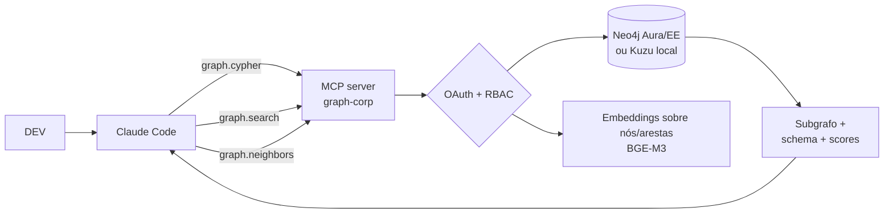

# Graph RAG via MCP — quando a estrutura importa mais que o texto

> Complemento ao [`02-rag-via-mcp.md`](./02-rag-via-mcp.md). Trata o caso em que a base de conhecimento corporativa tem **relações fortes** (entidades, hierarquias, dependências) — situações onde RAG vetorial pura subperforma e Graph RAG resolve.

## Quando Graph RAG ganha de RAG vetorial

| Situação | Por que vetor falha | Por que grafo ganha |
|----------|---------------------|----------------------|
| "Quais sistemas dependem do serviço X?" | Vetor casa por similaridade de texto, não por aresta de dependência | Cypher faz traversal exato |
| "Que clientes foram afetados quando trocamos o algoritmo Y?" | Sem ligação cliente↔release↔algoritmo no embedding | Grafo conecta os três |
| "Resumo dos ADRs que envolvem o time de pagamentos nos últimos 6 meses" | Filtro por entidade + tempo + autoria, depois síntese | Grafo filtra; depois passa subgrafo ao LLM |
| Onboarding de novo dev em sistema legado | "Mostre os 5 conceitos centrais e suas dependências" | Centralidade + comunidade no grafo |
| Análise de impacto regulatório | Mapeia regulamento → controle → sistema → time responsável | Travessia multi-hop |
| Investigação de incidente | "O que mudou na semana antes do incidente em qualquer sistema upstream?" | Grafo temporal de mudanças |

Quando o conhecimento é majoritariamente **prosa** (políticas, manuais, decisões textuais), RAG vetorial com reranker continua sendo o caminho principal. Graph RAG é **complementar**, não substituto.

## Padrões de implementação 2026

| Padrão | Como funciona | Quando usar |
|--------|---------------|--------------|
| **GraphRAG (Microsoft)** | Pré-processa corpus → extrai entidades/relações → constrói grafo + comunidades + sumários hierárquicos. Em query: recupera comunidades relevantes em vez de chunks. | Bom para "perguntas globais" sobre corpus grande |
| **HippoRAG / LightRAG** | Indexação mais barata; menor pre-compute; melhor para corpora pequenos/médios | Time pequeno sem orçamento de pré-processamento pesado |
| **Search-Augmented Cypher** | LLM gera Cypher dado um schema; executa; sintetiza resposta | Quando o grafo já existe (Neo4j legado, CMDB) |
| **Hybrid (vector + graph)** | Tool MCP devolve texto (vetor) e subgrafo (cypher) na mesma resposta | Maturidade alta; melhor qualidade |

## Arquitetura



## Ferramentas e bancos

| Tecnologia | Licença | Quando usar |
|------------|---------|--------------|
| **Neo4j** (Community / Enterprise / Aura) | GPLv3 / comercial | Padrão de mercado; ecossistema rico (GraphRAG, GDS); MCP server oficial em [neo4j-contrib/mcp-neo4j](https://github.com/neo4j-contrib/mcp-neo4j) |
| **Kuzu** | MIT | Embedded, single-binary, rápido para POC ou edge; tem Cypher; ainda sem MCP oficial mas adapter trivial |
| **TigerGraph** | Comercial | Workloads massivos (>bilhões de arestas); pouca tração open source |
| **Memgraph** | BSL (limitada) | Streaming/in-memory, alternativa Neo4j-compatible |
| **PuppyGraph / Apache AGE** | Apache | Grafo sobre Postgres existente; baixo overhead operacional |

**Recomendação default**: começar com **Neo4j Community + mcp-neo4j-graphrag** (open source) ou **Kuzu** se a equipe quer evitar +1 servidor. Migrar para Aura/Enterprise quando ACL fina e HA forem requisito.

## Servidores MCP prontos para grafo

Catálogo (validado em maio/2026 — versionar antes de produção):

| Servidor | Foco | Repositório |
|----------|------|--------------|
| **mcp-neo4j-graphrag** (Neo4j Field) | Vector + fulltext + Cypher unified em uma tool | [neo4j-field/mcp-neo4j-graphrag](https://github.com/neo4j-field/mcp-neo4j-graphrag) |
| **mcp-neo4j** (Neo4j Labs) | Tools básicas: schema, cypher, modelos de dados | [neo4j-contrib/mcp-neo4j](https://github.com/neo4j-contrib/mcp-neo4j) |
| **graphify** | Indexa folders de código/SQL/docs como knowledge graph; skill para Claude Code | [safishamsi/graphify](https://github.com/safishamsi/graphify) |
| **mcp-neo4j-server** (da-okazaki) | Implementação leve em Node | [mcp servers — Neo4j](https://glama.ai/mcp/servers/@da-okazaki/mcp-neo4j-server) |

## Contrato de tool típico

```jsonc
// graph.search — híbrido vector + cypher
{
  "name": "graph.search",
  "description": "Busca em grafo de conhecimento corporativo. Use para perguntas sobre relações, dependências, impacto, hierarquias, autoria e linhagem. Para texto livre, prefira rag.search.",
  "input_schema": {
    "type": "object",
    "properties": {
      "query": { "type": "string" },
      "mode": { "type": "string", "enum": ["vector","cypher","hybrid"], "default": "hybrid" },
      "max_hops": { "type": "integer", "default": 2 }
    },
    "required": ["query"]
  }
}
```

```jsonc
// graph.cypher — fuga de emergência: Cypher escrito pelo modelo
{
  "name": "graph.cypher",
  "description": "Executa uma query Cypher read-only no grafo corporativo. Use APENAS quando graph.search não atender. O servidor valida que a query é read-only.",
  "input_schema": {
    "type": "object",
    "properties": {
      "cypher": { "type": "string" },
      "params": { "type": "object" }
    },
    "required": ["cypher"]
  }
}
```

**Risco**: deixar o modelo escrever Cypher livre é poderoso mas perigoso. Mitigação:
- Validar AST e rejeitar `CREATE / DELETE / SET / MERGE / DROP`.
- Limitar `LIMIT` máximo.
- Limitar tempo de execução (timeout server-side).
- Allowlist de nós/relações expostos (não exponha tabelas internas de auth).
- Tudo logado em Langfuse com user_id (auditoria).

## Construção do grafo a partir de fontes existentes

O conhecimento corporativo raramente já está em grafo. Pipelines comuns:

1. **Extração com LLM** sobre o mesmo corpus do RAG vetorial (Confluence, ADRs, runbooks). Modelos como Granite-Reasoning, Qwen3 ou Llama 3.3 70B + few-shots extraem (entidade, relação, entidade) com alta qualidade. Ferramentas: **GraphRAG da Microsoft**, **LightRAG**, **InstructLab para fine-tune do extrator**.
2. **Importação de fontes estruturadas**: CMDB (BMC, ServiceNow), repositórios Git (commits → autoria), Jira (épicos → stories → bugs), Lake (tabelas → colunas → linhagem via OpenLineage/Marquez), Datahub (catálogo).
3. **Hibrido**: estrutura vem de fontes; descrição/notas vêm do LLM; arestas confirmadas por humano antes de promover ao grafo "oficial".

Custo de pré-processamento da abordagem GraphRAG-MS: ~3–10× o custo de embedding do mesmo corpus (LLM passes adicionais). Para 1M de docs, planejar 2–4 dias de batch em GPU dedicada e revalidar trimestralmente.

## Quando NÃO fazer Graph RAG

- Corpus < 10k docs e perguntas majoritariamente "explique X" → reranker resolve melhor.
- Time sem ninguém com background em modelagem de dados/grafo → curva de aprendizado vira gargalo.
- Sem caso de uso claro com perguntas relacionais → grafo vira museu.
- ROI menor que do RAG vetorial nos primeiros 6 meses → priorizar Caso 3 vetorial primeiro, Graph na Fase 2.

## Como se conecta com a Etapa 5 (ROI)

Graph RAG entra como **expansão da plataforma de RAG**, não projeto separado. Custo incremental para empresa que já tem Caso 3 rodando: ~150–300k US$/ano (1 eng dedicado + Neo4j EE/Aura + GPU para extração). Justifica-se quando há ao menos um caso âncora de impacto/análise de dependência (incidentes, compliance, M&A, descomissionamento de sistemas).

## Referências

- Neo4j blog — Building Knowledge Graphs With Claude and Neo4j: A No-Code MCP Approach: <https://neo4j.com/blog/developer/knowledge-graphs-claude-neo4j-mcp/>
- Neo4j MCP integrations: <https://neo4j.com/developer/genai-ecosystem/model-context-protocol-mcp/>
- mcp-neo4j-graphrag (vector + fulltext + cypher unified): <https://github.com/neo4j-field/mcp-neo4j-graphrag>
- Microsoft GraphRAG: <https://github.com/microsoft/graphrag>
- LightRAG: <https://github.com/HKUDS/LightRAG>
- Kuzu: <https://github.com/kuzudb/kuzu>
- Graphify (Claude Code skill): <https://github.com/safishamsi/graphify>
