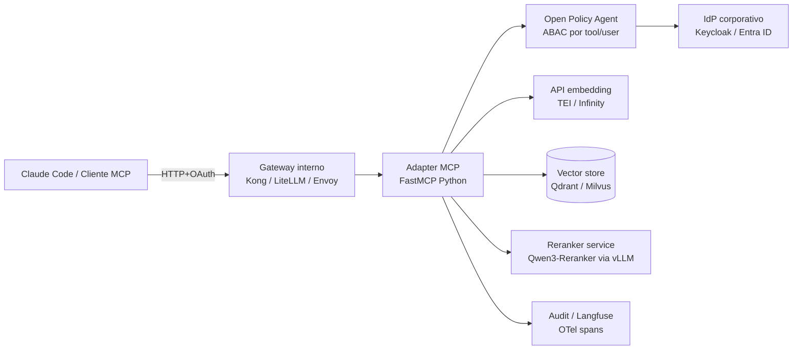

# Construindo um servidor MCP interno — adapter sobre a API corporativa de RAG

> Guia de implementação. Mostra o caminho recomendado quando a empresa já tem (ou planeja ter) uma API interna de RAG/embedding (Caso 3) e quer expô-la como servidor MCP sem reescrever a stack. Usa FastMCP (Python) como referência; equivalentes em TypeScript no fim do doc.

## Por que construir, e não só consumir um servidor pronto

A Etapa 4 do catálogo ([`04-servidores-mcp-prontos.md`](./04-servidores-mcp-prontos.md)) marca que servidores prontos resolvem o caso individual do dev, mas não atendem requisitos corporativos:

- **ACL por identidade do dev** (não por chave global do servidor).
- **Audit trail centralizado** (Langfuse + Open Policy Agent).
- **Reranker com modelo aprovado** (Qwen3-Reranker via runtime interno, não API pública).
- **Rate limit / quota** por equipe.
- **Versionamento de tool** (`rag.search.v2` sem quebrar `v1`).
- **Plug-in com SSO corporativo** (OIDC do Azure AD, Keycloak, Okta).
- **Air-gap**: sem dependências runtime que puxem pacotes/imagens da internet pública.

Adapter próprio = ~400–800 linhas em Python. Manter é barato; o RAG já existe.

## Arquitetura do adapter



O adapter MCP é **stateless**, **horizontalmente escalável**, **observável**. Pode rodar como deployment Kubernetes com 2–4 réplicas + HPA por latência.

## Esqueleto em Python (FastMCP)

Estrutura do projeto:

```
mcp-rag-corp/
├── pyproject.toml
├── src/
│   └── mcp_rag_corp/
│       ├── __init__.py
│       ├── server.py       # entrypoint MCP
│       ├── auth.py         # OIDC + introspecção de token
│       ├── policy.py       # OPA / ABAC
│       ├── retrieve.py     # chamada ao Qdrant/Milvus
│       ├── rerank.py       # cliente do reranker
│       ├── audit.py        # spans OTel + Langfuse
│       └── settings.py     # pydantic-settings
├── tests/
│   └── test_contract.py    # contrato de tools (MCP Inspector + pytest)
├── Dockerfile
└── deploy/
    ├── chart/              # Helm
    └── k8s.yaml
```

`server.py` mínimo viável:

```python
from fastmcp import FastMCP
from .auth import require_user
from .policy import allow
from .retrieve import hybrid_search
from .rerank import rerank
from .audit import span

mcp = FastMCP("rag-corporativo")

@mcp.tool(
    name="rag.search",
    description=(
        "Busca semântica + léxica na base de conhecimento corporativa. "
        "Use ANTES de responder qualquer pergunta sobre arquitetura interna, "
        "processos, decisões passadas, runbooks ou políticas. "
        "Retorna até K trechos relevantes com citação de fonte e score."
    ),
)
async def rag_search(query: str, top_k: int = 8, filters: dict | None = None):
    user = await require_user()  # extrai claims do token OAuth
    allow(user, tool="rag.search", filters=filters)  # OPA decision

    with span("rag.search", user=user.sub, query=query) as s:
        candidates = await hybrid_search(query, top_k=max(top_k * 3, 20), filters=filters, acl=user.acl)
        reranked = await rerank(query, candidates, top_k=top_k)
        s.set_attribute("chunks_returned", len(reranked))
        return {
            "chunks": reranked,
            "audit_id": s.context.trace_id_hex,
        }

@mcp.tool(name="rag.fetch", description="Recupera documento completo por URI a partir de um chunk_id.")
async def rag_fetch(uri: str):
    user = await require_user()
    allow(user, tool="rag.fetch", uri=uri)
    return await fetch_doc(uri, acl=user.acl)

if __name__ == "__main__":
    mcp.run(transport="http", host="0.0.0.0", port=8080)
```

Pontos críticos:

1. **`require_user()`** valida o token Bearer OAuth contra o introspect endpoint do IdP. Falha = 401 antes de qualquer trabalho.
2. **`allow()`** delega ao OPA: a política sabe que "dev do time X pode buscar nos buckets A, B, C, mas não em D". Centralizada, não espalhada no código.
3. **`hybrid_search()`** já recebe o **ACL do usuário** e passa como filtro **pré-query** ao Qdrant/Milvus. Nunca pós-processar.
4. **`rerank()`** chama serviço interno do Qwen3-Reranker (ou BGE) via gRPC/HTTP. Não embute o modelo no processo (separação de concerns + escalabilidade).
5. **`span()`** abre um span OTel; finaliza com atributos; Langfuse coleta. O `trace_id` vira `audit_id` devolvido ao cliente.

## Validação de contrato em CI

Testar tools com MCP Inspector + pytest:

```python
# tests/test_contract.py
import asyncio
from fastmcp import Client

async def test_rag_search_returns_chunks():
    async with Client("http://localhost:8080/mcp") as c:
        tools = await c.list_tools()
        assert any(t.name == "rag.search" for t in tools)

        res = await c.call_tool("rag.search", {"query": "política de retenção de logs", "top_k": 5})
        assert "chunks" in res
        assert "audit_id" in res
        assert len(res["chunks"]) <= 5
        for ch in res["chunks"]:
            assert "uri" in ch and "score_rerank" in ch
```

Inspector em CI para sanity check de descrições/schemas:

```bash
npx @modelcontextprotocol/inspector --headless --validate src/mcp_rag_corp/server.py
```

## Deploy no perímetro

`Dockerfile` enxuto (multi-stage com `uv`):

```dockerfile
FROM ghcr.io/astral-sh/uv:python3.12-bookworm AS build
WORKDIR /app
COPY pyproject.toml uv.lock ./
RUN uv sync --frozen --no-dev
COPY src ./src

FROM python:3.12-slim
WORKDIR /app
COPY --from=build /app /app
ENV PATH="/app/.venv/bin:$PATH"
EXPOSE 8080
CMD ["python", "-m", "mcp_rag_corp.server"]
```

Helm/K8s: 2–4 réplicas, HPA por P95 latência (alvo < 600ms incluindo rerank), `Service` ClusterIP atrás do gateway interno. Sem `LoadBalancer` exposto à internet.

Imagem **assinada com cosign**, armazenada no registry interno (Harbor / ECR / Artifactory). SBOM gerado (Syft) e arquivado.

## Versionamento de tools

Quebrar a assinatura é caro — clientes (Claude Code de devs) podem estar pinned em CLAUDE.md/repo. Estratégia:

- Nome inclui versão semântica: `rag.search.v1`, `rag.search.v2`.
- v1 marcada como deprecated por 90 dias antes de remover (anúncio interno).
- Cliente pode chamar pela alias `rag.search` (sempre = versão estável recomendada).
- Cabeçalho de resposta inclui `X-Tool-Version` para telemetria de uso.

## TypeScript / Node — equivalente

Para times mais à vontade em Node:

```typescript
import { McpServer } from "@modelcontextprotocol/sdk/server/mcp.js";
import { z } from "zod";

const server = new McpServer({ name: "rag-corporativo", version: "1.0.0" });

server.tool(
  "rag.search",
  "Busca semântica + léxica corporativa. Use antes de responder sobre arquitetura/processo/decisão.",
  {
    query: z.string(),
    top_k: z.number().int().max(20).default(8),
  },
  async ({ query, top_k }, ctx) => {
    const user = await requireUser(ctx);
    allow(user, "rag.search");
    const candidates = await hybridSearch(query, top_k * 3, user.acl);
    const chunks = await rerank(query, candidates, top_k);
    return { content: [{ type: "text", text: JSON.stringify({ chunks, audit_id: ctx.traceId }) }] };
  },
);
```

A semântica é equivalente. Decisão Python vs TS: **a do time de plataforma**, não do protocolo.

## Custo de manter

Estimativa para empresa Cenário M (Etapa 5):

| Item | Custo anual |
|------|-------------|
| 0,3 FTE de eng de plataforma (mantém adapter + servidores em registry) | US$ 35–55k |
| Infra K8s adicional (2–4 réplicas leves) | US$ 2–5k |
| Reranker GPU (compartilhado com RAG corporativo) | US$ 0 (incluso no Caso 3) |
| Observabilidade (Langfuse + OTel) | US$ 0 (incluso na Etapa 4) |
| **Total incremental sobre o Caso 3** | **~US$ 40–60k/ano** |

ROI vem de: (1) maior acceptance rate do Claude Code (+5–10 p.p.), (2) tempo de dev colando contexto manual → zero, (3) reuso da mesma plataforma por outros agentes internos.

## Próximos passos

- Segurança e governança detalhadas: [`06-seguranca-governanca.md`](./06-seguranca-governanca.md).
- Sequência de rollout (Fase 0–3): [`07-roadmap-adocao.md`](./07-roadmap-adocao.md).

## Referências

- FastMCP: <https://github.com/jlowin/fastmcp>
- MCP TypeScript SDK: <https://github.com/modelcontextprotocol/typescript-sdk>
- Best Practices for Production MCP Servers (New Stack, 2026): <https://thenewstack.io/how-to-build-rag-applications-using-model-context-protocol/>
- OpenTelemetry GenAI semconv: <https://opentelemetry.io/docs/specs/semconv/gen-ai/>
- Open Policy Agent: <https://www.openpolicyagent.org/>
