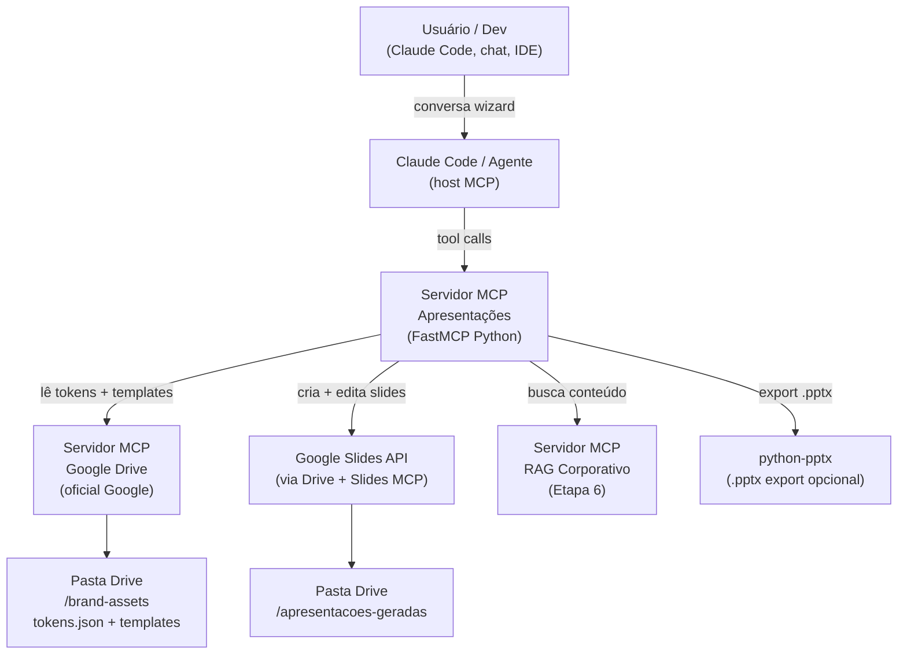

# Design System para Apresentações — Arquitetura e Fundamentos

> Mapa técnico da solução: como tokens, templates, servidor MCP e wizard se conectam para gerar apresentações on-brand via agente de IA. Referência para Tech Lead e Arquiteto de Plataforma.

## Visão geral da arquitetura



**Fluxo resumido**:
1. Usuário inicia conversa com o agente (via Claude Code, chat corporativo ou IDE).
2. Agente chama a tool `presentation.wizard_start` → servidor MCP retorna as perguntas do wizard.
3. Usuário responde as perguntas (audiência, objetivo, seções, dados).
4. Servidor MCP lê `tokens.json` e o template adequado do Drive.
5. Servidor MCP copia o template via Drive API, preenche placeholders via Slides API batchUpdate.
6. (Opcional) Servidor MCP chama RAG corporativo para enriquecer conteúdo.
7. Link do deck gerado é retornado ao usuário no Drive.

## As quatro camadas do sistema

### Camada 1 — Design Tokens

Arquivo `tokens.json` (formato W3C DTCG, estável out/2025) versionado no Drive e/ou no repositório interno. Define todos os valores visuais da marca:

- Cores primária, secundária, acento, fundo, texto.
- Tipografia: família, tamanhos (título, corpo, legenda), peso.
- Espaçamentos (margin dos slides, padding de caixas).
- Variantes de tema: `default`, `dark`, `clean`, `bold`.

O servidor MCP lê este arquivo ao iniciar (ou a cada request, para pegar atualizações). Qualquer mudança de marca no `tokens.json` é automaticamente refletida em todos os decks gerados dali em diante.

### Camada 2 — Templates

Arquivos `.gslides` (Google Slides nativo) ou `.potx` (PowerPoint template) armazenados em `/brand-assets/templates/` no Drive. Cada template é um layout mestre com:

- Slide Master configurado com as fontes e cores dos tokens.
- Layouts nomeados: `TitleSlide`, `AgendaSlide`, `ContentSlide`, `DataSlide`, `QuoteSlide`, `TeamSlide`, `ClosingSlide`.
- Placeholders com nomes semânticos: `{{slide_title}}`, `{{slide_body}}`, `{{author_name}}`, `{{date}}`, `{{logo_position}}`.
- Slide com instruções de uso (oculto — só visível ao designer).

Templates disponíveis na pasta:
- `template-corporativo.gslides` — deck de proposta/relatório
- `template-pitch.gslides` — deck de pitch/venda
- `template-treinamento.gslides` — deck de treinamento interno
- `template-executivo.gslides` — deck boardroom (poucas palavras, muito visual)

### Camada 3 — Skills de Slides

Skills são funções Python no servidor MCP que sabem montar cada tipo de slide. Recebem `tokens + conteúdo_do_slide` e retornam um conjunto de comandos `batchUpdate` para a Slides API.

Exemplos de skills:
- `skill_title_slide(title, subtitle, author, date, tokens)` → cria slide de capa com logo, cor de fundo do token `color.primary`, fonte do token `typography.display`.
- `skill_data_slide(title, chart_data, footnote, tokens)` → cria slide com tabela ou gráfico embutido.
- `skill_quote_slide(quote, author, source, tokens)` → slide de destaque com citação formatada.
- `skill_agenda_slide(items, tokens)` → slide de agenda com bullets numerados.
- `skill_section_divider(section_title, tokens)` → slide de divisão de seção, fundo na cor do token `color.section_bg`.

### Camada 4 — Wizard de Coleta

O wizard é implementado como uma **sequência de MCP Prompts** (primitiva MCP) ou como uma **Claude Skill** (Anthropic Agent SDK). Ele guia a conversa antes de qualquer geração:

```
Wizard: Qual o objetivo principal deste deck?
  (a) Proposta comercial  (b) Report executivo  (c) Treinamento interno
  (d) Pitch de produto  (e) Outro: ___

Wizard: Quem vai receber/assistir esta apresentação?
  [resposta livre ou lista]

Wizard: Quantos slides aproximadamente? (pode ser uma faixa)
  [resposta livre]

Wizard: Quais são as 3–5 mensagens principais que você quer que o público lembre?
  [resposta livre, uma por linha]

Wizard: Tem dados, tabelas, gráficos ou imagens específicas para incluir?
  [resposta livre]

Wizard: Qual variante de tema preferir?
  (a) Default (cores completas)  (b) Clean (fundo branco)
  (c) Dark (fundo escuro)  (d) Bold (cores fortes)
```

Com as respostas, o servidor MCP monta o **plano de slides** (outline JSON) e o apresenta ao usuário para confirmação antes de gerar.

## Comparativo de abordagens técnicas

| Abordagem | Como funciona | Prós | Contras | Recomendação |
|---|---|---|---|---|
| **Google Slides API + MCP** | Copia template .gslides via Drive API; preenche via batchUpdate | API nativa, edição real no Slides, compartilhamento fácil | Precisa de OAuth; API verbosa para layouts complexos | **Principal** — usar para output primário |
| **python-pptx** | Gera .pptx em memória; salva no Drive | Controle total do arquivo, sem OAuth adicional, roda off-line | Output não fica no Google Slides nativo; formatos podem divergir | **Complementar** — exportar como .pptx quando pedido |
| **PPTAgent / DeepPresenter** | LLM fine-tunado (9B params) especializado em slides | Qualidade alta de layout autônomo | Infra adicional (modelo extra), latência maior | **Futura** — avaliar se qualidade do layout virar gargalo |
| **PowerPoint COM API** | Controla app PowerPoint via COM automation | Formatação fiel ao PowerPoint | Windows-only, precisa do app instalado, não serve para servidor | **Descartar** |
| **Google Apps Script MCP** | Apps Script exposto como MCP server | Sem infra adicional (roda no Google Cloud) | Limitações de runtime (6 min), sem auth corporativa avançada | **POC** — válido para exploração inicial |

## Decisões arquiteturais

### 1. Google Slides como output primário

A empresa usa Google Workspace (premissa). Google Slides tem:
- API REST estável e bem documentada.
- Servidor MCP oficial disponível (GA em 2026).
- Compartilhamento nativo pelo Drive (link, permissões por e-mail).
- Histórico de versões automático.
- Export para .pptx em 1 clique (ou via API).

### 2. Design Tokens como fonte de verdade visual

Manter cores/fontes em código (tokens.json) ao invés de "na cabeça do designer" garante que:
- O agente sempre aplica a marca correta, mesmo sem o designer envolvido.
- Atualizar a paleta de cores exige mudar 1 arquivo, não 400 decks.
- Times remotos ou externos com acesso à pasta sempre têm os tokens corretos.

### 3. Servidor MCP próprio (FastMCP) em vez de só os servidores do Google

O servidor MCP do Google Drive e do Google Slides expõem as APIs brutas. A empresa precisa de:
- Lógica de wizard (sequência de perguntas → plano de slides).
- Aplicação dos tokens (lógica de negócio, não API do Google).
- Skills de slides (patterns de layout).
- Integração com RAG (busca de conteúdo corporativo).
- Observabilidade e audit trail.

O servidor MCP próprio encapsula tudo isso; por baixo, chama os servidores do Google.

### 4. Pasta do Drive como fonte de verdade de assets

```
/brand-assets/
├── tokens.json              ← Design tokens DTCG
├── templates/
│   ├── template-corporativo.gslides
│   ├── template-pitch.gslides
│   ├── template-treinamento.gslides
│   └── template-executivo.gslides
├── logos/
│   ├── logo-primary.png
│   ├── logo-white.png
│   └── logo-dark.png
├── fonts/                   ← só para export .pptx
│   ├── BrandFont-Regular.ttf
│   └── BrandFont-Bold.ttf
└── GUIA-DE-USO.md           ← instruções para o designer atualizar assets
```

Permissões: pasta `brand-assets` com acesso de leitura para a service account do servidor MCP; acesso de edição somente para o time de Design/Comunicação.

## Integrações futuras naturais

| Integração | O que adiciona | Quando considerar |
|---|---|---|
| RAG Corporativo (Caso 3 + Etapa 6) | Agente popula slides com dados reais do knowledge base | Quando Etapa 6 estiver em produção |
| Sumarização de PDF (Caso 6) | Entrada de relatório → slides automáticos | Alta prioridade; economiza mais tempo |
| Jira/GitHub MCP (Etapa 6) | Deck de sprint review gerado automaticamente | Muito alta adesão em times de tech |
| Aprovação de deck via Slack | Agente posta no Slack para aprovação antes de finalizar | UX melhora muito; 1–2 semanas de dev |
| Versionamento semântico de decks | Cada geração com hash do tokens.json + timestamp | Auditoria e reprodutibilidade |

## Referências

- Google Workspace MCP servers (oficial): <https://cloud.google.com/blog/products/ai-machine-learning/google-managed-mcp-servers-are-available-for-everyone>
- Google Slides MCP (community): <https://github.com/matteoantoci/google-slides-mcp>
- Google Drive MCP (community): <https://github.com/piotr-agier/google-drive-mcp>
- Google Slides API — Create and manage presentations: <https://developers.google.com/workspace/slides/api/guides/presentations>
- W3C DTCG Design Tokens Specification 2025.10: <https://www.designtokens.org/tr/drafts/format/>
- PPTAgent (framework agentic de slides): <https://github.com/icip-cas/PPTAgent>
- python-pptx: <https://python-pptx.readthedocs.io/>
