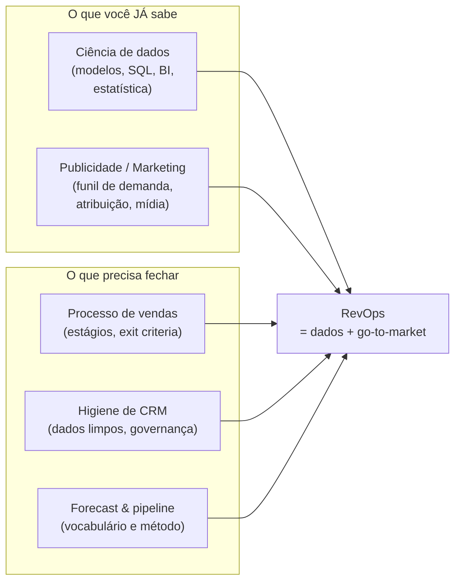

# Etapa 8 — RevOps (Revenue Operations): o dossiê de entrada na função

> Este conjunto de documentos estrutura, em português, tudo o que você precisa para assumir a posição de **RevOps** na empresa: o que é Revenue Operations, por que existe, o que um profissional de RevOps faz no dia a dia, quais métricas e ferramentas dominam a disciplina, quais processos e frameworks operacionalizam a receita, e um plano de 90 dias para começar a entregar valor. É escrito para o seu perfil específico — **publicitário e cientista de dados** fazendo o pivô entre Comercial e Marketing. Maio/2026.

## Para quem é este dossiê

Você é **cientista de dados e publicitário**, está num cargo de fronteira entre **Comercial (Vendas)** e **Marketing**, e foi convidado a assumir um papel de **RevOps**. Você tem os inputs e a posição para dirigir decisões baseadas em dados, mas falta o **como**: qual o método, qual o vocabulário, quais referências.

A boa notícia: RevOps é exatamente a disciplina que **conecta dados + go-to-market**. Metade do trabalho é o que você já sabe fazer (modelar, instrumentar, medir). A outra metade é o que você precisa aprender (o processo de vendas, a higiene de CRM, o vocabulário de pipeline e forecast). Este dossiê foi montado para alavancar o que você domina e fechar as lacunas com precisão.

## O que é RevOps, em uma frase

> **RevOps é o sistema operacional da receita: unifica pessoas, processos, tecnologia e dados de Marketing, Vendas e Customer Success em torno de um único objetivo — receita previsível e escalável.**

## Por que RevOps existe

Em quase toda empresa B2B, Marketing, Vendas e Customer Success operam em **silos**: cada um com sua ferramenta, sua definição de "lead bom", sua planilha de números. O resultado é atrito no funil, dados que não batem entre áreas, e ninguém com dono único da jornada de receita ponta a ponta. RevOps surge para **derrubar esses silos** e tratar a receita como um sistema único, mensurável e otimizável.

O movimento não é moda: a adoção do modelo formal de RevOps disparou entre empresas B2B de alto crescimento nos últimos anos, e empresas com função de RevOps madura reportam crescimento de receita mais rápido e maior rentabilidade do que as que não têm (ver [`01-fundamentos-revops.md`](./01-fundamentos-revops.md)).

## O que esta Etapa entrega

| Doc | Conteúdo | Quando ler |
|-----|----------|-----------|
| [`00-resumo-executivo.md`](./00-resumo-executivo.md) | Visão geral, mensagem-chave, mapa dos documentos, conexão com seu perfil | Agora (este doc) |
| [`01-fundamentos-revops.md`](./01-fundamentos-revops.md) | Definição, origem, o problema dos silos, modelo bowtie, RevOps vs SalesOps vs MktOps, modelo operacional, onde reporta | Para entender o conceito |
| [`02-papel-e-responsabilidades.md`](./02-papel-e-responsabilidades.md) | O que você faz no dia a dia, responsabilidades, níveis de maturidade, **onde seu perfil de cientista de dados entra** | Para entender seu trabalho |
| [`03-metricas-e-kpis.md`](./03-metricas-e-kpis.md) | Métricas por etapa do funil, fórmulas, benchmarks, quais um cientista de dados instrumenta bem | Referência de medição |
| [`04-stack-ferramentas.md`](./04-stack-ferramentas.md) | CRM, automação de marketing, sales engagement, BI, revenue intelligence, fluxo de dados, opções p/ Brasil | Para mapear a stack |
| [`05-processos-e-frameworks.md`](./05-processos-e-frameworks.md) | Ciclo de vida do lead, MQL→SQL, SLAs, estágios de oportunidade, forecast, território/quota, deal desk, cadência | Para desenhar o operacional |
| [`06-roadmap-90-dias.md`](./06-roadmap-90-dias.md) | Plano 30/60/90 dias, primeiros entregáveis que provam valor, armadilhas a evitar | Para começar a agir |
| [`07-referencias-e-aprendizado.md`](./07-referencias-e-aprendizado.md) | Trilha de livros, comunidades, certificações, podcasts, bibliografia consolidada | Para se aprofundar |

## Como isso se conecta ao seu perfil

| Sua força | Onde vira vantagem em RevOps |
|-----------|------------------------------|
| Ciência de dados | Lead scoring preditivo, modelos de forecast, análise de coorte/retenção, análise de pipeline, qualidade de dados |
| Atribuição e mídia (publicidade) | Atribuição de receita multi-touch, ROI de campanha, handoff Marketing→Vendas |
| SQL / BI | Construir a "fonte única de verdade" (dashboard) que acaba com a briga de "qual número está certo" |
| Pensamento estatístico | Definir benchmarks, medir acurácia de forecast, separar sinal de ruído nas métricas |

| Sua lacuna | Como fechar (ver doc) |
|------------|----------------------|
| Como funciona o processo de vendas | [`05-processos-e-frameworks.md`](./05-processos-e-frameworks.md) |
| Higiene e governança de CRM | [`05-processos-e-frameworks.md`](./05-processos-e-frameworks.md) + [`06-roadmap-90-dias.md`](./06-roadmap-90-dias.md) |
| Vocabulário de pipeline/forecast | [`03-metricas-e-kpis.md`](./03-metricas-e-kpis.md) + [`05-processos-e-frameworks.md`](./05-processos-e-frameworks.md) |
| Quais ferramentas existem | [`04-stack-ferramentas.md`](./04-stack-ferramentas.md) |

## Como começar

Não tente "consertar tudo" no primeiro mês. A sequência vencedora é **ouvir → ganhos rápidos → construir**:

1. **Ouvir/auditar** (dias 1–30): auditoria de dados, checagem de higiene do CRM, mapeamento do funil real, entrevistas com stakeholders de Vendas, Marketing e CS.
2. **Ganhos rápidos** (dias 31–60): um dashboard de fonte única de verdade, consertar **um** handoff quebrado, estabelecer uma baseline de forecast.
3. **Construir** (dias 61–90): dicionário de métricas, SLAs entre áreas, cadência de reporting.

O plano detalhado, com entregáveis e armadilhas, está em [`06-roadmap-90-dias.md`](./06-roadmap-90-dias.md). Comece a leitura por [`01-fundamentos-revops.md`](./01-fundamentos-revops.md) para fixar o conceito, depois vá direto ao [`02-papel-e-responsabilidades.md`](./02-papel-e-responsabilidades.md).

## Referências

- Salesforce — *What Is Revenue Operations (RevOps)?* — salesforce.com/sales/revenue-lifecycle-management/what-is-revenue-operations/
- Gartner — *Revenue Operations: The What, Best Practices & RevOps Guide* — gartner.com/en/sales/topics/revenue-operations
- 1000-steps — *What Is Revenue Operations? A Practical RevOps Guide for 2026* — https://1000-steps.com/articles/what-is-revenue-operations-revops-guide/
- growintandem — *RevOps Framework: How B2B Companies Unify GTM in 2026* — https://growintandem.com/revops-framework-2026/
