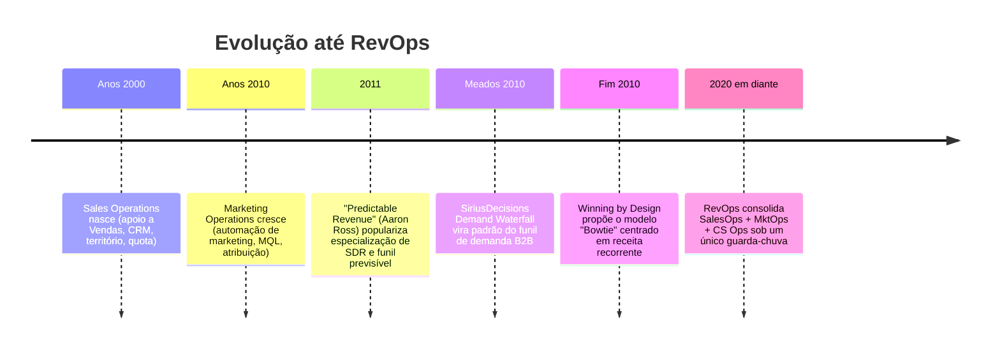
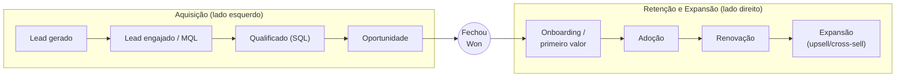
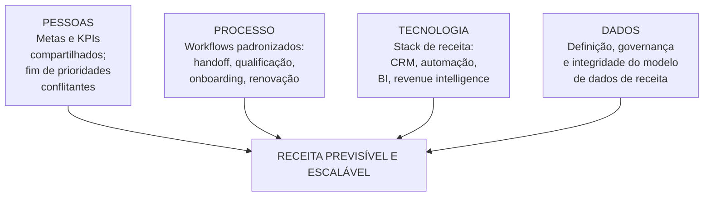

# Fundamentos de RevOps — definição, origem, o problema dos silos e o modelo operacional

> Este documento fixa o conceito: o que é Revenue Operations, de onde veio, qual problema resolve (os silos entre Marketing, Vendas e Customer Success), o modelo unificado de funil/receita (o "bowtie"), como RevOps se diferencia de SalesOps, MarketingOps e Sales Enablement, e o modelo operacional de quatro pilares (pessoas, processo, tecnologia, dados). É a base conceitual para os demais documentos.

## O que é RevOps

**Revenue Operations (RevOps)** é o modelo operacional que **unifica pessoas, processo, tecnologia e dados** das três áreas geradoras de receita — Marketing, Vendas e Customer Success — em torno de um único objetivo: **receita previsível e escalável**. Em vez de tratar a aquisição (Marketing), a conversão (Vendas) e a retenção/expansão (CS) como três funções separadas com metas próprias, RevOps as trata como um **sistema único** de ponta a ponta.

A definição corrente em 2026 descreve RevOps como o "sistema operacional por trás de todo o ciclo de vida da receita", conectando geração de demanda, progressão de negócios, visibilidade da receita e crescimento do cliente. RevOps é dono da definição, governança e integridade do **modelo de dados de receita**, e da **stack de tecnologia** que sustenta o go-to-market (GTM).

> **Princípio central:** receita não é o resultado de três áreas trabalhando bem isoladamente; é o resultado de um funil único trabalhando sem atrito. RevOps existe para remover esse atrito.

## Por que RevOps existe — o problema dos silos

Na ausência de RevOps, cada área de receita otimiza o seu pedaço, e o todo sofre:

| Sintoma do silo | O que acontece na prática |
|-----------------|---------------------------|
| Definições divergentes | Marketing chama de "lead bom" algo que Vendas considera lixo; não há definição compartilhada de MQL/SQL |
| Dados que não batem | O número de pipeline do dashboard de Marketing não casa com o do CRM de Vendas; reuniões viram briga de planilha |
| Handoff quebrado | Lead qualificado fica horas/dias sem contato; ninguém é dono do tempo de resposta |
| Ferramentas sobrepostas | Marketing compra uma ferramenta, Vendas outra, CS outra; dados ficam presos em cada silo |
| Forecast não confiável | Cada gerente projeta do seu jeito; a liderança não confia no número |
| Ninguém dono da jornada | Aquisição, conversão e retenção têm donos diferentes e nenhum dono do todo |

RevOps resolve isso criando **um dono único** da máquina de receita: definições compartilhadas, dados governados, ferramentas integradas, SLAs entre áreas e um forecast em que a liderança confia.

A relevância do modelo cresceu fortemente: estima-se que a maioria das empresas B2B de altíssimo crescimento já opera com um modelo formal de RevOps em 2026, uma alta expressiva frente a poucos anos atrás, e empresas com RevOps maduro reportam crescimento de receita mais rápido e maior rentabilidade. (Os números exatos variam por fonte; trate-os como ordem de grandeza, não como verdade absoluta.)

## Origem e história

RevOps não nasceu do nada — é a convergência de disciplinas que já existiam:

Dois marcos importam para você:

- **Predictable Revenue (Aaron Ross & Marylou Tyler, 2011)** — popularizou a especialização de papéis (SDRs prospectam, AEs fecham) e a ideia de um funil de geração de demanda previsível e escalável. É a raiz cultural do "funil como máquina".
- **O modelo Bowtie (Winning by Design)** — repensou o funil tradicional para negócios de **receita recorrente** (SaaS, assinaturas), incluindo o que acontece **depois** da venda.

## O modelo unificado de receita — o "Bowtie"

O funil tradicional para no "fechou a venda". Para negócios de receita recorrente, isso é metade da história: a maior parte do valor de um cliente vem **depois** da primeira venda (renovação, upsell, expansão). O modelo **Bowtie** (gravata-borboleta) da Winning by Design corrige isso, espelhando o funil para representar a jornada inteira do cliente.

| Lado do bowtie | Dono primário | Pergunta que responde |
|----------------|---------------|-----------------------|
| Esquerdo (aquisição) | Marketing + Vendas (SDR/AE) | Como geramos e convertemos demanda? |
| Centro (handoff) | Vendas → CS | Como entregamos o primeiro valor (onboarding)? |
| Direito (retenção/expansão) | Customer Success | Como mantemos e expandimos a receita? |

A "primeira premissa" do modelo, segundo a Winning by Design, é que **o crescimento vem de ajudar o cliente a alcançar o impacto que ele deseja** — não de apenas empurrar mais vendas. RevOps é quem fornece o **modelo de dados e a linguagem comum** para medir e otimizar essa jornada inteira, dos dois lados do bowtie.

> Para você (publicitário + cientista de dados): o lado esquerdo do bowtie é território conhecido — é o funil de demanda da publicidade, com atribuição. O lado direito (retenção, NRR, coorte) é onde sua análise de coorte/retenção brilha. RevOps te dá o mandato sobre os dois.

## RevOps vs SalesOps vs MarketingOps vs Sales Enablement

Confundir essas funções é o erro mais comum de quem entra na área. A diferença é de **escopo**:

| Função | Escopo | Foco principal | Métrica que persegue |
|--------|--------|----------------|----------------------|
| **Sales Operations (SalesOps)** | Só Vendas | Eficiência do time de vendas: território, quota, CRM de vendas, comissão | Produtividade do vendedor, atingimento de quota |
| **Marketing Operations (MktOps)** | Só Marketing | Automação de marketing, gestão de leads, atribuição, MQL | Volume e qualidade de MQL, ROI de campanha |
| **Customer Success Ops (CS Ops)** | Só CS | Saúde do cliente, renovação, expansão, health score | NRR/GRR, churn |
| **Sales Enablement** | Capacitação de Vendas | Treinamento, playbooks, conteúdo, ferramentas de venda | Ramp time, adoção de playbook |
| **RevOps** | **As três áreas + enablement** | Sistema de receita ponta a ponta; dono da stack e do modelo de dados | **Receita previsível, NRR, eficiência do funil inteiro** |

Em empresas menores, **RevOps absorve todas** essas funções. Em empresas maiores, SalesOps/MktOps/CSOps podem existir como **sub-times dentro de RevOps**. Sales Enablement costuma ser uma capacidade que RevOps coordena ou contém.

## O modelo operacional — os quatro pilares

RevOps se apoia em quatro pilares. É o framework que você usará para diagnosticar a empresa (ver auditoria em [`06-roadmap-90-dias.md`](./06-roadmap-90-dias.md)):

| Pilar | O que RevOps faz | Onde seu perfil ajuda |
|-------|------------------|-----------------------|
| **Pessoas** | Alinhar Marketing, Vendas e CS em metas e KPIs compartilhados; SLAs entre áreas | Médio — exige influência e relacionamento |
| **Processo** | Padronizar o lead-to-cash: handoff, qualificação, estágios de oportunidade, renovação | Lacuna a fechar — é o vocabulário de vendas |
| **Tecnologia** | Decidir o que comprar, manter e descontinuar na stack; integrar as ferramentas | Médio — você aprende rápido por ser técnico |
| **Dados** | Ser dono da definição, governança e integridade do modelo de dados de receita | **Sua maior força** — é literalmente ciência de dados aplicada |

## Onde RevOps reporta na organização

Não há um único padrão, mas há uma direção clara conforme a empresa amadurece:

| Modelo de reporte | Quando faz sentido | Maturidade |
|-------------------|--------------------|-----------|
| RevOps dentro de Vendas (reporta ao VP de Vendas) | Empresa pequena, RevOps começou como SalesOps | Baixa |
| RevOps dentro de Marketing | Empresa onde Marketing puxou a iniciativa | Baixa |
| RevOps reporta ao **CRO (Chief Revenue Officer)** | Modelo mais comum em empresas maduras: CRO supervisiona Vendas, Mkt e CS | Média/Alta |
| RevOps como função própria, reporta ao **CEO/COO/CFO** | Empresa onde RevOps é parceiro estratégico, neutro entre as áreas | Alta |

**Recomendação opinativa:** o ideal é que RevOps reporte a alguém **acima** de qualquer área individual de receita (CRO, COO ou CEO), justamente para ser **neutro** entre Marketing, Vendas e CS. Se RevOps reporta ao VP de Vendas, ele tende a virar "SalesOps com outro nome" e perde a neutralidade que é sua razão de existir. Na sua realidade — um cargo de fronteira entre Comercial e Marketing — vale clarificar com a liderança a quem você reporta e qual seu mandato, antes de tudo.

## Referências

- Salesforce — *What Is Revenue Operations (RevOps)? A Complete Guide* — salesforce.com/sales/revenue-lifecycle-management/what-is-revenue-operations/
- Gartner — *Revenue Operations: The What, Best Practices & RevOps Guide* — gartner.com/en/sales/topics/revenue-operations
- 1000-steps — *What Is Revenue Operations? A Practical RevOps Guide for 2026* — https://1000-steps.com/articles/what-is-revenue-operations-revops-guide/
- growintandem — *RevOps Framework: How B2B Companies Unify GTM in 2026* — https://growintandem.com/revops-framework-2026/
- Winning by Design (via Business Wire) — *Releases Updated Bowtie Model and Benchmarks...* — https://www.businesswire.com/news/home/20231011112360/en/Winning-by-Design-Releases-Updated-Bowtie-Model-and-Benchmarks
- Inflection — *Winning by Design Bowtie Funnel is the new SiriusDecisions Demand Waterfall* — https://www.inflection.io/post/winning-by-design-bowtie-funnel-is-the-new-siriusdecisions-demand-waterfall
- Predictable Revenue — *15-Minute Summary of Predictable Revenue* — https://predictablerevenue.com/blog/15-minute-summary-of-predictable-revenue
- Sendspark — *RevOps vs Sales Ops: Key Differences Explained* — https://blog.sendspark.com/revops-vs-sales-ops
