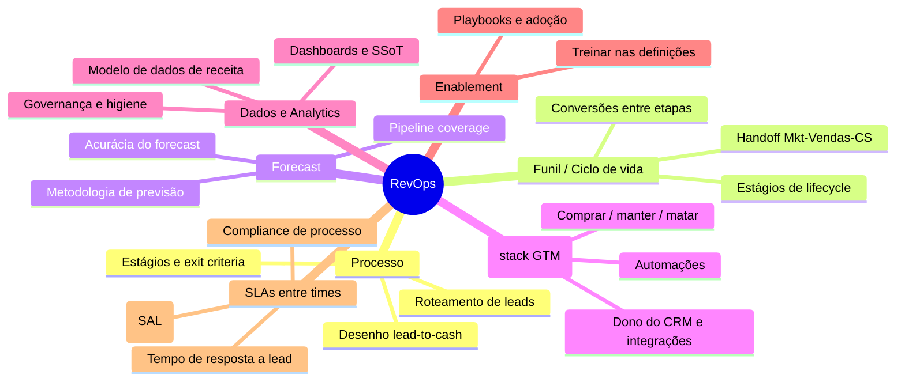
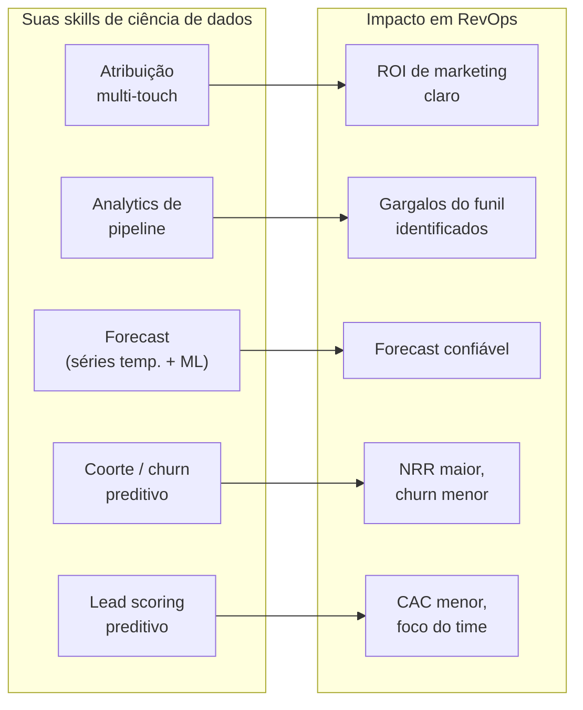

# O papel de RevOps — o que você faz no dia a dia

> Este documento descreve, de forma concreta, o que um profissional de RevOps realmente faz: as responsabilidades centrais (desenho de processo, gestão de funil/ciclo de vida, forecast, posse da stack de GTM, dados e analytics, enablement, SLAs entre times), os níveis de maturidade da função, e uma seção dedicada a **onde o seu perfil de cientista de dados entra** com vantagem competitiva.

## O dia a dia, sem romantismo

RevOps não é "estratégia o tempo todo". Boa parte do trabalho é **traduzir pedidos das áreas de receita em soluções de sistema** — sem criar um emaranhado de campos e automações desnecessárias. Um retrato realista de uma semana:

| Momento | Atividade típica |
|---------|------------------|
| Segunda | Revisar o board de tarefas (Jira/Asana/Trello), fechar o sprint anterior, planejar a semana |
| Execução | Refinar um workflow, testar uma automação, publicar um novo processo no CRM |
| Troubleshooting | Investigar por que um campo não atualiza, consertar automação quebrada, descobrir por que um relatório não bate com a realidade |
| Análise | Montar/atualizar dashboards, investigar uma queda de conversão, preparar dados para a reunião de pipeline |
| Reuniões | Pipeline review semanal, alinhamento Marketing↔SDR, reportar à liderança |

> A imagem mental certa: RevOps é o **"engenheiro civil" da máquina de receita** — desenha, constrói e refina a estrada do lead-ao-caixa (*lead-to-cash*), garantindo que não haja engarrafamentos.

## Responsabilidades centrais

| Responsabilidade | O que significa na prática |
|------------------|----------------------------|
| **Desenho de processo** | Mapear e refinar o lead-to-cash: cada estágio com critério de entrada, critério de saída, SLA e o workflow no sistema que o força a acontecer |
| **Gestão de funil/ciclo de vida** | Definir os estágios de lifecycle (lead → MQL → SQL → oportunidade → cliente → expansão), medir conversão entre eles, achar onde vaza |
| **Forecast** | Definir a metodologia de previsão, manter a higiene de CRM que a alimenta, medir a acurácia do forecast |
| **Posse da stack de GTM** | Ser dono técnico do CRM e das integrações; decidir o que comprar, manter e descontinuar (ver [`04-stack-ferramentas.md`](./04-stack-ferramentas.md)) |
| **Dados e analytics** | Ser dono do modelo de dados de receita, construir a fonte única de verdade, garantir que os números batem |
| **Enablement** | Treinar as áreas nas definições compartilhadas, nos novos processos e relatórios; garantir adoção |
| **SLAs entre times** | Definir e *medir* os acordos: tempo de resposta a lead, critérios de aceite, compliance de estágio (ver [`05-processos-e-frameworks.md`](./05-processos-e-frameworks.md)) |

## Os papéis dentro de RevOps

Conforme a função cresce, ela se especializa. Você provavelmente começará acumulando vários desses papéis:

| Papel | Foco | Seu fit |
|-------|------|---------|
| **RevOps Analyst** | Relatórios, dashboards, qualidade de dados, análises ad hoc | Altíssimo — é onde sua ciência de dados entra direto |
| **RevOps Manager** | Desenho de processo, posse de sistema, coordenação entre áreas | Alvo de médio prazo |
| **Systems/Platform Admin** | Administração de CRM, automações, integrações | A aprender (lado técnico, você pega rápido) |
| **Deal Desk Analyst** | Aprovação de descontos, termos, estrutura de negócio | Especialização posterior |
| **Head of RevOps / VP** | Estratégia, liderança, assento na mesa de receita | Horizonte de carreira |

## Níveis de maturidade da função

Use esta escala para diagnosticar onde sua empresa está hoje — e para definir o destino. Os quatro pilares (pessoas, processo, tecnologia, dados) são avaliados de 1 a 5.

| Nível | Como se parece | Sinais |
|-------|----------------|--------|
| **1 — Inexistente/Ad hoc** | Sem função dedicada, sem processos documentados, ninguém dono da stack | Tudo em planilhas; cada área com sua verdade |
| **2 — Reativo** | RevOps existe mas atende pedidos em vez de dirigir estratégia; SLAs no papel, não medidos | "Helpdesk de CRM"; processos documentados mas não seguidos |
| **3 — Definido** | Time de 2–5 pessoas com papéis claros; RevOps tem assento na mesa de receita; definições e estágios publicados, treinados e *enforced* | SLAs medidos semanalmente; sabe-se quando um SLA é furado e por quê |
| **4 — Estratégico** | Departamento com sub-times; líder de RevOps no time executivo; áreas veem RevOps como parceiro estratégico, não IT interno | Forecast confiável; otimização contínua |
| **5 — Otimizado** | RevOps dirige decisões de GTM com modelos preditivos; experimentação contínua | Dados antecipam, não só reportam |

> Estimativas de mercado indicam que sair do Nível 1 para o Nível 3 costuma render melhora de dois dígitos em win rate e ciclos de venda mais rápidos. **Seu objetivo nos primeiros 90 dias é mover a empresa de 1/2 para 2/3** — não tentar chegar ao 5 de imediato (ver [`06-roadmap-90-dias.md`](./06-roadmap-90-dias.md)).

## Onde seu perfil de cientista de dados entra

Esta é a sua maior vantagem. RevOps é a única função de go-to-market onde **ciência de dados é trabalho central, não acessório**. Cinco frentes onde você entra na frente de um RevOps "tradicional" (que veio de vendas e não modela):

### 1. Atribuição de receita

Você já lida com atribuição na publicidade. Em RevOps, o desafio é atribuir **receita fechada** (não só leads) aos pontos de contato.

| Modelo de atribuição | Quando usar | Sua contribuição |
|----------------------|-------------|------------------|
| First-touch / Last-touch | Simples, ponto de partida | Implementar e explicar limitações |
| Linear / Time-decay | Jornadas multi-touch | Construir no BI/warehouse |
| Data-driven / Markov / Shapley | Quando há volume de dados | **Modelagem própria — vantagem clara** |

### 2. Analytics de pipeline

Decompor o **pipeline velocity** nos seus quatro componentes (nº de oportunidades × ticket médio × win rate ÷ ciclo de venda) e descobrir qual alavanca mexer. Análise de funil, detecção de gargalos, identificação de negócios "presos" (*stuck deals*). É análise exploratória aplicada — seu pão com manteiga.

### 3. Modelos de forecast

A maioria das empresas faz forecast de pipeline ponderado (*weighted pipeline*) na unha. Você pode subir o nível com **séries temporais** (tendência + sazonalidade) e **modelos de ML** que preveem se e quando um negócio fecha. Estima-se que ML bem feito melhora a acurácia em ordem de 15–30% sobre o pipeline ponderado — desde que a higiene de CRM esteja boa (por isso a higiene vem primeiro). Apenas uma fração pequena dos times atinge 90%+ de acurácia; aqui há espaço claro para você criar valor. Detalhes em [`05-processos-e-frameworks.md`](./05-processos-e-frameworks.md).

### 4. Coorte e retenção

O lado direito do bowtie (retenção/expansão) é onde a análise de coorte é rei: coortes por mês de aquisição, curvas de retenção, NRR/GRR por segmento, identificação de risco de churn. Modelagem de **churn preditivo** é literalmente classificação supervisionada — terreno conhecido.

### 5. Lead scoring

Saia do scoring por regras ("+10 pontos se abriu email") para **lead scoring preditivo**: treine um modelo na sua base histórica de conversão para rankear leads pela probabilidade real de fechar. Reduz CAC e foca o time de vendas nos leads de maior fit. Cuidado: comece simples e *evidence-based* (qual atributo histórico realmente correlaciona com fechamento) antes de partir para ML — modelo complexo sobre dados sujos é pior que regra simples sobre dados limpos.

### A lacuna a fechar (seja honesto consigo)

Sua vantagem em dados não substitui o que falta. As três lacunas que você precisa fechar com prioridade:

| Lacuna | Por que importa | Como fechar |
|--------|-----------------|-------------|
| **Processo de vendas** | Sem entender estágios e exit criteria, seus modelos predizem cima de dados que não refletem a realidade comercial | Sentar com AEs, mapear o processo real, ler [`05-processos-e-frameworks.md`](./05-processos-e-frameworks.md) |
| **Higiene de CRM** | Modelo de forecast sobre CRM sujo = lixo entra, lixo sai | Auditoria de dados como primeira entrega ([`06-roadmap-90-dias.md`](./06-roadmap-90-dias.md)) |
| **Vocabulário comercial** | Você precisa falar "win rate, ACV, quota coverage" com fluência para ter credibilidade com Vendas | [`03-metricas-e-kpis.md`](./03-metricas-e-kpis.md) é o seu glossário |

## Referências

- Revenue Operations Alliance — *What does a revenue operations leader actually do?* — https://www.revenueoperationsalliance.com/a-day-in-the-life-of-a-revops-lead/
- Revenue Operations Alliance — *What does a revenue operations analyst do?* — https://www.revenueoperationsalliance.com/what-does-a-revenue-operations-analyst-do-and-how-much-are-they-paid/
- SyncGTM — *RevOps Maturity Model: Where Does Your Team Stand?* — https://syncgtm.com/blog/revops-maturity-model
- SyncGTM — *What Does a RevOps Manager Do? Responsibilities and Skills Explained* — https://syncgtm.com/blog/revops-manager-responsibilities-skills
- The Pedowitz Group — *How to Build a RevOps Function from Scratch* — https://www.pedowitzgroup.com/blog/how-to-build-a-revops-function-from-scratch-a-step-by-step-guide
- EverAfter — *RevOps (Revenue Operations): AI-Driven Strategy Guide* — https://www.everafter.ai/glossary/revops
- Jeff Ignacio (RevEngine) — *Evidence based Lead Scoring models* — https://revengine.substack.com/p/evidence-based-lead-scoring-models
