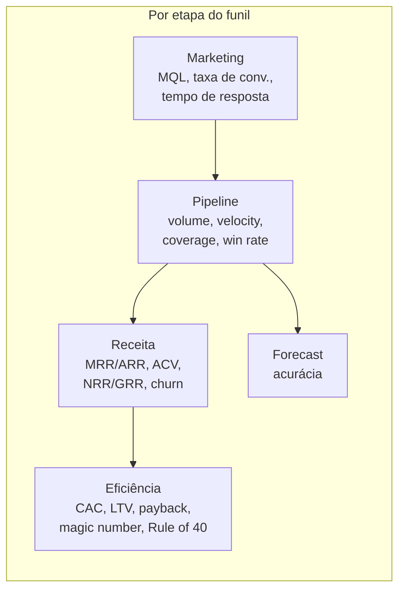

# Métricas e KPIs de RevOps — fórmulas, benchmarks e o que medir

> Este documento é o seu glossário operacional de métricas, organizado por etapa do funil: métricas de pipeline, de receita, de eficiência, do handoff Marketing→Vendas e de acurácia de forecast. Cada métrica vem com fórmula, benchmark saudável (quando existe) e uma nota sobre quais um cientista de dados consegue instrumentar bem. Use-o para ganhar fluência no vocabulário comercial e para decidir o que colocar no seu dashboard de fonte única de verdade.

## Regra de ouro: poucas métricas, bem escolhidas

Os melhores dashboards de RevOps acompanham **8 a 12 KPIs centrais**. Mais que isso é ruído. Para um CRO/diretor comercial, as três métricas que mais importam costumam ser: **pipeline coverage, win rate e acurácia de forecast**. Comece por elas.

## 1. Métricas de pipeline

| Métrica | Fórmula | Benchmark saudável | Nota p/ cientista de dados |
|---------|---------|--------------------|----------------------------|
| **Pipeline volume** | Soma do valor das oportunidades abertas | Depende da meta; ver coverage | Trivial — agregação de CRM |
| **Pipeline coverage** | Pipeline qualificado ÷ meta de receita do período | **3x a 5x**. Abaixo de 3x = depende de heroísmo; acima de 5x = qualificação frouxa | Fácil; o desafio é definir "qualificado" |
| **Win rate** | Negócios ganhos ÷ (ganhos + perdidos) | **~20–30%** para SaaS enterprise | Médio — segmentar por fonte/segmento revela muito |
| **Sales cycle length** | Tempo médio do estágio inicial ao fechamento | **30–60 dias** (SMB); **90–180 dias** (enterprise) | Fácil; cuidado com outliers (use mediana) |
| **Pipeline velocity** | (Nº de oportunidades × ticket médio × win rate) ÷ ciclo de venda | Quanto maior, melhor; acompanhe a tendência | **Sua métrica favorita** — combina 4 alavancas; decomponha para achar onde mexer |

> **Pipeline velocity** é a métrica mais completa de pipeline porque junta quatro variáveis em um número. Aumentar receita é mexer numa dessas quatro alavancas. Como cientista de dados, você consegue mostrar à liderança qual alavanca tem maior retorno marginal.

## 2. Métricas de receita

| Métrica | O que é / fórmula | Benchmark saudável | Nota |
|---------|-------------------|--------------------|------|
| **MRR** | Receita recorrente mensal | — | Base de quase tudo em SaaS |
| **ARR** | Receita recorrente anual = MRR × 12 | — | Métrica de board |
| **ACV** | *Annual Contract Value* — valor anual médio por contrato | Depende do segmento | Útil para capacity/quota |
| **NRR** | *Net Revenue Retention* = (MRR início + expansão − contração − churn) ÷ MRR início | **>110% sólido; >125% excepcional** | Lado direito do bowtie; coorte ajuda muito |
| **GRR** | *Gross Revenue Retention* = (MRR início − contração − churn) ÷ MRR início (sem expansão) | Quanto mais perto de 100%, melhor | GRR ≤ NRR sempre |
| **Churn (logo)** | Clientes perdidos ÷ clientes no início | Quanto menor, melhor | Classificação preditiva de churn |
| **Churn (receita)** | MRR perdido ÷ MRR início | Quanto menor, melhor | Distinguir de logo churn |

> **NRR > 100%** significa que sua base cresce mesmo sem nenhum cliente novo — é o santo graal de receita recorrente. É também onde sua **análise de coorte** prova valor: NRR por coorte de aquisição mostra se clientes mais recentes retêm melhor ou pior que os antigos.

## 3. Métricas de eficiência (unit economics)

São as métricas que a liderança e investidores olham para saber se o crescimento é **saudável** ou comprado a qualquer custo.

| Métrica | Fórmula | Benchmark saudável | Nota |
|---------|---------|--------------------|------|
| **CAC** | (Gasto total Vendas + Marketing) ÷ nº de novos clientes no período | Depende do ACV | Cuidado em alocar custos corretamente |
| **LTV** | (ARPA × margem bruta) ÷ taxa de churn | — | Depende de churn estável; cuidado em base nova |
| **LTV:CAC** | LTV ÷ CAC | **≥ 3:1**. Abaixo de 3 = caro demais; acima de 5 = pode estar subinvestindo em crescimento | Razão clássica de eficiência |
| **CAC payback** | CAC ÷ (ARPA × margem bruta), em meses | **≤ 12 meses** é bom; mediana SaaS recente ~18 meses | Use margem bruta, não receita |
| **Magic Number** | (ΔReceita recorrente do trimestre × 4) ÷ gasto S&M do trimestre anterior | **> 0,75** = eficiente; **< 0,5** = repensar | Não usa margem bruta (diferença do payback) |
| **Rule of 40** | % crescimento de receita + % margem de lucro | **≥ 40%** | Métrica de board para equilíbrio crescimento×lucro |

> **Diferença sutil que dá credibilidade:** o CAC payback usa **margem bruta** (R$1 de receita não é R$1 de caixa que você pode reinvestir); o magic number, não. Saber explicar isso numa reunião te posiciona como alguém que entende de finanças de receita, não só de dados.

## 4. Handoff Marketing → Vendas

Aqui mora o atrito mais comum entre as áreas. As definições e os SLAs estão em [`05-processos-e-frameworks.md`](./05-processos-e-frameworks.md); aqui ficam as **métricas**.

| Métrica | Definição | Benchmark | Nota |
|---------|-----------|-----------|------|
| **Volume de MQL** | Leads que atingem o score/critério de marketing | — | Cuidado: volume sem qualidade é vaidade |
| **Taxa MQL→SQL** | SQLs ÷ MQLs | **~13–15%** média B2B; varia muito por indústria | Mede a qualidade real do MQL |
| **Taxa SAL→SQL (aceite)** | Leads aceitos virando qualificados | **30–50%** saudável; <30% = scoring frouxo ou SLA fraco | Bom termômetro de alinhamento |
| **Lead response time** | Tempo entre lead chegar e primeiro contato de vendas | Quanto menor, melhor (ver abaixo) | Fácil de instrumentar; alto impacto |
| **MQL→SQL→Won (cascata)** | Conversão composta ao longo do funil | — | Decompor mostra onde vaza |

**O dado que vai te dar munição:** empresas que respondem a um lead na **primeira hora** reportam taxa de conversão muito superior à de quem responde após 24h; responder em **5 minutos** chega a multiplicar por ~9x a chance de conversão frente a esperar mais. Tempo de resposta a lead é um SLA barato de instrumentar e de altíssimo retorno — um forte candidato a **quick win** para você ([`06-roadmap-90-dias.md`](./06-roadmap-90-dias.md)).

> Trate os números de conversão como **ordem de grandeza por benchmark de mercado**, não como lei. O valor real é medir os *seus* números e acompanhar a tendência.

## 5. Acurácia de forecast

| Métrica | Fórmula | Benchmark | Nota |
|---------|---------|-----------|------|
| **Forecast accuracy** | 1 − \|previsto − realizado\| ÷ realizado | Dentro de **±10%** é considerado bom | Apenas uma fração pequena dos times atinge 90%+ |
| **Forecast bias** | Tendência sistemática de superestimar/subestimar | Próximo de zero | Detectável só com histórico; análise estatística sua |

Métodos de forecast (categórico, ponderado, séries temporais, IA) e como melhorar a acurácia estão detalhados em [`05-processos-e-frameworks.md`](./05-processos-e-frameworks.md). A mensagem aqui: **acurácia de forecast é uma métrica que você, cientista de dados, pode mover mais que qualquer outra pessoa do time** — é medição + modelagem + higiene de dados, tudo no seu domínio.

## Quais métricas um cientista de dados instrumenta melhor

| Nível de vantagem | Métricas |
|-------------------|----------|
| **Vantagem clara (faça você mesmo)** | Pipeline velocity decomposta, atribuição de receita, NRR/GRR por coorte, churn preditivo, lead scoring, acurácia e viés de forecast |
| **Fácil (instrumente cedo)** | Pipeline coverage, win rate, sales cycle, lead response time, taxas de conversão do funil |
| **Exige contexto comercial (valide com Vendas/Finanças)** | CAC (alocação de custos), LTV (premissas de churn), magic number, Rule of 40 |

## O dicionário de métricas (entregável seu)

Um dos primeiros entregáveis que provam valor é um **dicionário de métricas**: para cada KPI, a definição exata, a fórmula, a fonte de dados, o dono e a cadência de revisão. Sem isso, "win rate" significa coisas diferentes para cada pessoa, e nenhum dashboard será confiável. Modelo de tabela para o dicionário:

| Métrica | Definição | Fórmula | Fonte (sistema) | Dono | Cadência |
|---------|-----------|---------|-----------------|------|----------|
| Win rate | ... | ganhos ÷ (ganhos+perdidos) | CRM | RevOps | Semanal |
| ... | ... | ... | ... | ... | ... |

## Referências

- Landbase — *The RevOps KPI Dashboard: 12 Metrics That Actually Matter in 2026* — https://www.landbase.com/blog/revops-kpi-dashboard-12-metrics-2026
- The RevOps Report — *The 25 RevOps KPIs That Actually Matter* — https://therevopsreport.com/insights/revops-kpis-metrics/
- The SaaS CFO — *How to Calculate the SaaS Magic Number* — https://www.thesaascfo.com/calculate-saas-magic-number/
- The SaaS CFO — *The Rule of 40 SaaS* — https://www.thesaascfo.com/rule-of-40-saas/
- Drivetrain — *CAC Payback Period – Formula, Benchmarks and How to Reduce It* — https://www.drivetrain.ai/strategic-finance-glossary/cac-payback-period-formula-benchmarks-and-how-to-reduce-it
- Beancount.io — *The 2026 SaaS Metrics Stack: LTV, CAC, NRR, and the Rule of 40* — https://beancount.io/blog/2026/05/10/saas-metrics-founders-must-track-2026-ltv-cac-nrr-churn-cac-payback-benchmarks-guide
- Understory — *MQL to SQL Conversion Rate Benchmarks: B2B SaaS* — https://www.understoryagency.com/blog/mql-to-sql-conversion-rate-benchmarks
- Drivetrain — *Essential bowtie funnel metrics* — https://www.drivetrain.ai/post/essential-saas-bowtie-funnel-metrics
