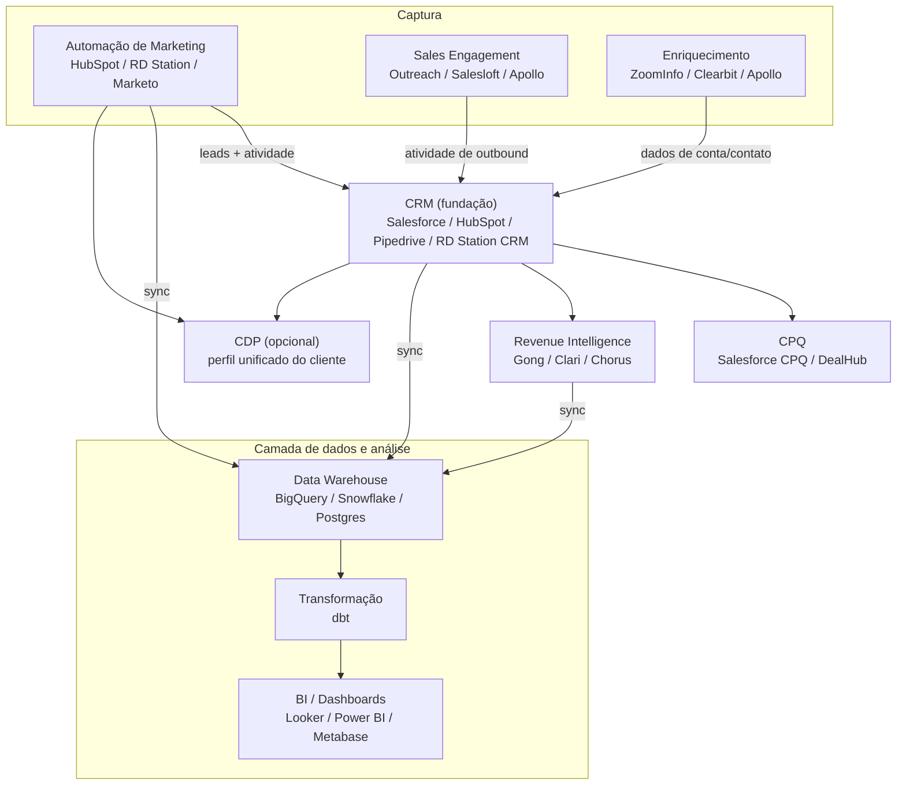
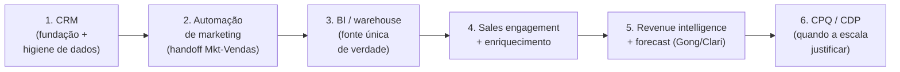

# A stack de ferramentas de RevOps — CRM, automação, BI e revenue intelligence

> Este documento mapeia a stack de tecnologia que vive sob RevOps: CRM, automação de marketing, sales engagement, CPQ, dados/BI & analytics, revenue intelligence, enriquecimento de dados e CDP. Traz tabela comparativa, o que priorizar, como os dados fluem entre as camadas (diagrama), e opções acessíveis/open-source pensadas para uma empresa brasileira. RevOps decide o que comprar, manter e descontinuar — então você precisa conhecer o terreno.

## As camadas da stack

Pense na stack de RevOps como um conjunto de camadas, não uma lista de produtos. O **CRM é a fundação** (a fonte de verdade transacional); tudo se conecta a ele.

> Princípio de RevOps: toda atividade (e-mail enviado, ligação, reunião) precisa **registrar de volta no CRM automaticamente**. Ferramentas que guardam a atividade no próprio sistema, sem sincronizar com o CRM, criam buracos de atribuição. Esse é o critério nº 1 ao avaliar qualquer ferramenta de captura.

## Camada por camada

### CRM — a fundação

| Ferramenta | Perfil ideal | Pontos fortes | Observação |
|------------|--------------|---------------|------------|
| **Salesforce Sales Cloud** | Mid-market e enterprise | Maior ecossistema de integrações, customização infinita | Caro e complexo; exige admin dedicado |
| **HubSpot** | SMB a mid-market | Fácil de usar, marketing+vendas+CS no mesmo lugar | Custos escalam com contatos |
| **Pipedrive** | Times de vendas pequenos | Simples, foco em pipeline visual | Pouco para CS/marketing |
| **RD Station CRM** | **PMEs brasileiras** | Integra nativo com RD Station Marketing e WhatsApp; em português; suporte local | Menos robusto que Salesforce para enterprise |

### Automação de marketing

| Ferramenta | Perfil ideal | Observação |
|------------|--------------|------------|
| **HubSpot Marketing Hub** | SMB/mid-market | Mesma plataforma do CRM HubSpot — menos atrito de integração |
| **Marketo (Adobe)** | Enterprise | Poderosa, complexa; ecossistema enterprise |
| **RD Station Marketing** | **Mercado brasileiro** | Líder no Brasil, ~25 mil clientes, parte do grupo TOTVS; em português, com automação conversacional e WhatsApp |

> **Nota Brasil:** para uma empresa brasileira de PME/mid-market B2B, a dupla **RD Station Marketing + RD Station CRM** é a escolha de menor atrito: tudo em português, integração nativa, WhatsApp, suporte local e preço em real. Avalie Salesforce/HubSpot quando a operação ganhar escala internacional ou complexidade que o RD não cobre.

### Sales engagement

| Ferramenta | Perfil | Observação |
|------------|--------|------------|
| **Outreach** | Enterprise | Sequências de outbound, líder de mercado |
| **Salesloft** | Mid-market/enterprise | Concorrente direto do Outreach |
| **Apollo** | SMB/mid-market | Combina base de dados + engagement num preço acessível |

### CPQ (Configure, Price, Quote)

Automatiza configuração de produto, precificação e geração de propostas/contratos. Relevante quando o catálogo é complexo ou há muitos descontos a controlar (liga-se ao **deal desk**, ver [`05-processos-e-frameworks.md`](./05-processos-e-frameworks.md)).

| Ferramenta | Observação |
|------------|------------|
| **Salesforce CPQ** | Nativo no Salesforce; melhor para quem já está nesse ecossistema |
| **DealHub / outros** | Alternativas independentes de CRM |

### Dados / BI & analytics — sua casa

Esta é a camada onde seu perfil de cientista de dados é decisivo. É aqui que se constrói a **fonte única de verdade**.

| Componente | Opções | Observação |
|------------|--------|------------|
| **Data warehouse** | BigQuery, Snowflake, Redshift, **Postgres** (econômico) | Centraliza dados de CRM + marketing + produto |
| **Transformação** | **dbt** | Padrão de mercado; versiona e testa a lógica de métricas (ótimo para o dicionário de métricas) |
| **BI / dashboards** | Looker, Power BI, **Metabase** (open source) | A camada que o time inteiro consome |

### Revenue intelligence

Capturam e analisam conversas de vendas (ligações, reuniões) e a saúde do pipeline com IA.

| Ferramenta | Foco |
|------------|------|
| **Gong** | Conversation intelligence; analisa chamadas, dá coaching e sinais de deal |
| **Clari** | Revenue intelligence e forecast; visibilidade de pipeline |
| **Chorus (ZoomInfo)** | Conversation intelligence |

### Enriquecimento de dados

Mantêm a base de contas/contatos completa e atualizada — insumo direto para qualidade de dados e lead scoring.

| Ferramenta | Observação |
|------------|------------|
| **ZoomInfo** | Maior base B2B; integração nativa com Salesforce e HubSpot |
| **Clearbit** | Enriquecimento via web/API |
| **Apollo** | Base + engagement, custo acessível |

> **Nota Brasil:** bases globais (ZoomInfo, Clearbit) têm cobertura desigual de empresas brasileiras. Avalie complementar com fontes locais e enriquecimento via **CNPJ** (dados públicos da Receita Federal) para qualificar contas brasileiras.

### CDP (Customer Data Platform)

Unifica o perfil do cliente a partir de várias fontes. **Não é prioridade inicial** — é uma camada que faz sentido em operações maduras com muitos pontos de contato. Para a maioria das PMEs B2B, um warehouse bem modelado faz o papel de "perfil unificado" sem o custo de um CDP dedicado.

## O que priorizar — a ordem de adoção

Não compre tudo de uma vez. A regra é adicionar camadas conforme ARR e tamanho de time justificam:

| Prioridade | Camada | Por quê primeiro |
|------------|--------|------------------|
| 1 | CRM limpo | Sem fonte de verdade, nada mais funciona |
| 2 | Automação de marketing integrada ao CRM | Conserta o handoff, o atrito mais comum |
| 3 | BI / warehouse | Sua maior alavanca; acaba com a briga de números |
| 4 | Sales engagement + enriquecimento | Produtividade de outbound + dados melhores |
| 5 | Revenue intelligence | Quando há volume de deals para a IA analisar |
| 6 | CPQ / CDP | Só quando a complexidade/escala exigir |

## Stack econômica/open-source para empresa brasileira

Você não precisa de um orçamento enterprise para fazer RevOps direito. Uma stack enxuta e poderosa:

| Camada | Opção econômica/open-source | Comentário |
|--------|------------------------------|------------|
| CRM | **RD Station CRM** ou **HubSpot (free/starter)** | RD para Brasil; HubSpot free é generoso para começar |
| Automação | **RD Station Marketing** | Líder no Brasil, em português |
| Warehouse | **PostgreSQL** (gerenciado em cloud) | Dispensa Snowflake/BigQuery em volumes moderados |
| Transformação | **dbt Core** (open source) | Grátis; versiona a lógica de métricas |
| BI | **Metabase** (open source) | Self-host; dashboards para todo o time |
| Enriquecimento | **Apollo** + dados de **CNPJ** (Receita) | Custo baixo + cobertura local |

> **Recomendação opinativa:** para uma PME brasileira começando RevOps, a stack **RD Station (Marketing + CRM) + Postgres + dbt Core + Metabase** entrega 80% do valor a uma fração do custo de Salesforce + Marketo + Looker. Suba para ferramentas enterprise só quando uma dor concreta justificar — não por status. E lembre: a stack é meio, não fim; CRM sujo com Gong instalado continua sendo CRM sujo.

## Como os dados fluem (e por que importa para você)

O fluxo de dados é o que sustenta toda a sua análise. A regra prática:

1. **Captura** (marketing, sales engagement, enriquecimento) → escreve no **CRM**.
2. **CRM** → sincroniza para o **warehouse** (junto com dados de marketing e produto).
3. **Warehouse** → **dbt** transforma e aplica as definições do dicionário de métricas.
4. **dbt** → **BI** expõe os dashboards (a fonte única de verdade).

Quebras nesse fluxo (atividade que não loga no CRM, sync que falha, definição divergente no BI) são a causa raiz de "os números não batem". Mapear e blindar esse fluxo é trabalho central de RevOps — e é exatamente engenharia de dados, seu terreno.

## Referências

- The Pedowitz Group — *The RevOps Tech Stack: 12 Tools That Actually Belong Together* — https://www.pedowitzgroup.com/blog/the-revops-tech-stack-12-tools-that-actually-belong-together
- revops.tools — *The Modern RevOps Tech Stack in 2026* — https://revops.tools/the-modern-revops-tech-stack-in-2026-architecture-best-practices-and-tools/
- Cognism — *8 Best RevOps Tools for 2026* — https://www.cognism.com/blog/revops-tools
- Revenue.io — *The Ultimate Revenue Operations Tool List for 2026* — https://www.revenue.io/blog/revops-tool-guide
- RD Station — site oficial — https://www.rdstation.com/
- SunsetHQ — *RD Station Acquisition: Key Details, Impact, and What Comes Next* — https://www.sunsethq.com/blog/rd-station-acquisition
