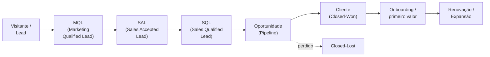
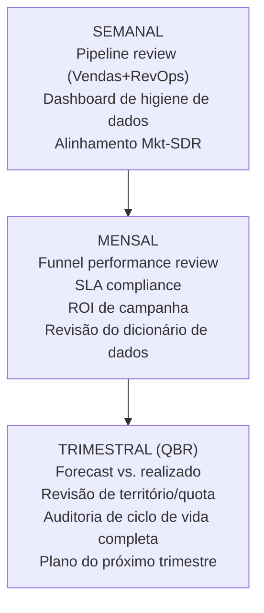

# Processos e frameworks de RevOps — do lead ao caixa

> Este documento detalha os processos que operacionalizam a receita: o ciclo de vida do lead e os estágios de lifecycle, roteamento e scoring de leads, as definições de MQL→SQL e os SLAs entre Marketing e Vendas, os estágios de oportunidade com critérios de saída, as metodologias de forecast (categórico, ponderado, séries temporais e IA), planejamento de território/quota/capacidade, deal desk, a cadência de reuniões de RevOps e a governança/higiene de dados. É o documento que fecha a sua principal lacuna: o vocabulário e o método do processo comercial.

## O ciclo de vida (lifecycle) — visão geral

A jornada do lead-ao-caixa (*lead-to-cash*) atravessa Marketing, Vendas e CS. Cada transição precisa de **critério de entrada, critério de saída, SLA e o workflow no sistema que força a transição a acontecer**. Essa é a essência do desenho de processo de RevOps.

| Estágio | Dono | Critério de entrada (exemplo) |
|---------|------|-------------------------------|
| Lead | Marketing | Capturou contato (formulário, evento) |
| **MQL** | Marketing | Atingiu score/critério de engajamento + fit de ICP |
| **SAL** | Vendas (SDR) | SDR revisou e *aceitou* o MQL como digno de busca |
| **SQL** | Vendas (SDR/AE) | Conversa confirmou necessidade e autoridade (ex.: BANT/MEDDIC) |
| Oportunidade | Vendas (AE) | Negócio criado no pipeline com valor e data estimados |
| Cliente | Vendas → CS | Contrato assinado (Closed-Won) |
| Renovação/Expansão | CS | Onboarding concluído, cliente em adoção |

## Definições MQL → SAL → SQL (acabe com a guerra)

O atrito clássico Marketing×Vendas vem de **não ter definições compartilhadas**. Fixe-as por escrito e force no sistema:

| Sigla | Definição | Quem é dono |
|-------|-----------|-------------|
| **MQL** — Marketing Qualified Lead | Confirma fit de ICP + engajamento relevante; ainda não vetado por vendas | Marketing |
| **SAL** — Sales Accepted Lead | MQL que Vendas revisou formalmente e aceitou como digno de busca, antes da conversa de qualificação | Vendas (aceite) |
| **SQL** — Sales Qualified Lead | Qualificado por conversa direta, com necessidade e autoridade confirmadas | Vendas |

> O **SAL** é o estágio que muita empresa pula — e é justamente o que torna o handoff mensurável. Se Marketing entrega 100 MQLs e Vendas só aceita 40, ou os MQLs são fracos ou o aceite é negligente. O SAL transforma uma discussão de opinião ("seus leads são ruins" × "seu time não trabalha os leads") em um **número** que RevOps audita.

## SLAs entre Marketing e Vendas

O SLA é um acordo de duas vias, e RevOps é o árbitro neutro que **mede** o cumprimento:

| SLA | Compromisso de Marketing | Compromisso de Vendas |
|-----|--------------------------|------------------------|
| Volume | Entregar X MQLs/mês dentro do ICP | — |
| Qualidade | MQLs com fit de ICP comprovado | Aceitar/rejeitar com motivo (alimenta o feedback) |
| **Tempo de resposta** | — | Contatar novo MQL dentro do SLA (ex.: 2h para sinais de alta intenção; idealmente minutos) |
| Feedback loop | Ajustar scoring com base no aceite | Registrar motivo de rejeição no CRM |

**Benchmarks de referência** (trate como ordem de grandeza): taxa MQL→SQL saudável ~13–15%; taxa de aceite (SAL→SQL) saudável de 30–50%; e tempo de resposta tem impacto enorme — responder na 1ª hora supera muito a resposta após 24h (ver [`03-metricas-e-kpis.md`](./03-metricas-e-kpis.md)).

## Roteamento e scoring de leads

**Roteamento (routing):** regra que define qual vendedor/time recebe cada lead. RevOps é o dono (com Marketing e Vendas consultados). Critérios comuns: território, segmento, tamanho de conta, round-robin, ou conta nominal (named account).

**Scoring:** prioriza leads pela probabilidade de fechar.

| Tipo de scoring | Como funciona | Quando usar |
|-----------------|---------------|-------------|
| **Por regras** | Pontos por atributo/comportamento (ex.: +10 abriu e-mail, +20 cargo de decisor) | Ponto de partida; transparente |
| **Evidence-based** | Regras *calibradas* pelo que historicamente correlaciona com fechamento | Quando há histórico; antes de ML |
| **Preditivo (ML)** | Modelo treinado na base de conversão rankeia por probabilidade | Quando há volume e dados limpos |

> **Para você:** a tentação é pular direto para ML. Resista. Comece com scoring *evidence-based* (descubra, com seus dados, quais atributos realmente predizem fechamento), valide com Vendas, e só então evolua para modelo preditivo. Modelo complexo sobre CRM sujo é pior que regra simples sobre dados limpos.

## Estágios de oportunidade e critérios de saída

Dentro do pipeline, cada oportunidade avança por estágios. O erro comum é estágios baseados em **tempo/sentimento** ("acho que vai fechar") em vez de **evidência verificável**. Cada estágio deve ter um **exit criterion** objetivo:

| Estágio (exemplo) | Critério de saída (evidência para avançar) |
|-------------------|--------------------------------------------|
| Qualificação | Necessidade, autoridade e orçamento confirmados; reunião agendada |
| Descoberta/Diagnóstico | Dor mapeada, stakeholders identificados, fit técnico validado |
| Proposta | Proposta enviada e reconhecida pelo cliente |
| Negociação | Termos/preço em discussão; aprovação interna (deal desk) se necessário |
| Fechamento | Contrato em assinatura |
| Closed-Won / Closed-Lost | Assinado / encerrado com motivo registrado |

> Estágios com exit criteria objetivos são a **base de um forecast confiável** e dos seus modelos. Se o estágio "Proposta" significa coisas diferentes para cada AE, a probabilidade ponderada daquele estágio é ficção. Padronizar isso é trabalho de RevOps — e pré-requisito da sua modelagem.

## Metodologias de forecast

| Método | Como funciona | Prós | Contras | Seu papel |
|--------|---------------|------|---------|-----------|
| **Categórico** | AE classifica deals em "commit / best case / pipeline" | Simples, rápido | Subjetivo, viesado | Medir o viés histórico |
| **Ponderado (weighted pipeline)** | Valor × probabilidade do estágio | Objetivo, fácil de automatizar | Probabilidade do estágio costuma estar errada | Recalibrar as probabilidades com dados reais |
| **Séries temporais** | Projeta a partir do histórico (tendência + sazonalidade) | Ótimo p/ ciclos curtos / PLG | Ignora o pipeline atual | **Construir você mesmo** |
| **IA / ML** | Modelo prevê se e *quando* o deal fecha | Maior acurácia (~+15–30% sobre ponderado) | Exige dados limpos e volume | **Sua maior alavanca** |

> Na prática, combine: use o ponderado/categórico como baseline operacional e o de ML como "segunda opinião" que aponta deals superestimados. Lembre que apenas uma fração pequena dos times atinge 90%+ de acurácia, e que a higiene de CRM é o que separa um modelo bom de lixo. **Estabeleça a baseline antes de prometer o modelo sofisticado.**

## Território, quota e capacidade

| Conceito | O que é | Cadência |
|----------|---------|----------|
| **Território** | Como as contas são divididas entre vendedores (vertical, segmento, geografia, named accounts) | Revisar a cada trimestre, não 1x/ano |
| **Quota** | Meta de receita por vendedor/time | Anual com ajuste; derivada da meta da empresa |
| **Capacidade** | Quantos vendedores × produtividade esperada × quota = capacidade de receita | Planejar antes do ciclo fiscal |

A lógica que liga os três: a partir das **taxas de conversão e volumes** (que você instrumenta), estima-se quantas contas/oportunidades um vendedor precisa para bater a quota — e isso define a capacidade necessária. É um modelo quantitativo — território/quota/capacidade é onde sua matemática encontra o planejamento comercial.

## Deal desk

O **deal desk** é o processo centralizado de aprovação de negócios não-padrão: descontos fora da política, termos especiais, escopo de serviços. RevOps mede o **tempo de resposta (turnaround)** do deal desk — um deal desk lento trava receita. Em empresas menores, é uma regra simples de aprovação; em maiores, vira função dedicada e se apoia em CPQ (ver [`04-stack-ferramentas.md`](./04-stack-ferramentas.md)).

## A cadência de RevOps

RevOps roda em um ritmo de reuniões e revisões. Estabelecer essa cadência é um entregável concreto seu:

| Cadência | Reunião | Foco | Dono |
|----------|---------|------|------|
| Semanal | Pipeline review | Saúde do pipeline, deals em risco | Vendas + RevOps |
| Semanal | Dashboard de higiene | Duplicatas, campos vazios, deals parados | RevOps |
| Quinzenal | Qualidade de MQL | Conversão e aceite de leads | Marketing + SDR |
| Mensal | Funnel performance | Conversões, SLA, ROI de campanha, lifecycle | RevOps |
| Trimestral | **QBR** | Forecast vs. realizado, território/quota, plano | Liderança + RevOps |

## Governança e higiene de dados

Sem dados limpos, nenhuma das análises acima funciona. RevOps é dono da **integridade do modelo de dados de receita**.

| Cadência | Atividade de higiene |
|----------|----------------------|
| Semanal | Dashboard de higiene: contagem de duplicatas, campos obrigatórios vazios, oportunidades "presas" sem atividade |
| Mensal | Revisão do dicionário de dados: o que mudou, o que precisa atualizar |
| Trimestral | Auditoria completa do ciclo de vida: registros parados, campos mortos, definições que derivaram (*drift*) |

**Governança** define as regras do ciclo de vida do dado (coleta, armazenamento, uso, proteção, arquivamento, descarte) e quem pode mudar o quê. Sem governança, cada área cria campos e regras à revelia, e o modelo de dados vira um pântano. Estabelecer a governança é menos glamuroso que modelar — mas é o que torna a modelagem possível. Comece pela auditoria descrita em [`06-roadmap-90-dias.md`](./06-roadmap-90-dias.md).

## Referências

- Default — *MQL vs. SQL vs. SAL: What's the Difference?* — https://www.default.com/post/marketing-qualified-lead-mql-vs-sales-qualified-lead-sql
- Kubaru — *MQL, SAL, SQL: A Complete Guide to Lead Qualification Stages* — https://kubaru.io/blog/mql-sal-sql-lead-qualification-stages/
- Understory — *MQL to SQL Conversion Rate Benchmarks: B2B SaaS* — https://www.understoryagency.com/blog/mql-to-sql-conversion-rate-benchmarks
- Forecastio — *Pipeline Forecasting: The Complete Guide for B2B Sales Teams* — https://forecastio.ai/blog/pipeline-forecasting
- Forecastio — *Time Series Sales Forecasting: Models, Examples, and Best Practices* — https://forecastio.ai/blog/time-series-forecasting
- getMaxiQ — *7 Sales Forecasting Methods Explained (2026 Guide)* — https://www.getmaxiq.com/blog/sales-forecasting-methods
- RevOps Co-op — *How to Design Sales Territories* — https://www.revopscoop.com/post/territory-planning-strategies-tactics
- Umbrex — *RevOps System Design: Lead-to-Cash, KPIs, Governance* — https://umbrex.com/resources/sales-strategy-playbook/sales-ops-and-revenue-operations-revops/
- Revenue Operations Alliance — *Database governance vs database management for RevOps* — https://www.revenueoperationsalliance.com/database-governance-vs-database-management-for-revops/
- MarTech Do — *Unlocking RevOps Growth: Master Your Quarterly Business Reviews* — https://martechdo.com/quarterly-business-reviews/
