# Roadmap de 90 dias — como você começa na função de RevOps

> Este é o seu plano de ação concreto para os primeiros 90 dias, dividido em três fases: **ouvir/auditar** (dias 1–30), **ganhos rápidos** (dias 31–60) e **construir** (dias 61–90). Cada ação está formulada para o seu perfil de cientista de dados, com foco nos entregáveis que provam valor cedo e nas armadilhas mais comuns. A lógica é simples: ganhe credibilidade entendendo antes de mudar, prove valor com uma vitória visível, e só então construa a fundação duradoura.

## Princípio orientador

> **Ouvir → ganhos rápidos → construir.** Não tente consertar tudo no primeiro mês. RevOps que chega "mudando o CRM" sem entender o processo perde credibilidade na primeira semana. Sua autoridade vem de **mostrar o número que ninguém tinha** — e você sabe fazer isso.

```mermaid
gantt
    title Roadmap RevOps 90 dias
    dateFormat  X
    axisFormat %s
    section Fase 1 — Ouvir/Auditar (1–30)
    Entrevistas com stakeholders      :a1, 0, 10
    Auditoria de dados / higiene CRM  :a2, 5, 20
    Mapeamento do funil real          :a3, 10, 25
    section Fase 2 — Ganhos rápidos (31–60)
    Dashboard fonte única de verdade  :b1, 30, 50
    Consertar 1 handoff quebrado      :b2, 35, 55
    Baseline de forecast              :b3, 40, 60
    section Fase 3 — Construir (61–90)
    Dicionário de métricas            :c1, 60, 75
    SLAs entre áreas                  :c2, 65, 85
    Cadência de reporting             :c3, 75, 90
```

## Fase 1 (dias 1–30) — Ouvir e auditar

O objetivo não é entregar; é **entender o estado real** e ganhar a confiança das áreas. Você está mapeando o terreno antes de construir.

| Ação | O que fazer | Por que (e seu ângulo de dados) |
|------|-------------|----------------------------------|
| **Entrevistas com stakeholders** | Conversar com líderes de Vendas, Marketing, CS e com AEs/SDRs na linha de frente. Perguntar: o que te trava? Em qual número você não confia? | Você descobre as dores reais e a quem reporta seu mandato. Anote as definições que cada um usa — vão divergir |
| **Auditoria de dados** | Mapear quais sistemas existem, o que está integrado, onde os dados moram, qual a qualidade (duplicatas, campos vazios, deals parados) | Trabalho de cientista de dados puro. Quantifique a sujeira — vira munição |
| **Checagem de higiene do CRM** | Medir % de campos obrigatórios preenchidos, oportunidades sem atividade recente, registros órfãos | Estabelece a baseline de qualidade. Forecast sobre CRM sujo é lixo |
| **Mapeamento do funil real** | Desenhar o funil como ele *realmente* funciona (não como o org chart diz): estágios, handoffs, onde os leads/deals vazam | Análise de funil = sua especialidade. Use [`05-processos-e-frameworks.md`](./05-processos-e-frameworks.md) como gabarito |

**Entregável da Fase 1:** um diagnóstico de 1 página — estado atual dos quatro pilares (pessoas/processo/tecnologia/dados, ver [`02-papel-e-responsabilidades.md`](./02-papel-e-responsabilidades.md)), nível de maturidade estimado, e as 3 dores mais citadas. Apresente, não como crítica, mas como "aqui está o que encontrei e onde vejo oportunidade".

## Fase 2 (dias 31–60) — Ganhos rápidos

Agora você prova valor com vitórias visíveis. Escolha alvos de **alto impacto e baixo atrito político**.

| Ação | O que entregar | Por que é um bom quick win |
|------|----------------|----------------------------|
| **Dashboard de fonte única de verdade** | Um dashboard (Metabase/Power BI) com os 8–12 KPIs centrais, alimentado por dados conciliados, que substitui as planilhas conflitantes | Acaba com a briga de "qual número está certo". Visível para todos. É a sua casa (BI) |
| **Consertar UM handoff quebrado** | Escolher o atrito mais doloroso (provavelmente o tempo de resposta a lead) e consertá-lo: alerta automático + medição do SLA | Alto impacto, escopo pequeno. Tempo de resposta a lead tem retorno enorme e é barato de instrumentar (ver [`03-metricas-e-kpis.md`](./03-metricas-e-kpis.md)) |
| **Baseline de forecast** | Estabelecer um forecast simples (pipeline ponderado) e começar a medir a acurácia contra o realizado | Cria a régua. Você só pode provar que seu modelo melhora o forecast se tiver a baseline |

> **Por que essa ordem:** o dashboard te dá credibilidade ("finalmente alguém botou os números no mesmo lugar"). O handoff consertado te dá uma vitória de processo ("o RevOps resolveu um problema real"). A baseline de forecast prepara o terreno para sua maior alavanca de médio prazo — os modelos preditivos — sem prometer demais cedo.

### Primeiros entregáveis que provam valor

Concentre-se em coisas **visíveis, conciliadas e usadas em reunião**:

1. **Dashboard de pipeline conciliado** — usado na pipeline review semanal. Substitui as planilhas.
2. **SLA de tempo de resposta a lead instrumentado** — com número antes/depois mostrando melhora.
3. **Decomposição do pipeline velocity** — mostrando qual das 4 alavancas (nº de deals, ticket, win rate, ciclo) tem maior retorno marginal. Isso é insight que ninguém no time consegue produzir sem você.
4. **Diagnóstico de qualidade de dados quantificado** — "X% das oportunidades estão sem campo Y, comprometendo Z" — transforma um problema vago em prioridade.

## Fase 3 (dias 61–90) — Construir a fundação

Com credibilidade e quick wins no bolso, construa o que dura.

| Ação | O que entregar | Conecta com |
|------|----------------|-------------|
| **Dicionário de métricas** | Para cada KPI: definição exata, fórmula, fonte, dono, cadência. Documento vivo, idealmente versionado (dbt) | [`03-metricas-e-kpis.md`](./03-metricas-e-kpis.md) |
| **SLAs entre áreas** | Acordos escritos e *medidos*: MQL→SAL, tempo de resposta, critérios de aceite, feedback loop | [`05-processos-e-frameworks.md`](./05-processos-e-frameworks.md) |
| **Cadência de reporting** | Estabelecer o ritmo: pipeline review semanal, funnel review mensal, QBR trimestral, com donos e pautas | [`05-processos-e-frameworks.md`](./05-processos-e-frameworks.md) |

**Entregável da Fase 3:** a empresa sai do Nível 1/2 de maturidade para o Nível 2/3 — definições compartilhadas publicadas, SLAs medidos, cadência rodando. Esse é um salto realista e defensável em 90 dias.

## Resumo do plano

| Fase | Dias | Lema | Entregável-chave |
|------|------|------|------------------|
| 1 — Ouvir/Auditar | 1–30 | Entender antes de mudar | Diagnóstico dos 4 pilares + nível de maturidade |
| 2 — Ganhos rápidos | 31–60 | Provar valor visível | Dashboard SSoT + 1 handoff consertado + baseline de forecast |
| 3 — Construir | 61–90 | Fundação duradoura | Dicionário de métricas + SLAs + cadência |

## Armadilhas comuns a evitar

| Armadilha | Por que acontece | Como evitar |
|-----------|------------------|-------------|
| **Chegar mudando o CRM** | Vontade de "consertar logo" | Ouça primeiro 30 dias. Mudança sem entendimento gera retrabalho e desconfiança |
| **Construir o modelo de ML antes da higiene** | Sua zona de conforto técnica | Higiene de dados primeiro, sempre. Modelo sobre CRM sujo é lixo com aparência de ciência |
| **Métricas demais no dashboard** | Achar que mais é melhor | 8–12 KPIs. Mais é ruído e menos ação |
| **Virar "helpdesk de CRM"** | Atender pedidos reativamente | Reserve tempo para trabalho estratégico; priorize por impacto na receita, não por quem grita mais |
| **Definir métricas sozinho** | Pressa de padronizar | Co-crie as definições com Vendas/Mkt/CS, senão ninguém adota |
| **Prometer forecast perfeito cedo** | Querer impressionar | Estabeleça a baseline, melhore incrementalmente. Acurácia de 90%+ é rara — não a prometa no mês 2 |
| **Ignorar o lado humano** | Foco só em dados/sistemas | RevOps é 50% relacionamento. Os melhores números não adotados não valem nada |
| **Não clarificar o mandato** | Cargo de fronteira ambíguo | Defina cedo a quem você reporta e qual seu escopo (ver [`01-fundamentos-revops.md`](./01-fundamentos-revops.md)) |

## Seu kit de partida (checklist)

- [ ] Mandato e linha de reporte clarificados com a liderança
- [ ] Inventário de sistemas e integrações feito
- [ ] Baseline de qualidade de dados medida e quantificada
- [ ] Funil real mapeado, com pontos de vazamento identificados
- [ ] Definições atuais de MQL/SQL coletadas de cada área (e suas divergências)
- [ ] Dashboard SSoT no ar com 8–12 KPIs
- [ ] Um handoff consertado, com SLA medido antes/depois
- [ ] Baseline de forecast estabelecida
- [ ] Dicionário de métricas v1 publicado
- [ ] SLAs escritos e em medição
- [ ] Cadência de reuniões definida com donos e pautas

## Referências

- The Pedowitz Group — *How to Build a RevOps Function from Scratch: A Step-by-Step Guide* — https://www.pedowitzgroup.com/blog/how-to-build-a-revops-function-from-scratch-a-step-by-step-guide
- SyncGTM — *RevOps Maturity Model: Where Does Your Team Stand?* — https://syncgtm.com/blog/revops-maturity-model
- Salesmotion — *8 RevOps Best Practices to Scale Revenue in 2026* — https://salesmotion.io/blog/revops-best-practices
- Default — *9 RevOps Best Practices for Streamlining Revenue Performance* — https://www.default.com/post/revops-best-practices
- Landbase — *The RevOps KPI Dashboard: 12 Metrics That Actually Matter in 2026* — https://www.landbase.com/blog/revops-kpi-dashboard-12-metrics-2026
