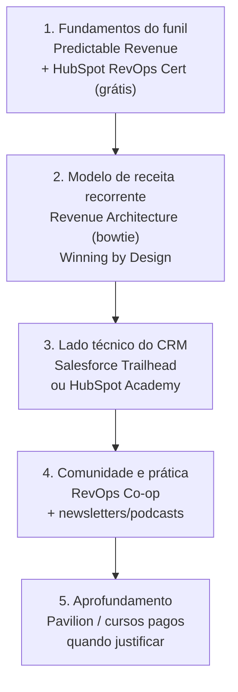

# Referências e trilha de aprendizado — sua biblioteca de RevOps

> Este documento é a sua trilha curada para virar referência em RevOps: os livros fundamentais (Predictable Revenue, Revenue Architecture/bowtie da Winning by Design), os líderes de pensamento e comunidades (RevOps Co-op, Pavilion, Sales Hacker), as certificações que valem o tempo (HubSpot, Salesforce, Pavilion), newsletters e podcasts, e os recursos de contexto brasileiro. Fecha com a bibliografia consolidada de todas as fontes citadas ao longo do dossiê. A trilha está priorizada para o seu perfil — comece pelo que conecta dados a go-to-market.

## Como percorrer esta trilha (sugestão para o seu perfil)

> Você já domina a parte de dados. Sua trilha deve priorizar o **vocabulário e o método comercial** (funil, processo de vendas, receita recorrente) — exatamente sua lacuna ([`02-papel-e-responsabilidades.md`](./02-papel-e-responsabilidades.md)). Pule o que já sabe (estatística, BI) e invista onde tem gap.

## Livros fundamentais

| Livro | Autor(es) | Por que ler | Prioridade p/ você |
|-------|-----------|-------------|--------------------|
| **Predictable Revenue** (2011) | Aaron Ross & Marylou Tyler | Raiz cultural do funil previsível e da especialização de papéis (SDR/AE, "Cold Calling 2.0"). Construído sobre a experiência na Salesforce.com | Alta — base histórica |
| **Revenue Architecture** | Jacco van der Kooij (Winning by Design) | O "livro-texto" por trás do modelo bowtie e da "fábrica de receita"; 250+ diagramas/blueprints operacionalizando processo, métricas e systems design. Derivado do trabalho com 1.000+ empresas SaaS | Altíssima — é o framework central |
| **The SaaS Sales Method** | Jacco van der Kooij, Dominique Levin et al. | Fundamentos de conversas de venda em SaaS; parte da série "Sales Blueprints" da Winning by Design | Média — complementar |

> **Comece por Revenue Architecture.** É o que mais conecta o seu mundo (modelos, dados, systems thinking) com o go-to-market. O modelo bowtie ([`01-fundamentos-revops.md`](./01-fundamentos-revops.md)) vem daqui.

## Líderes de pensamento e comunidades

| Recurso | O que é | Para quê serve |
|---------|---------|----------------|
| **RevOps Co-op** | Comunidade de prática de RevOps; programa ROC™ cobre processo, sistemas, dados e analytics; office hours ao vivo | Melhor para aprendizado entre pares e quick wins práticos; tem faixa gratuita |
| **Pavilion** (ex-Revenue Collective) | Comunidade e desenvolvimento profissional para líderes de GTM/Receita; cohorts ao vivo, mentoria, "RevOps School" | Profissionalização e networking de liderança |
| **Sales Hacker** | Comunidade/conteúdo de vendas B2B; eventos | Conteúdo de vendas e GTM; Jacco van der Kooij é palestrante recorrente |
| **The RevOps Collective / Rosalyn Santa Elena** | Líder de referência (20+ anos em GTM/Revenue Operations) | Conteúdo e visão estratégica da função |
| **Jeff Ignacio (RevEngine, Substack)** | Praticante respeitado; escreve sobre lead scoring evidence-based, maturidade e assessment | Conteúdo técnico-prático alinhado ao seu perfil |
| **Winning by Design** | Consultoria/escola que criou o bowtie e o Revenue Architecture; certificou milhares de executivos de GTM | Frameworks de referência da indústria |

## Certificações que valem o tempo

| Certificação | Custo | Esforço | Valor para você |
|--------------|-------|---------|-----------------|
| **HubSpot Revenue Operations Certification** | Gratuita | ~10–15h | Melhor opção grátis: estratégia de RevOps, gestão de dados, reporting, desenho de processo. Conceitos servem para qualquer stack |
| **Salesforce Admin (Trailhead)** | Pago (exame) | Alto | Maior ROI de carreira se a empresa usa/usará Salesforce; domina o lado técnico do CRM |
| **Pavilion RevOps School** | Pago (associação) | Médio | Desenvolvimento entre pares, baseado em cohort |
| **HubSpot Academy (trilhas)** | Gratuita | Variável | Trilhas específicas de marketing, vendas e CRM |

> **Recomendação:** comece pela **HubSpot RevOps Certification** (grátis, rápida, dá vocabulário) e, se a empresa for de Salesforce, invista no **Trailhead/Admin** depois. O lado técnico do CRM é a parte de "tecnologia" do modelo de quatro pilares que você precisa dominar.

## Newsletters, podcasts e conteúdo contínuo

| Recurso | Formato | Observação |
|---------|---------|------------|
| **RevEngine (Jeff Ignacio)** — Substack | Newsletter | Técnico e prático |
| **RevOps Lab** — podcast | Áudio | Entrevistas com líderes (ex.: Jacco van der Kooij sobre a "revenue factory") |
| **Revenue Operations Alliance** | Blog/comunidade | Artigos sobre dia a dia, governança de dados, salários da função |
| **The SaaS CFO** | Blog | Excelente para unit economics (magic number, Rule of 40), úteis em [`03-metricas-e-kpis.md`](./03-metricas-e-kpis.md) |
| **Winning by Design** — recursos/blog | Conteúdo | Bowtie, benchmarks, frameworks |

## Contexto brasileiro

O ecossistema brasileiro de RevOps ainda é mais novo que o americano, mas há âncoras concretas:

| Recurso | O que é |
|---------|---------|
| **RD Station** (grupo TOTVS) | Maior plataforma de automação de marketing/CRM do Brasil; blog e materiais em português sobre marketing e vendas B2B. Stack natural de uma PME brasileira (ver [`04-stack-ferramentas.md`](./04-stack-ferramentas.md)) |
| **RD Summit** | Maior evento de marketing e vendas da América Latina, organizado pela RD Station; já recebeu palestrantes globais de GTM como Jacco van der Kooij |
| **Dados de CNPJ (Receita Federal)** | Fonte pública para enriquecer e qualificar contas B2B brasileiras — útil onde bases globais têm cobertura fraca |

> Boa parte do conteúdo de RevOps de ponta ainda está em inglês. Para você isso não é barreira — e é, na verdade, uma vantagem competitiva no mercado brasileiro, onde poucos profissionais combinam o vocabulário internacional de RevOps com domínio de dados.

## Bibliografia consolidada (todas as fontes citadas no dossiê)

Todas as URLs abaixo foram recuperadas e confirmadas via busca/fetch durante a pesquisa (Maio/2026). Fontes cujo conteúdo foi descrito por nome, sem link, é porque o site bloqueou o acesso automatizado (403) — nesses casos o nome basta para localizar a fonte oficial.

### Definição, fundamentos e modelo bowtie
- Salesforce — *What Is Revenue Operations (RevOps)? A Complete Guide* — salesforce.com/sales/revenue-lifecycle-management/what-is-revenue-operations/ *(site bloqueia fetch automatizado; fonte oficial)*
- Gartner — *Revenue Operations: The What, Best Practices & RevOps Guide* — gartner.com/en/sales/topics/revenue-operations *(site bloqueia fetch automatizado; fonte oficial)*
- 1000-steps — *What Is Revenue Operations? A Practical RevOps Guide for 2026* — https://1000-steps.com/articles/what-is-revenue-operations-revops-guide/
- growintandem — *RevOps Framework: How B2B Companies Unify GTM in 2026* — https://growintandem.com/revops-framework-2026/
- Winning by Design (via Business Wire) — *Releases Updated Bowtie Model and Benchmarks...* — https://www.businesswire.com/news/home/20231011112360/en/Winning-by-Design-Releases-Updated-Bowtie-Model-and-Benchmarks
- Winning by Design — *Revenue Architecture* (livro) — https://winningbydesign.com/resources/books/revenue-architecture/
- Inflection — *Winning by Design Bowtie Funnel is the new SiriusDecisions Demand Waterfall* — https://www.inflection.io/post/winning-by-design-bowtie-funnel-is-the-new-siriusdecisions-demand-waterfall
- Predictable Revenue — *15-Minute Summary of Predictable Revenue* — https://predictablerevenue.com/blog/15-minute-summary-of-predictable-revenue
- Sendspark — *RevOps vs Sales Ops: Key Differences Explained* — https://blog.sendspark.com/revops-vs-sales-ops

### Papel, responsabilidades e maturidade
- Revenue Operations Alliance — *What does a revenue operations leader actually do?* — https://www.revenueoperationsalliance.com/a-day-in-the-life-of-a-revops-lead/
- Revenue Operations Alliance — *What does a revenue operations analyst do?* — https://www.revenueoperationsalliance.com/what-does-a-revenue-operations-analyst-do-and-how-much-are-they-paid/
- SyncGTM — *RevOps Maturity Model* — https://syncgtm.com/blog/revops-maturity-model
- SyncGTM — *What Does a RevOps Manager Do?* — https://syncgtm.com/blog/revops-manager-responsibilities-skills
- The Pedowitz Group — *How to Build a RevOps Function from Scratch* — https://www.pedowitzgroup.com/blog/how-to-build-a-revops-function-from-scratch-a-step-by-step-guide
- EverAfter — *RevOps (Revenue Operations): AI-Driven Strategy Guide* — https://www.everafter.ai/glossary/revops
- Jeff Ignacio (RevEngine) — *Evidence based Lead Scoring models* — https://revengine.substack.com/p/evidence-based-lead-scoring-models

### Métricas e KPIs
- Landbase — *The RevOps KPI Dashboard: 12 Metrics That Actually Matter in 2026* — https://www.landbase.com/blog/revops-kpi-dashboard-12-metrics-2026
- The RevOps Report — *The 25 RevOps KPIs That Actually Matter* — https://therevopsreport.com/insights/revops-kpis-metrics/
- The SaaS CFO — *How to Calculate the SaaS Magic Number* — https://www.thesaascfo.com/calculate-saas-magic-number/
- The SaaS CFO — *The Rule of 40 SaaS* — https://www.thesaascfo.com/rule-of-40-saas/
- Drivetrain — *CAC Payback Period – Formula, Benchmarks and How to Reduce It* — https://www.drivetrain.ai/strategic-finance-glossary/cac-payback-period-formula-benchmarks-and-how-to-reduce-it
- Drivetrain — *Essential bowtie funnel metrics* — https://www.drivetrain.ai/post/essential-saas-bowtie-funnel-metrics
- Beancount.io — *The 2026 SaaS Metrics Stack: LTV, CAC, NRR, and the Rule of 40* — https://beancount.io/blog/2026/05/10/saas-metrics-founders-must-track-2026-ltv-cac-nrr-churn-cac-payback-benchmarks-guide

### Stack e ferramentas
- The Pedowitz Group — *The RevOps Tech Stack: 12 Tools That Actually Belong Together* — https://www.pedowitzgroup.com/blog/the-revops-tech-stack-12-tools-that-actually-belong-together
- revops.tools — *The Modern RevOps Tech Stack in 2026* — https://revops.tools/the-modern-revops-tech-stack-in-2026-architecture-best-practices-and-tools/
- Cognism — *8 Best RevOps Tools for 2026* — https://www.cognism.com/blog/revops-tools
- Revenue.io — *The Ultimate Revenue Operations Tool List for 2026* — https://www.revenue.io/blog/revops-tool-guide
- RD Station — site oficial — https://www.rdstation.com/
- SunsetHQ — *RD Station Acquisition* — https://www.sunsethq.com/blog/rd-station-acquisition

### Processos e frameworks
- Default — *MQL vs. SQL vs. SAL: What's the Difference?* — https://www.default.com/post/marketing-qualified-lead-mql-vs-sales-qualified-lead-sql
- Kubaru — *MQL, SAL, SQL: A Complete Guide to Lead Qualification Stages* — https://kubaru.io/blog/mql-sal-sql-lead-qualification-stages/
- Understory — *MQL to SQL Conversion Rate Benchmarks: B2B SaaS* — https://www.understoryagency.com/blog/mql-to-sql-conversion-rate-benchmarks
- Forecastio — *Pipeline Forecasting: The Complete Guide for B2B Sales Teams* — https://forecastio.ai/blog/pipeline-forecasting
- Forecastio — *Time Series Sales Forecasting* — https://forecastio.ai/blog/time-series-forecasting
- getMaxiQ — *7 Sales Forecasting Methods Explained (2026 Guide)* — https://www.getmaxiq.com/blog/sales-forecasting-methods
- RevOps Co-op — *How to Design Sales Territories* — https://www.revopscoop.com/post/territory-planning-strategies-tactics
- Umbrex — *RevOps System Design: Lead-to-Cash, KPIs, Governance* — https://umbrex.com/resources/sales-strategy-playbook/sales-ops-and-revenue-operations-revops/
- Revenue Operations Alliance — *Database governance vs database management for RevOps* — https://www.revenueoperationsalliance.com/database-governance-vs-database-management-for-revops/
- MarTech Do — *Master Your Quarterly Business Reviews* — https://martechdo.com/quarterly-business-reviews/

### Roadmap, best practices e aprendizado
- Salesmotion — *8 RevOps Best Practices to Scale Revenue in 2026* — https://salesmotion.io/blog/revops-best-practices
- Default — *9 RevOps Best Practices for Streamlining Revenue Performance* — https://www.default.com/post/revops-best-practices
- SyncGTM — *Best RevOps Courses and Certifications Worth Your Time in 2026* — https://syncgtm.com/blog/best-revops-courses-certifications-2026
- RevOps Careers — *RevOps Courses* — https://revopscareers.com/courses/
- The RevOps Report — *RevOps Certifications Worth Getting in 2026* — https://therevopsreport.com/insights/revops-certifications/

## Referências

Este documento é, ele próprio, a bibliografia consolidada do dossiê. As fontes específicas de cada tema estão listadas acima e nas seções "## Referências" de cada documento ([`00`](./00-resumo-executivo.md) a [`06`](./06-roadmap-90-dias.md)).
