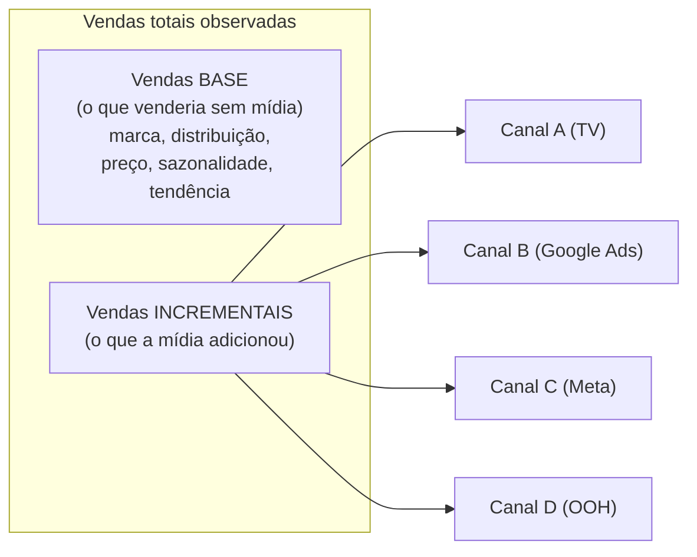
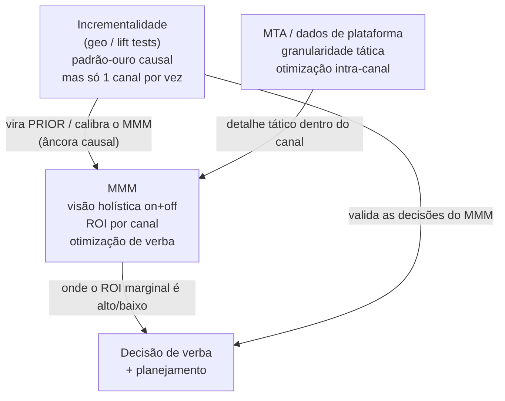
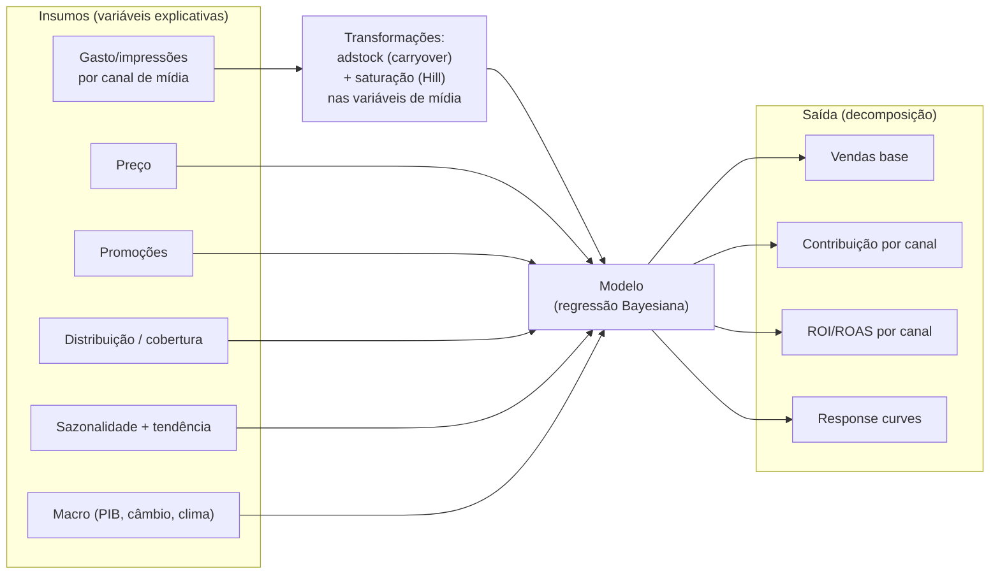

# Fundamentos do MMM — definição, história e o que ele responde

> O que é Marketing Mix Modeling, de onde veio (econometria e os pioneiros de bens de consumo), quais perguntas de negócio ele responde, e os conceitos centrais: vendas base vs incrementais, decomposição/contribuição e ROI/ROAS por canal. Inclui o comparativo essencial **MMM × MTA × Incrementalidade** e como a prática moderna triangula os três.

## Definição

**Marketing Mix Modeling (MMM)** — em português, **Modelagem de Mix de Marketing**, também chamado **Media Mix Modeling** — é uma técnica de **análise estatística (regressão econométrica)** que usa **dados históricos agregados** para estimar o efeito das atividades de marketing sobre um resultado de negócio.

Três palavras-chave que diferenciam o MMM de tudo o mais:

1. **Agregado**: o MMM não olha para o usuário X que clicou no anúncio Y. Ele olha para "na semana 14, gastamos R$ 80k em TV, R$ 120k em Google Ads, o preço médio foi R$ 49 e vendemos 12.300 unidades". Por isso é **privacy-safe** e imune ao fim dos cookies.
2. **Histórico**: o MMM aprende com o passado (tipicamente 2–3 anos de dados semanais) para entender como cada alavanca moveu o resultado.
3. **Causal-ish**: o MMM tenta isolar a **contribuição incremental** de cada canal — o quanto ele realmente *adicionou*, separando do que teria vendido de qualquer jeito.

## História — por que isso existe e por que CPG inventou

| Marco | Quando | O quê |
|---|---|---|
| Conceito de "marketing mix" | ~1949 | **Neil Borden** (Harvard) cunha o termo "marketing mix", inspirado em James Culliton, que descrevia o executivo de marketing como um "misturador de ingredientes". |
| Os 4 Ps | 1960 | **E. Jerome McCarthy** organiza o mix nos 4 Ps: **Produto, Preço, Praça (Place), Promoção**. MMM, no fundo, tenta medir o retorno de movimentos nesses Ps. |
| Primeiros modelos | Anos 1960–70 | Empresas de bens de consumo (CPG/FMCG) — **Kraft Foods** entre as pioneiras — aplicam econometria a dados de vendas e mídia. **BRANDAID** (John Little, anos 1970) formaliza a abordagem. |
| Era da consultoria | 1990s–2010s | MMM vira projeto caro de consultoria (Nielsen, IRI, econometristas). Refresh anual/semestral. |
| Open source / Bayesiano | 2017 → hoje | Google publica a pesquisa Bayesiana fundadora (Jin, Wang, Sun, Chan, Koehler, 2017). Meta abre o **Robyn** (2021). Google abre o **LightweightMMM** e depois o **Meridian** (2025). A comunidade mantém o **PyMC-Marketing**. MMM democratiza. |

**Por que CPG/FMCG foi o berço?** Três razões que explicam muito do método até hoje:

- **Não tinham clique para rastrear.** Sabão em pó e refrigerante são comprados em gôndola, não num site. A única forma de medir o efeito da propaganda era estatística, sobre dados agregados de venda (sell-out). MMM nasceu *justamente* do problema que o digital agora reencontra com o fim dos cookies.
- **Tinham dados sindicados ricos** (Nielsen/IRI): vendas por loja/região, preço, distribuição, promoção. Matéria-prima abundante para regressão.
- **Investiam pesado em mídia de massa** (TV, rádio, OOH), cujo efeito é difuso e perdura no tempo — o cenário ideal para os conceitos de adstock e saturação.

A ironia de 2026: o mundo digital, que se gabava de medir "tudo no clique", está voltando para a ferramenta que o CPG criou justamente por *não* conseguir medir no clique.

## Quais perguntas de negócio o MMM responde

| Pergunta | Saída do MMM |
|---|---|
| Quanto cada canal contribuiu para a receita no período? | **Decomposição de vendas** (gráfico de contribuição por canal) |
| Qual o ROI / ROAS de cada canal? | **ROI por canal** (incremental / gasto) |
| Quanto venderíamos mesmo sem nenhuma mídia? | **Vendas base** (baseline) |
| Estou saturando algum canal (jogando dinheiro fora)? | **Response curves / curvas de saturação** |
| Para onde devo mover o próximo real? | **ROI marginal** + **otimização de verba** |
| O que acontece com a receita se eu cortar 20% da verba? | **Cenários what-if** |
| TV ainda vale a pena vs. concentrar tudo no digital? | Contribuição e ROI comparáveis entre on e offline |

## Conceitos centrais

### Vendas base vs vendas incrementais

- **Vendas base (baseline)**: o que a empresa venderia mesmo desligando toda a mídia paga, puxado por força de marca, distribuição, preço, sazonalidade e tendência. Costuma ser a **maior fatia** — frequentemente 60–80% das vendas. Engole muito ego de marketeiro, mas é a verdade.
- **Vendas incrementais**: a fatia que a mídia *adicionou*. É essa parte que o MMM reparte entre os canais. ROI só faz sentido sobre o incremental.

### Decomposição / contribuição

A **decomposição** é a quebra da venda total observada em "quanto veio de cada coisa". Visualmente é um gráfico de área empilhada ao longo do tempo (base + cada canal + preço + promo + sazonalidade). É a entrega mais icônica do MMM — e a que mais conversa com o time de mídia, porque mostra **share de efeito** por canal, que você compara com o **share de gasto**.

### ROI vs ROAS por canal

- **ROI** (Return on Investment): `(receita incremental do canal − gasto) / gasto`. Em prática de MMM, muitos usam a forma simplificada `receita incremental / gasto` e chamam de ROI; sempre verifique a convenção.
- **ROAS** (Return on Ad Spend): `receita incremental do canal / gasto no canal`. Quanto de receita cada R$ 1 de mídia gerou.
- **Atenção crítica** (detalhada em [`04-interpretacao-e-decisao.md`](./04-interpretacao-e-decisao.md)): existe **ROI médio** (sobre todo o gasto do canal) e **ROI marginal** (sobre o *próximo* real). Decisão de realocação de verba se faz com o **marginal**, não com o médio. Confundir os dois é o erro nº 1.

## O comparativo que você precisa dominar: MMM × MTA × Incrementalidade

Esse é o slide que você vai apresentar para a liderança. As três abordagens medem efeito de mídia, mas por lentes diferentes.

| Dimensão | **MMM** (Marketing Mix Modeling) | **MTA** (Multi-Touch Attribution) | **Incrementalidade** (lift / geo tests) |
|---|---|---|---|
| Granularidade do dado | **Agregado** (semana/região) | **User-level** (jornada individual) | Agregado, mas em grupos teste vs controle |
| Pergunta que responde | "Quanto cada canal contribuiu no total e qual o ROI?" | "Quais touchpoints da jornada do usuário levaram à conversão?" | "Qual o efeito **causal** real deste canal específico?" |
| Tipo de evidência | Correlacional/econométrica (causal-ish) | Correlacional, baseada em jornada | **Causal de verdade** (experimento controlado) |
| Cobre canais offline (TV, OOH, rádio)? | **Sim** | Não | Sim (via geo) |
| Sobrevive ao fim dos cookies / ATT? | **Sim** (não usa user-level) | **Não** — depende de tracking que está morrendo | Sim |
| Privacy-safe / LGPD-friendly? | **Sim** | Frágil | Sim |
| Velocidade / cadência | Lenta (refresh semanal a trimestral) | Rápida (quase tempo real) | Lenta (semanas por teste) |
| Custo / esforço | Médio (precisa de histórico + DS) | Alto (infra de tracking) | Alto (desenhar e rodar experimentos) |
| Fraqueza principal | Não é causal puro; precisa de bom histórico; multicolinearidade | Morrendo com privacidade; ignora offline; viés de last-touch | Caro, lento, mede **um** canal por vez |
| Força principal | Visão holística on+off, privacy-safe, otimização de verba | Detalhe de jornada, granular, tático | Padrão-ouro de causalidade |

### Como a prática moderna triangula os três

Ninguém sério escolhe *um*. A prática de 2026 (a chamada "unified measurement" / triangulação) usa cada um para o que ele faz melhor — e, crucialmente, usa a incrementalidade para **calibrar** o MMM:

Em uma frase: **a incrementalidade dá a verdade causal de pontos específicos; o MMM espalha essa verdade por todos os canais e horizontes; o MTA refina dentro de cada canal digital.** A ligação técnica entre incrementalidade e MMM (usar o resultado de um lift test como *prior* informativo) é a **calibração**, detalhada em [`02-metodologia-estatistica.md`](./02-metodologia-estatistica.md).

## Como os insumos viram uma saída decomposta

A coluna do meio — adstock, saturação e a escolha do modelo — é onde mora a estatística de verdade. É o assunto de [`02-metodologia-estatistica.md`](./02-metodologia-estatistica.md).

## Conexão com o seu mundo de publicitário

Cada conceito do MMM tem um nome que você já usa no plano de mídia:

| Termo MMM | O que o publicitário já chama de... |
|---|---|
| Adstock / carryover | "a campanha continua respirando depois do flight" / efeito residual |
| Saturação / diminishing returns | "a partir de certo GRP/verba, satura, não adianta empurrar mais" |
| Vendas base | "venda institucional / de marca / que vem da prateleira" |
| Contribuição incremental | "o quanto a campanha realmente puxou de venda" |
| Response curve | "curva de eficiência do canal" |
| ROI marginal | "onde o próximo real de verba rende mais" |

Você não está aprendendo um campo estrangeiro. Está aprendendo a **medir, com número, o que você já planeja por intuição.**

## Referências

- Marketing mix modeling — Wikipedia: <https://en.wikipedia.org/wiki/Marketing_mix_modeling>
- The History of Marketing Mix Modeling — Eliya: <https://www.eliya.io/blog/marketing-mix-modeling/history>
- Bayesian Methods for Media Mix Modeling with Carryover and Shape Effects (Jin, Wang, Sun, Chan, Koehler — Google, 2017): <https://research.google/pubs/bayesian-methods-for-media-mix-modeling-with-carryover-and-shape-effects/>
- What is Incrementality testing vs MMM vs MTA? — Measured: <https://www.measured.com/faq/what-are-the-pros-and-cons-of-incrementality-testing-versus-mmm-or-mta/>
- Marketing Measurement 2026: MMM vs MTA vs Incrementality — House of Martech: <https://houseofmartech.com/blog/marketing-measurement-evolution-2026-when-to-use-mmm-vs-mta-vs-incrementality-testing-vs-unified-approaches>
- Marketing Mix Modeling vs Multi-Touch Attribution: When to Use Each in 2026 — Improvado: <https://improvado.io/blog/mmm-vs-multi-touch-attribution>
- Introduction to Media Mix Modeling — PyMC-Marketing: <https://www.pymc-marketing.io/>
