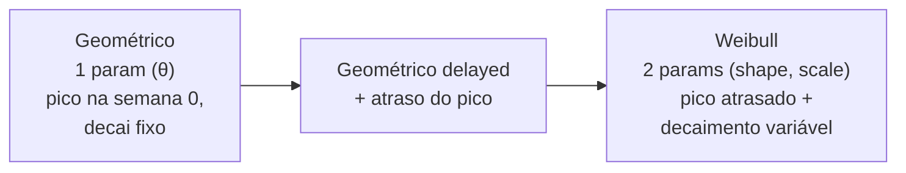
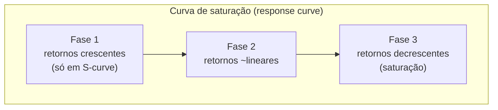
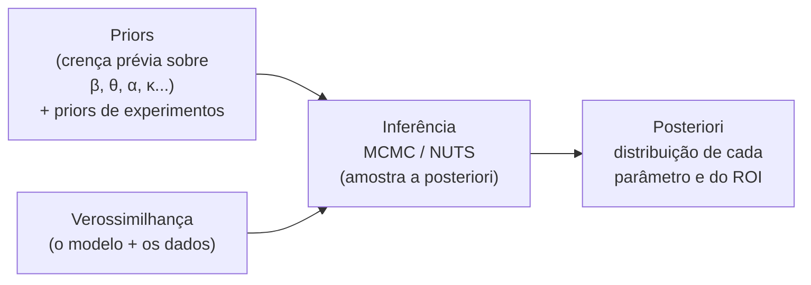
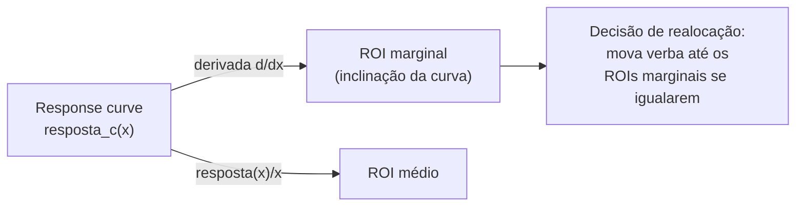

# Metodologia estatística do MMM — a matemática, para quem é cientista de dados

> A estatística do MMM escrita sem condescendência: a espinha dorsal de regressão (aditiva vs multiplicativa/log-log), as duas transformações não-lineares que definem a disciplina — **adstock/carryover** e **saturação/retornos decrescentes** —, o controle dos drivers de base, o problema da multicolinearidade e a regularização (ridge), e por que a **abordagem Bayesiana** domina as ferramentas modernas, incluindo calibração com priors vindos de experimentos. Com fórmulas e a derivação das response curves e do ROI marginal.

## Visão geral: o que é o modelo

No fundo, MMM é um modelo de regressão de uma variável de resposta `y_t` (vendas/receita/conversões na semana `t`) em função de variáveis de mídia transformadas e de variáveis de controle. A forma canônica (aditiva):

```
y_t = base_t + Σ_c  β_c · f_sat( f_adstock( x_{c,t} ) )  +  Σ_k  γ_k · z_{k,t}  +  ε_t
```

Onde:
- `x_{c,t}` = investimento (ou impressões/GRPs) do canal `c` na semana `t`
- `f_adstock(·)` = transformação de **carryover** (efeito que perdura no tempo)
- `f_sat(·)` = transformação de **saturação** (retornos decrescentes)
- `β_c` = coeficiente de efeito do canal `c` (o "tamanho" do efeito)
- `z_{k,t}` = variáveis de controle (preço, promo, sazonalidade, macro...)
- `γ_k` = coeficientes dos controles
- `base_t` = intercepto + tendência (vendas base)
- `ε_t` = erro

A ordem importa: aplica-se **adstock primeiro** (acumula o efeito no tempo) e **saturação depois** (achata os retornos do efeito acumulado). É a arquitetura "Adstock → Hill" usada pelo Google Meridian.

## 1. A espinha dorsal: aditivo vs multiplicativo (log-log)

| Forma | Equação (esqueleto) | Interpretação do coeficiente | Quando usar |
|---|---|---|---|
| **Aditiva (linear)** | `y = base + Σ β_c · m_c + Σ γ_k z_k` | `β_c` = unidades de venda por unidade de mídia transformada | Padrão moderno (Meridian, PyMC-Marketing). Decomposição direta e somável. |
| **Multiplicativa (log-log)** | `log(y) = β_0 + Σ β_c · log(m_c) + Σ γ_k log(z_k)` | `β_c` = **elasticidade** (% de variação em `y` por % em `m_c`) | Tradicional na econometria. Efeitos multiplicativos/interativos; sazonalidade entra natural. |

O log-log é elegante para o economista porque os coeficientes *são* elasticidades e o modelo captura interações de forma natural. Mas a forma **aditiva com transformações não-lineares explícitas** (adstock + Hill) venceu na prática moderna porque **decompõe de forma aditiva** (a contribuição de cada canal soma e fecha com o total) e porque modela carryover e saturação de maneira mais interpretável e flexível que o log puro. As três ferramentas de referência (Meridian, Robyn, PyMC-Marketing) usam a forma aditiva com adstock+saturação.

## 2. Adstock / carryover — o efeito não morre no dia do anúncio

**Problema que resolve**: propaganda tem memória. Quem viu o comercial na segunda pode comprar na sexta, ou duas semanas depois. O efeito de `x_t` se espalha pelas semanas seguintes. Ignorar isso atribui mal o efeito no tempo e subestima mídias de marca (TV, OOH).

### Adstock geométrico (1 parâmetro)

O clássico. O efeito da mídia decai a uma taxa fixa `θ ∈ [0,1)` por período:

```
adstock_t = x_t + θ · adstock_{t-1}
```

Equivalente, como soma ponderada das exposições passadas:

```
adstock_t = Σ_{l=0}^{L}  θ^l · x_{t-l}
```

- `θ` (decay/retention rate): quão "grudenta" é a mídia. `θ=0` → sem carryover (todo efeito na mesma semana, típico de search/performance). `θ=0.7` → efeito muito persistente (típico de TV/branding).
- `L` = janela máxima de lag (ex.: 8 a 13 semanas).
- **Half-life** (meias-vidas) é o jeito intuitivo de comunicar: `half_life = ln(0.5)/ln(θ)`. Um `θ=0.5` significa que metade do efeito sumiu após 1 período.

### Adstock geométrico com atraso (delayed) e Weibull (2 parâmetros)

O geométrico simples assume que o **pico do efeito é na própria semana** e só decai dali. Nem sempre é verdade — uma campanha pode ter o pico de efeito uma ou duas semanas *depois* (tempo de o consumidor reagir). Duas extensões:

- **Geométrico com atraso (delayed)**: introduz um parâmetro de defasagem do pico.
- **Weibull (PDF/CDF)**: função de **dois parâmetros** (shape e scale) que permite **taxa de decaimento variável no tempo** (em vez de fixa) e um pico atrasado. É a opção mais flexível do Robyn (Weibull PDF e Weibull CDF), ao custo de mais parâmetros para estimar.



Regra prática: **comece com geométrico** (menos parâmetros, mais estável). Só vá para Weibull se você tem dado suficiente e suspeita de pico atrasado (comum em mídia de marca de ciclo longo).

## 3. Saturação / retornos decrescentes — o primeiro real vale mais que o milionésimo

**Problema que resolve**: a relação mídia→venda não é linear. Os primeiros reais num canal rendem muito; conforme você empurra verba, **satura** (você já atingiu o público disponível, a frequência vira desperdício). Sem isso, o modelo recomendaria gastar infinito no canal de maior coeficiente.

### Curva de Hill (2 parâmetros) — a padrão moderna

Originária da bioquímica, é a função usada por Meridian e Robyn:

```
f_Hill(x) =  x^α / ( x^α + κ^α )
```

- `α` (shape/slope): controla o **formato** da curva. `α ≈ 1` → curva côncava (log-like, sempre desacelerando). `α > 1` → **curva em S** (começa devagar, acelera, depois satura — típico quando há um limiar mínimo de exposição para gerar efeito).
- `κ` (half-saturation / `gamma`): o ponto de **meia-saturação** — o nível de `x` em que se atinge metade do efeito máximo. Define "onde" a curva vira.

### Outras formas de saturação

| Forma | Equação | Característica |
|---|---|---|
| **Hill** | `x^α / (x^α + κ^α)` | Flexível: côncava ou S, 2 params. Padrão Meridian/Robyn. |
| **Logística** | `1 / (1 + e^{-λ(x-x0)})` | S-curve clássica. Usada por padrão no PyMC-Marketing (`LogisticSaturation`). |
| **Exponencial negativa** | `1 − e^{-λx}` | Sempre côncava (sem fase de S). Simples, 1 param. |
| **Log** | `log(1 + x)` | Côncava, sem teto explícito. Muito usada na econometria tradicional. |



A **response curve** de um canal é a composição `f_sat(f_adstock(x))` multiplicada pelo coeficiente `β_c`: ela mapeia "quanto gasto" → "quanta venda incremental". É dela que sai todo o resto (ROI marginal, otimização).

## 4. Controlando os drivers de base (senão você atribui tudo à mídia)

Se você não controlar o que **também** move as vendas, o modelo joga esse efeito em cima da mídia e infla o ROI. Variáveis de controle típicas (`z_k`):

| Controle | Por que entra | Forma típica |
|---|---|---|
| **Sazonalidade** | Natal, dia das mães, volta às aulas movem venda sozinhos | Dummies mensais/semanais, Fourier, ou Prophet (Robyn usa Prophet) |
| **Tendência** | Crescimento/declínio estrutural da marca | Termo de tendência (linear/spline) |
| **Preço** | Preço próprio e do concorrente movem demanda | Nível de preço ou índice de preço relativo |
| **Promoções / descontos** | Promoção gera pico que não é "mídia" | Dummy ou intensidade da promo |
| **Distribuição / cobertura** | Mais PDVs = mais venda, independente de mídia | % de cobertura, nº de lojas |
| **Macro** | PIB, desemprego, câmbio, clima | Séries macro externas |
| **Eventos/feriados** | Black Friday, Copa, eleições | Dummies de evento |

Regra de ouro: **a base costuma explicar 60–80% das vendas.** Se o seu modelo diz que a mídia explica metade do faturamento, desconfie — provavelmente faltou controle e a mídia está "roubando" crédito da base.

## 5. Multicolinearidade — o problema crônico do MMM

Canais de mídia **andam juntos**. Quando a empresa faz campanha grande, sobe TV, Google e Meta ao mesmo tempo. Isso gera **multicolinearidade**: o modelo não consegue separar com confiança o efeito de cada canal correlacionado. Sintomas: coeficientes instáveis, sinais trocados (ROI negativo sem sentido), erros-padrão enormes.

Mitigações:
1. **Regularização (ridge / L2)** — penaliza coeficientes grandes, estabiliza a estimação sob colinearidade. O **Robyn usa ridge regression** como backbone exatamente por isso.
2. **Priors informativos** (abordagem Bayesiana) — você "ancora" o coeficiente em torno de um valor plausível, restringindo o espaço de soluções.
3. **Variação experimental** — rodar geo/lift tests cria variação independente entre canais que ajuda a identificá-los.
4. **Cuidado no desenho de mídia** — escalonar canais em momentos diferentes gera variação que o modelo aproveita.

### Ridge regression (relembrando)

Minimiza:
```
Σ (y_t − ŷ_t)²  +  λ · Σ β_c²
```
O termo `λ · Σ β_c²` encolhe os coeficientes em direção a zero. `λ` controla a força da penalidade (escolhido por validação ou, no Robyn, dentro da otimização de hiperparâmetros).

## 6. A abordagem Bayesiana — por que domina o MMM moderno

As três ferramentas de referência (Meridian, PyMC-Marketing) são **Bayesianas**; o Robyn é frequentista (ridge) mas com forte automação de hiperparâmetros. Por que o Bayesiano venceu o MMM moderno:

| Vantagem Bayesiana | Por que importa no MMM |
|---|---|
| **Priors informativos** | Você injeta conhecimento de domínio (ex.: "ROI de TV provavelmente está entre 1 e 3") e resultados de experimentos. Resolve identificabilidade sob colinearidade e pouco dado. |
| **Quantificação de incerteza nativa** | Em vez de um ROI pontual, você tem uma **distribuição a posteriori** — "ROI do canal X é 2,1 com intervalo crível [1,4; 2,9]". Decisão de verba sob incerteza é honesta. |
| **Hierarquia (priors hierárquicos)** | Modela geo/regiões/produtos com *partial pooling* — regiões com pouco dado tomam emprestada força de regiões parecidas. Meridian é hierárquico. |
| **Calibração formal** | O resultado de um lift test entra como **prior** sobre o efeito do canal. É a ponte matemática entre incrementalidade e MMM. |
| **Regularização "de graça"** | Priors funcionam como regularização — encolhem coeficientes implausíveis sem precisar de um `λ` separado. |

### O fluxo Bayesiano em uma imagem



- **MCMC / NUTS**: o motor de amostragem. O **Meridian** usa o **No-U-Turn Sampler (NUTS)** do **TensorFlow Probability**, com aceleração por GPU. O **PyMC-Marketing** usa o NUTS do **PyMC**. Você não calcula a posteriori em forma fechada (impossível aqui) — você **amostra** dela.
- **Diagnóstico**: cheque `R̂` (Gelman-Rubin, deve ≈ 1.0), tamanho efetivo de amostra (ESS), divergências do NUTS, e os trace plots. Isso é higiene Bayesiana padrão — você já conhece de outros modelos PyMC/Stan.

### Calibração — onde a incrementalidade encontra o MMM

Esta é a peça que separa um MMM de brinquedo de um MMM confiável. Você rodou um **geo lift test** que mediu, causalmente, que o canal Meta tem ROI ≈ 1,8. Você usa esse resultado como **prior informativo** sobre o coeficiente do Meta no MMM. O modelo então é forçado a respeitar essa âncora causal ao decompor o resto.

- No **Robyn** (frequentista), a calibração entra como um **terceiro objetivo de otimização**: `MAPE.LIFT`, junto de `NRMSE` (erro de ajuste) e `DECOMP.RSSD` (estabilidade da decomposição). O otimizador busca modelos que batem com os experimentos.
- No **Meridian** e no **PyMC-Marketing** (Bayesianos), a calibração entra naturalmente como **prior** sobre o ROI/efeito do canal calibrado.

> Sem calibração, o MMM é uma opinião estatística sofisticada. Com calibração, ele vira uma opinião ancorada em causalidade. **Sempre que possível, calibre.**

## 7. Da response curve ao ROI marginal (a derivação que vale ouro)

Você tem a curva de resposta de um canal `c`:
```
resposta_c(x) = β_c · f_sat( f_adstock(x) )
```

- **ROI médio** no nível de gasto `x*`: `resposta_c(x*) / x*` — a receita incremental total dividida pelo gasto total. É o número que aparece nos relatórios.
- **ROI marginal** em `x*`: a **derivada** da curva, `d resposta_c / dx` avaliada em `x*` — quanto de venda o **próximo** real adiciona naquele ponto de gasto.



Por que importa: por causa da saturação, **o ROI marginal cai à medida que você gasta mais.** A regra de otimização (princípio equimarginal) é **mover verba dos canais com menor ROI marginal para os de maior ROI marginal até que se igualem** (respeitando restrições). Tudo isso está aplicado em [`04-interpretacao-e-decisao.md`](./04-interpretacao-e-decisao.md).

## Resumo dos hiperparâmetros que você vai estimar/definir

| Hiperparâmetro | Onde aparece | Faixa típica | Intuição |
|---|---|---|---|
| `θ` (decay) | Adstock geométrico | 0–0.9 | Persistência da mídia (TV alto, search baixo) |
| `shape, scale` | Adstock Weibull | — | Pico atrasado + decaimento variável |
| `α` (shape) | Saturação Hill | 0.5–3 | Côncava (≈1) vs S-curve (>1) |
| `κ`/`gamma` | Saturação Hill | depende da escala | Ponto de meia-saturação |
| `β_c` | Coeficiente do canal | ≥ 0 (priors costumam forçar não-negativo) | Tamanho do efeito |
| `λ` | Ridge (Robyn) | otimizado | Força da regularização |

## Referências

- Bayesian Methods for Media Mix Modeling with Carryover and Shape Effects (Jin, Wang, Sun, Chan, Koehler — Google, 2017): <https://research.google/pubs/bayesian-methods-for-media-mix-modeling-with-carryover-and-shape-effects/>
- Media saturation and lagging — Meridian | Google for Developers: <https://developers.google.com/meridian/docs/basics/media-saturation-lagging>
- Meridian (repositório oficial — NUTS/TensorFlow Probability, hierárquico): <https://github.com/google/meridian>
- adstocks: Adstocking Transformation (Geometric and Weibull) in Robyn: <https://rdrr.io/cran/Robyn/man/adstocks.html>
- Saturation and Adstock Effects in Bayesian MMM: <https://medium.com/@mail2rajivgopinath/saturation-and-adstock-effects-in-bayesian-mmm-ac62bfd16b12>
- PyMC-Marketing — Introduction to Media Mix Modeling (GeometricAdstock, LogisticSaturation, priors): <https://www.pymc-marketing.io/>
- A Comprehensive Guide to Bayesian Marketing Mix Modeling: <https://medium.com/@nialloulton/a-comprehensive-guide-to-bayesian-marketing-mix-modeling-a37da5fde7c4>
