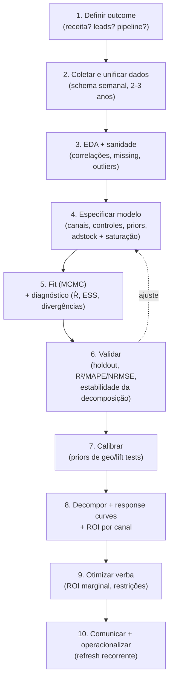

# Implementação prática — dados, ferramentas e como construir o seu primeiro MMM

> Como sair do conceito e construir um MMM de verdade: requisitos de dados (2–3 anos de dado semanal, gasto **e** impressões/GRPs por canal, variável dependente, controles) com schema de tabela; o panorama de ferramentas open source com comparativo (Google Meridian, Meta Robyn, PyMC-Marketing, LightweightMMM legado) e opções comerciais; a stack recomendada para um cientista de dados que vive em Python; o workflow passo a passo; um esboço de código; e as armadilhas típicas.

## Parte 1 — De quais dados você precisa

O MMM é tão bom quanto o dado que entra. Antes de qualquer modelo, monte a **base de dados única, em série temporal, uma linha por semana**.

### Requisitos não-negociáveis

| Requisito | Por quê | Regra prática |
|---|---|---|
| **Histórico de 2–3 anos** | Precisa captar 2+ ciclos sazonais e variação de gasto entre canais | Mínimo ~104 semanas; abaixo de 52 o modelo fica frágil |
| **Granularidade semanal** | Diário é ruidoso demais; mensal esconde dinâmica de carryover | Semana padrão (ISO week), mesmo calendário em todas as fontes |
| **Gasto por canal** | É a variável de decisão (a verba que você realoca) | Um canal por coluna, valores monetários |
| **Impressões/GRPs por canal de marca** | Gasto não captura entrega; CPM varia. Mídia de marca (TV, OOH) precisa do volume de exposição | Para TV: escolha **GRP OU gasto, nunca os dois** (dupla contagem) |
| **Variável dependente clara** | O resultado que você quer explicar | Receita, unidades, conversões, leads ou pipeline — uma só, consistente |
| **Variáveis de controle** | Senão a mídia "rouba" o crédito da base | Preço, promo, sazonalidade, distribuição, macro, eventos |

### Schema de dados (a tabela que você vai montar)

| Coluna | Tipo | Exemplo | Origem |
|---|---|---|---|
| `semana` | data (início da semana) | 2024-W14 | Calendário |
| `receita` (dependente) | numérico | 1.842.300 | ERP / financeiro / CRM |
| `gasto_tv` | numérico (R$) | 80.000 | Plano de mídia / agência |
| `grp_tv` | numérico | 320 | Kantar IBOPE / agência |
| `gasto_google_ads` | numérico (R$) | 120.000 | Google Ads |
| `impr_google_ads` | numérico | 4.500.000 | Google Ads |
| `gasto_meta` | numérico (R$) | 95.000 | Meta Ads Manager |
| `impr_meta` | numérico | 6.200.000 | Meta Ads Manager |
| `gasto_linkedin` | numérico (R$) | 30.000 | LinkedIn (se B2B) |
| `gasto_ooh` | numérico (R$) | 40.000 | Plano de mídia |
| `gasto_email` | numérico (R$) | 5.000 | Plataforma de e-mail / RD/HubSpot |
| `preco_medio` | numérico | 49,90 | ERP |
| `desconto_promo` | numérico / dummy | 0.15 | Comercial |
| `distribuicao_pct` | numérico | 0.78 | Comercial / trade |
| `feriado` | dummy | 1 | Calendário |
| `black_friday` | dummy | 0 | Calendário |
| `sazonalidade` | derivada | — | Calculada (Fourier/Prophet) |

Dois lembretes que evitam dor de cabeça:
- **Gasto e exposição não são a mesma coisa.** Sempre que tiver impressões/GRPs, traga — modelar mídia de marca só com gasto subestima o efeito quando o CPM oscila.
- **Variável dependente única e estável.** Não troque de "receita" para "leads" no meio da série. Defina cedo o que o negócio quer mover (ver [`05-caso-aplicado.md`](./05-caso-aplicado.md)).

## Parte 2 — O panorama de ferramentas (open source)

Quatro ferramentas dominam a conversa. Status verificado em Maio/2026:

| Ferramenta | Mantenedor | Linguagem | Abordagem | Status | Destaques |
|---|---|---|---|---|---|
| **Google Meridian** | Google | **Python** | Bayesiana (NUTS / TensorFlow Probability), hierárquica | **Flagship atual** (lançado jan/2025) | Reach & frequency, calibração com experimentos, geo-level, integração BigQuery/Vertex AI, GPU. Sucessor oficial do LightweightMMM. Apache-2.0 |
| **Meta Robyn** | Meta Marketing Science | **R** (e versão Python) | Ridge regression + otimização multi-objetivo (Nevergrad), Prophet p/ sazonalidade | Ativo, maduro | Automação de hiperparâmetros (adstock/saturação), adstock geométrico **e Weibull**, calibração via lift como 3º objetivo, budget allocator |
| **PyMC-Marketing** | PyMC Labs (comunidade) | **Python** | Bayesiana (PyMC / NUTS) | Ativo, em forte evolução | API limpa em Python, `GeometricAdstock` + `LogisticSaturation`, priors customizáveis, também faz CLV/BTYD. Ótima curva de aprendizado p/ quem já usa PyMC |
| **LightweightMMM** | Google | Python (JAX/numpyro) | Bayesiana | **Legado / descontinuado** | Substituído pelo Meridian em jan/2025. O próprio Google recomenda **migrar para Meridian**. Não comece projeto novo aqui |

> **Ponto importante sobre o LightweightMMM**: ele foi a porta de entrada Python para MMM Bayesiano por anos, mas o Google **não o mantém mais** — o repositório oficial direciona ao Meridian e há um guia de migração. Se você encontrar tutoriais antigos usando LightweightMMM, traduza os conceitos para Meridian ou PyMC-Marketing.

### Diferenças de arquitetura que importam

- **Meridian** usa uma variação da arquitetura **Hill-Adstock** (não deixa você trocar a arquitetura). Foco em reach/frequency e calibração — pensado para anunciantes grandes com dado de qualidade.
- **Robyn** automatiza a busca de hiperparâmetros com um **algoritmo evolutivo multi-objetivo (Nevergrad)** otimizando três objetivos: `NRMSE` (ajuste), `DECOMP.RSSD` (estabilidade da decomposição) e, se você calibrar, `MAPE.LIFT`. Oferece adstock geométrico e Weibull.
- **PyMC-Marketing** te dá o controle Bayesiano explícito: você escreve priors, escolhe transformações, e tem acesso a todo o ecossistema PyMC/ArviZ para diagnóstico.

### Opções comerciais (para contexto, não para começar)

Você vai ouvir esses nomes da liderança. Bom saber posicioná-los:

| Tipo | Players | Faixa de preço (referência de mercado) | Quando faz sentido |
|---|---|---|---|
| Consultoria/enterprise | Analytic Partners, Nielsen/Circana, Kantar, Ekimetrics | Contratos anuais a partir de ~US$ 60k, podendo passar de US$ 200k | Sem time de DS interno; alta exigência de auditoria/board |
| SaaS self-service | Recast, Measured, Keen, LiftLab, Liquid Mix (Circana) | ~US$ 750–1.500/mês (mid-market) p/ cima | Quer UI para marketing, sem manter código |
| **Open source** | Meridian, Robyn, PyMC-Marketing | "Grátis" + custo do seu tempo/infra | **Tem time de DS (você) e quer dono do processo ponta a ponta** |

## Parte 3 — Stack recomendada para você

Você é fluente em Python e cientista de dados. A recomendação é direta:

> **Comece com PyMC-Marketing para aprender por dentro (controle total, Python, diagnóstico ArviZ) E/OU Google Meridian para o resultado "production-grade" (flagship, calibração, geo, integra com BigQuery).** Use o Robyn como referência/segunda opinião se a empresa tiver gente de R.

Racional:
- **PyMC-Marketing** é onde você *entende* o modelo — escreve os priors, vê a posteriori, faz o diagnóstico Bayesiano com ferramentas que você já conhece. Melhor ferramenta de aprendizado para um cientista de dados.
- **Meridian** é o que você *entrega* — é o estado da arte mantido pelo Google, com calibração e reach/frequency, e integra com a stack de dados (BigQuery/Vertex) que muitas empresas brasileiras já usam.
- Evite começar pelo **Robyn** se a empresa é Python-first (é R; há porta Python, mas o ecossistema é R). Evite **LightweightMMM** (legado).

## Parte 4 — Workflow passo a passo



Os passos 8–10 (interpretação, otimização, comunicação) estão detalhados em [`04-interpretacao-e-decisao.md`](./04-interpretacao-e-decisao.md). Aqui o foco é até o fit.

## Parte 5 — Esboço de código (PyMC-Marketing)

Ilustrativo — confira a API atual na documentação oficial, pois evolui. O fluxo conceitual data prep → fit → decompose → optimize:

```python
import pandas as pd
from pymc_marketing.mmm import MMM
from pymc_marketing.mmm import GeometricAdstock, LogisticSaturation
from pymc_marketing.prior import Prior

# 1. DATA PREP — uma linha por semana
df = pd.read_csv("mmm_semanal.csv", parse_dates=["semana"])

channel_cols = ["gasto_google_ads", "gasto_meta", "gasto_linkedin", "gasto_ooh", "gasto_tv"]
control_cols = ["preco_medio", "desconto_promo", "distribuicao_pct", "feriado", "black_friday"]

# 2. ESPECIFICAÇÃO — adstock + saturação + priors informativos
mmm = MMM(
    date_column="semana",
    channel_columns=channel_cols,
    control_columns=control_cols,
    adstock=GeometricAdstock(l_max=8),       # carryover até 8 semanas
    saturation=LogisticSaturation(),          # retornos decrescentes
    yearly_seasonality=2,                     # termos de Fourier p/ sazonalidade
)

# (opcional, mas recomendado) CALIBRAÇÃO: prior do ROI de um canal vindo de geo/lift test
# ex.: lift test mediu ROAS ~1.8 para o Meta -> ancora o prior daquele canal
# mmm.model_config["saturation_beta"] = Prior("HalfNormal", sigma=...)

X = df[["semana"] + channel_cols + control_cols]
y = df["receita"]

# 3. FIT — MCMC (NUTS). Diagnóstico Bayesiano padrão.
mmm.fit(X, y, chains=4, draws=2000, tune=1000, target_accept=0.9)
mmm.sample_posterior_predictive(X, extend_idata=True)

# diagnóstico: R̂ ~ 1.0, sem divergências, ESS adequado
import arviz as az
print(az.summary(mmm.idata, var_names=["saturation_beta"]))

# 4. DECOMPOSE — contribuição por canal e response curves
mmm.plot_components_contributions()      # decomposição
mmm.plot_channel_contribution_grid()     # contribuição por canal
roi = mmm.get_channel_contributions()    # base p/ ROI/ROAS por canal

# 5. OPTIMIZE — realocação de verba sob restrição de orçamento
allocation = mmm.optimize_budget(
    budget=sum(df[channel_cols].iloc[-1]),  # orçamento total a distribuir
    # bounds por canal (min, max) p/ respeitar realidade de compra de mídia
)
```

Para **Meridian** o esqueleto é análogo: monta `InputData` (com gasto, impressões, reach/frequency, controles e geos), define `PriorDistribution` (incluindo priors de calibração), roda `Meridian(...).sample_posterior()` com NUTS, e usa os módulos de `Analyzer`/`BudgetOptimizer` para decomposição, response curves e otimização. Veja a documentação oficial.

## Parte 6 — Armadilhas típicas (e como evitar)

| Armadilha | Sintoma | Como evitar |
|---|---|---|
| **Dados de menos** | Coeficientes instáveis, intervalos enormes | Mínimo 1–2 anos; prefira 2–3. Não modele canal com gasto quase sempre zero |
| **Canais correlacionados** (multicolinearidade) | ROI negativo sem sentido, sinais trocados | Ridge (Robyn) ou priors (Bayesiano); variação experimental; cuidado no desenho de mídia |
| **Ignorar calibração** | ROI inflado, ninguém confia no número | Rode geo/lift tests e use como prior. Sem âncora causal, é só correlação bonita |
| **Esquecer controles de base** | Mídia "explica" 50%+ do faturamento | Inclua preço, promo, sazonalidade, distribuição, macro. Base costuma ser 60–80% |
| **Dupla contagem TV** | Efeito de TV superestimado | Use GRP **ou** gasto, nunca os dois |
| **Confundir gasto com exposição** | Mídia de marca subestimada | Traga impressões/GRPs quando existirem |
| **Não validar out-of-sample** | Modelo decora o passado e erra o futuro | Holdout temporal; cheque NRMSE de teste, não só de treino |
| **Trocar a variável dependente no meio** | Decomposição incoerente | Defina o outcome no passo 1 e não mude |

## Referências

- Google Meridian (repositório oficial): <https://github.com/google/meridian>
- Migrate from LightweightMMM — Google for Developers: <https://developers.google.com/meridian/docs/migrate>
- google/lightweight_mmm (legado, com aviso de migração para Meridian): <https://github.com/google/lightweight_mmm>
- Meta Robyn (repositório oficial): <https://github.com/facebookexperimental/Robyn>
- PyMC-Marketing (documentação oficial): <https://www.pymc-marketing.io/>
- PyMC-Marketing — MMM Example Notebook: <https://www.pymc-marketing.io/en/stable/notebooks/mmm/mmm_example.html>
- Data Required in Marketing Mix Modeling — MASS Analytics: <https://mass-analytics.com/marketing-mix-modeling-blogs/data-required-in-marketing-mix-modeling/>
- Enhancing Marketing Mix Models: Beyond Spend with GRPs, Impressions, and Clicks: <https://medium.com/@nialloulton/enhancing-marketing-mix-models-beyond-spend-with-grps-impressions-and-clicks-7cae546d65d8>
- 30 Marketing Mix Modeling Tools (panorama comercial): <https://sellforte.com/blog/marketing-mix-modeling-tools-for-accelerating-growth>
