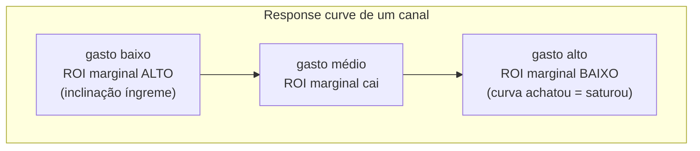
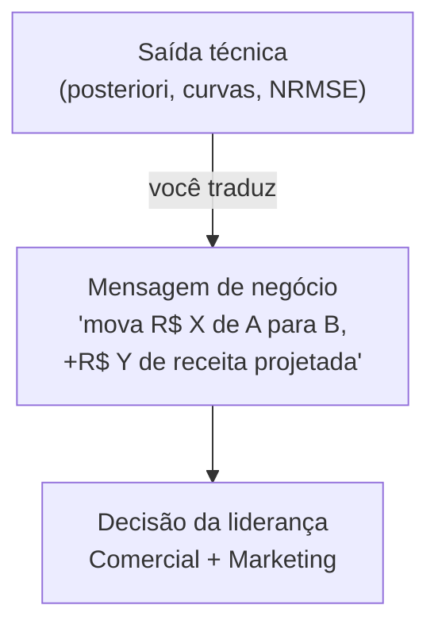

# Interpretação e decisão — transformar a saída do modelo em verba realocada

> Como ler a saída do MMM e virar decisão: gráfico de decomposição/contribuição, ROI/ROAS por canal, response/saturation curves, e a distinção crucial entre **ROI marginal e ROI médio**. A mecânica da **otimização de verba** (realocar até igualar o ROI marginal, com restrições), o **planejamento de cenários what-if** (que responde diretamente o seu "projetar hipóteses"), como **validar** o modelo, e como **comunicar** o resultado para a liderança Comercial e de Marketing — onde o seu lado publicitário é vantagem.

## O ciclo: do output à decisão

## 1. Ler a decomposição / contribuição

A **decomposição** quebra a venda observada em parcelas: base + cada canal + preço + promo + sazonalidade. Lê-se de baixo para cima num gráfico de área empilhada ao longo do tempo.

O que procurar:
- **Tamanho da base.** Se base < 50% das vendas, desconfie de controle faltando. Em marcas estabelecidas, base de 60–80% é comum e saudável.
- **Share de efeito vs share de gasto** (a leitura mais política e mais útil). Você compara, por canal, "quanto % da venda incremental ele gerou" contra "quanto % da verba ele consumiu". Canal com share de efeito >> share de gasto = subinvestido. Share de gasto >> share de efeito = candidato a corte.

| Canal | Share de gasto | Share de efeito | Leitura |
|---|---|---|---|
| Google Ads | 30% | 42% | Subinvestido — eficiente |
| Meta | 25% | 28% | Equilibrado |
| TV | 25% | 22% | Equilibrado (lembre do carryover longo) |
| OOH | 12% | 5% | Caro pelo que entrega — investigar |
| LinkedIn (B2B) | 8% | 3% | Investigar — talvez nicho/saturado |

> Esse "share de efeito vs share de gasto" é o `DECOMP.RSSD` que o Robyn minimiza — ele penaliza modelos cuja decomposição foge muito demais do share de gasto, justamente para evitar resultados absurdos.

## 2. ROI / ROAS por canal

- **ROAS do canal** = receita incremental / gasto. "Cada R$ 1 no Google Ads gerou R$ 4,20."
- Apresente sempre com **incerteza** (no Bayesiano você tem a posteriori): "ROAS do Meta ≈ 2,8 com intervalo crível [2,1; 3,4]". Um número pontual sem intervalo esconde risco.
- Ranqueie os canais por ROAS, mas **não decida realocação só por aqui** — esse é o ROI **médio**. A decisão é com o **marginal** (próximo item).

## 3. Response curves e a distinção que separa amador de profissional: marginal vs médio

A **response curve** mapeia gasto → venda incremental para cada canal (é `β · saturação(adstock(gasto))`, ver [`02-metodologia-estatistica.md`](./02-metodologia-estatistica.md)). Por causa da saturação, ela achata.

- **ROI médio** = receita_incremental(x) / x. É a média sobre tudo que você gastou. Bom para relatório.
- **ROI marginal** = derivada da curva em x = quanto o **próximo** real rende. **É com ele que se decide para onde mover verba.**

Por que confundir é o erro nº 1: um canal pode ter ROI **médio** alto (ótimo histórico) mas já estar saturado, com ROI **marginal** baixo — colocar mais verba ali rende pouco. Outro canal com ROI médio menor pode ter ROI marginal alto porque ainda está na parte íngreme da curva. **Verba nova vai para onde o marginal é maior, não onde a média é maior.**

## 4. Otimização de verba — a entrega que justifica o projeto

### O princípio equimarginal

Com orçamento total fixo, o ótimo é alcançado quando **o ROI marginal de todos os canais se iguala**. Enquanto um canal tiver marginal maior que outro, vale tirar R$ 1 do menor e botar no maior.

### Otimização com restrições (o mundo real)

Você não realoca livremente — a compra de mídia tem regras. A otimização real é **constrained**: maximizar receita incremental sujeito a:
- **Orçamento total** fixo (ou um teto).
- **Mínimos e máximos por canal** (ex.: "TV não pode cair abaixo de R$ 50k por contrato"; "não dá para 10x o LinkedIn de uma semana para a outra").
- **Limites de variação** semana-a-semana (realocação gradual, respeitando flighting).

As três ferramentas têm otimizador embutido (Robyn: `robyn_allocator`; Meridian: `BudgetOptimizer`; PyMC-Marketing: `optimize_budget`). A saída é uma **alocação recomendada** por canal e a receita incremental projetada.

| Canal | Verba atual | Verba otimizada | Δ | Por quê |
|---|---|---|---|---|
| Google Ads | R$ 120k | R$ 150k | +25% | Marginal alto, ainda não saturado |
| Meta | R$ 95k | R$ 100k | +5% | Próximo do ótimo |
| TV | R$ 80k | R$ 70k | −12% | Marginal caiu; carryover já entregue |
| OOH | R$ 40k | R$ 25k | −38% | Marginal baixo |
| LinkedIn | R$ 30k | R$ 25k | −17% | Saturado no nicho |
| **Total** | **R$ 365k** | **R$ 370k** | — | Mesmo orçamento, +X% receita projetada |

## 5. Cenários what-if — respondendo o seu "projetar hipóteses"

Aqui mora a metade da sua intuição inicial ("projetar hipóteses"). Com as response curves, você simula:

| Hipótese (pergunta de negócio) | Como o MMM responde |
|---|---|
| "E se cortarmos 20% da verba total?" | Recalcula a receita incremental sob o novo orçamento ótimo — mostra quanto se perde e onde dói menos |
| "E se dobrarmos o Google Ads?" | A curva mostra que parte vira saturação (retorno decrescente) — quantifica o desperdício |
| "Qual o orçamento para bater +15% de receita?" | Inverte a otimização: dado o alvo, qual verba e mix mínimos |
| "Vale entrar num canal novo (ex.: CTV/retail media)?" | Com prior de benchmark/lift inicial, simula contribuição esperada |
| "Cortar OOH machuca a marca no longo prazo?" | Olha o carryover (adstock longo) — efeito de marca não some na semana seguinte |

Cada cenário é uma **simulação sobre as curvas estimadas**, sempre com **intervalo de incerteza**. Você nunca entrega "vai dar exatamente +R$ 2M"; entrega "+R$ 2M com faixa [1,3M; 2,7M]".

## 6. Validar o modelo — sem isso, ninguém deve confiar

Não apresente um MMM sem ter passado por estas checagens:

| Checagem | O que é | Meta |
|---|---|---|
| **Holdout temporal** | Treina nas primeiras N semanas, testa nas últimas | Erro de teste próximo do de treino |
| **R²** | Quanto da variância de vendas o modelo explica | Alto (perto de 1), mas cuidado com overfit |
| **MAPE** | Erro percentual médio absoluto | Quanto menor melhor; comunica bem ao negócio |
| **NRMSE** | RMSE normalizado (penaliza erros grandes) | Baixo; é objetivo central no Robyn |
| **Estabilidade da decomposição** | Decomposição não muda absurdamente a cada refresh; share de efeito não foge do share de gasto | `DECOMP.RSSD` baixo (Robyn) |
| **Diagnóstico Bayesiano** | R̂ ≈ 1.0, ESS ok, sem divergências do NUTS | Convergência limpa |
| **Calibração vs lift tests** | A contribuição do canal bate com o experimento causal | `MAPE.LIFT` baixo (Robyn) |
| **Sanidade de negócio** | ROIs e curvas fazem sentido para quem conhece a mídia | Sem ROI negativo inexplicável |

> O R² alto **não é suficiente**. Um modelo pode ter R² ótimo e uma decomposição absurda (atribuindo tudo a um canal). Por isso o Robyn otimiza ajuste **e** estabilidade da decomposição **e** calibração ao mesmo tempo — três objetivos, não um.

## 7. Comunicar para a liderança — onde o publicitário ganha

Aqui é o seu diferencial. A maioria dos cientistas de dados entrega um notebook ilegível para o board. Você sabe contar história com dado.

Princípios de comunicação:
1. **Traduza marginal vs médio sem jargão.** "TV ainda dá um ROI ótimo no que já gastamos, mas o próximo real renderia mais no Google — então não cortamos TV, só não aumentamos."
2. **Lidere com share de efeito vs share de gasto.** É a tabela que o CFO entende na hora.
3. **Sempre traga incerteza.** "Recomendo mover R$ 30k de OOH para Search; projeção de +R$ 90k de receita, faixa de +R$ 60k a +R$ 120k." Honestidade vira credibilidade.
4. **Amarre ao objetivo de negócio**, não à mídia. O Comercial não quer saber de "adstock" — quer saber de receita, pipeline, CAC (ver [`05-caso-aplicado.md`](./05-caso-aplicado.md)).
5. **Mostre o cenário, não só o número.** Um slide "atual vs otimizado" com a barra de receita projetada vale mais que dez tabelas.
6. **Seja claro sobre o que o MMM NÃO faz.** Não é causal puro, não substitui o teste A/B tático, não recomenda criativo. Gerenciar expectativa é metade do trabalho.

## Referências

- Media Mix Optimization: How Diminishing Return Curves Turn MMM into Budget Decisions — Measured: <https://www.measured.com/faq/media-mix-modeling-diminishing-return-curves-mmm-budget-decision/>
- Practical Approaches to Optimizing Budget in Marketing Mix Modeling — Towards Data Science: <https://towardsdatascience.com/practical-approaches-to-optimizng-budget-in-marketing-mix-modeling-7816a27f2f71/>
- An Analyst's Guide to MMM — Robyn (decomposição, DECOMP.RSSD, validação): <https://facebookexperimental.github.io/Robyn/docs/analysts-guide-to-MMM/>
- Introduction to Market Mix Model Using Robyn (NRMSE, MAPE.LIFT, calibração): <https://www.analyticsvidhya.com/blog/2023/05/introduction-to-market-mix-model-using-robyn/>
- The right way to cross-validate your Marketing Mix Model — Recast: <https://getrecast.com/cross-validation/>
- Marginal ROI & Diminishing Returns Optimization — LiftLab: <https://liftlab.com/solutions/diminishing-returns-marginal-roi/>
