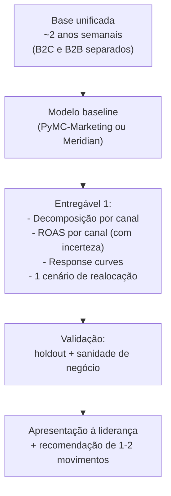

# Caso aplicado — um MMM para a sua empresa, passo a passo

> Um exemplo concreto e tangível, trazido para a sua realidade: uma empresa brasileira com operação B2B e B2C. Define o resultado de negócio, lista os canais reais (Google Ads, Meta, LinkedIn, eventos, OOH, e-mail), mostra exatamente quais dados puxar e de onde (CRM, RevOps, comercial, agência), como redigir as hipóteses, como é o primeiro entregável, e quais decisões ele informa — amarrando a saída do MMM às métricas de RevOps (CAC, pipeline) que você vai operar.

## O cenário (fictício, mas realista)

**Empresa**: "Nuvora" — uma empresa brasileira de tecnologia que vende um software de gestão. Tem dois motores de receita:
- **B2C / SMB**: pequenas empresas compram self-service pelo site (ciclo curto, conversão online).
- **B2B / Enterprise**: contas grandes entram via SDR/vendas (ciclo longo, MMM mede **pipeline/leads qualificados**, não venda imediata).

Você acabou de assumir o pivô entre Comercial e Marketing. A liderança quer saber: **"estamos gastando R$ ~400k/mês em mídia. Está bem distribuído? Onde dói cortar? Onde vale dobrar?"** O MMM é a resposta.

## Passo 1 — Definir o(s) resultado(s) de negócio (o `y`)

Como há dois motores com dinâmicas diferentes, o pragmático é **dois modelos** (ou um modelo com a variável certa por linha de negócio):

| Linha | Variável dependente (`y`) | Por quê |
|---|---|---|
| B2C / SMB | **Receita de novas assinaturas self-service** (semanal) | Ciclo curto, mídia → conversão na mesma janela (+ carryover curto) |
| B2B / Enterprise | **Pipeline gerado** (valor de oportunidades criadas) ou **MQLs/SQLs** | Venda demora meses; medir venda fechada quebra a relação temporal com a mídia |

> Decisão de design importante para B2B: como o ciclo é longo, modele o **topo/meio de funil** (lead qualificado, oportunidade, pipeline) — não a receita fechada. Isso preserva a relação temporal mídia→efeito que o adstock precisa. Esse é o tipo de escolha onde o seu lado de RevOps brilha.

## Passo 2 — Mapear os canais (os `x`)

| Canal | B2C | B2B | Variável a usar | Observação |
|---|---|---|---|---|
| Google Ads (Search) | ✓ | ✓ | Gasto + impressões/cliques | Search = fundo de funil, carryover curto (θ baixo) |
| Google Ads (PMax/Display) | ✓ | ✓ | Gasto + impressões | Mais topo, carryover médio |
| Meta (FB/IG) | ✓ | ✓ | Gasto + impressões | Prospecção + remarketing |
| LinkedIn Ads | — | ✓ | Gasto + impressões | Canal-chave B2B; público qualificado |
| Eventos / feiras | — | ✓ | Gasto (+ flag de evento) | Pico pontual; modele com dummy de evento + adstock longo |
| OOH (mídia exterior) | ✓ | ✓ | Gasto (ou inserções) | Marca; carryover longo (θ alto) |
| E-mail / CRM | ✓ | ✓ | Envios / custo de plataforma | Barato; efeito sobre base existente |
| TV / streaming (se houver) | ✓ | — | GRP **ou** gasto | Marca; adstock longo. Não usar GRP **e** gasto juntos |

E os controles de base (não esqueça, senão a mídia leva o crédito de tudo):

| Controle | Fonte |
|---|---|
| Preço / plano médio | ERP / billing |
| Promoções e descontos | Comercial / pricing |
| Sazonalidade (volta às aulas, fim de ano, fechamento de trimestre B2B) | Calendário |
| Eventos macro (Black Friday, Copa, eleição) | Calendário |
| Atividade de SDR/vendas (headcount, ligações) | CRM — relevante p/ B2B |
| Câmbio / indicador macro | Banco Central / IBGE |

## Passo 3 — De onde puxar cada dado (a parte de RevOps)

Esta é a tabela que você leva para a primeira reunião — quem é dono de cada fonte:

| Dado | Sistema / fonte | Dono interno |
|---|---|---|
| Receita / novas assinaturas | ERP / billing / financeiro | Financeiro |
| Pipeline, oportunidades, MQL/SQL | **CRM (Salesforce / HubSpot / Pipedrive)** | RevOps / Comercial (você) |
| Gasto e impressões digitais | Google Ads, Meta Ads Manager, LinkedIn Campaign Manager | Marketing / agência |
| GRP de TV | Kantar IBOPE / agência | Agência de mídia |
| Gasto OOH / eventos | Plano de mídia / financeiro | Marketing |
| Envios de e-mail | Plataforma (RD Station / HubSpot) | Marketing |
| Preço, promo, distribuição | ERP / pricing | Comercial / produto |
| Headcount de vendas, atividade SDR | CRM / RH | RevOps (você) |

> O seu papel de pivô Comercial×Marketing é exatamente o que destrava isso: **só você senta nas duas pontas.** O MMM morre na maioria das empresas não por falta de modelo, mas por falta de alguém que consiga juntar o dado de mídia (Marketing) com o dado de receita/pipeline (Comercial). Esse alguém é você.

## Passo 4 — Como redigir as hipóteses (o "projetar hipóteses")

Transforme as perguntas da liderança em hipóteses testáveis pelo MMM. Formato: _"Acreditamos que [canal/alavanca] [efeito]; o MMM confirma/refuta e quantifica."_

| Hipótese de negócio | O que o MMM entrega |
|---|---|
| "LinkedIn é caro mas é o que traz conta enterprise boa" | Contribuição do LinkedIn no **pipeline B2B** + ROAS + posição na response curve (já saturou?) |
| "OOH é só vaidade, não vende" | Contribuição incremental do OOH (lembrando do carryover longo de marca) |
| "Estamos saturando o Google Ads" | Onde estamos na curva de saturação do Search; ROI marginal vs médio |
| "Eventos B2B valem o custo?" | Efeito do dummy de evento sobre pipeline + adstock pós-evento |
| "Se cortarmos 15% da verba, onde dói menos?" | Cenário what-if com otimização sob orçamento reduzido |
| "Quanto investir para bater a meta de pipeline do Q3?" | Otimização inversa: verba e mix mínimos para o alvo |

## Passo 5 — Como é o primeiro entregável

Não tente entregar o MMM perfeito de cara. O primeiro deliverable (4–6 semanas de trabalho) é um **baseline honesto**:

Conteúdo do deck de entrega (puxando do seu lado publicitário de contar história):
1. **Quanto da receita/pipeline é base vs mídia** (gráfico de decomposição).
2. **Share de efeito vs share de gasto por canal** (a tabela que o CFO entende).
3. **ROAS por canal com intervalo de incerteza** (ranqueado).
4. **2–3 response curves** dos canais principais (mostrando quem saturou).
5. **Uma recomendação concreta de realocação** (atual vs otimizado, com receita projetada).
6. **O que vem a seguir** (calibração via lift test, refresh trimestral — ver [`06-roadmap-e-referencias.md`](./06-roadmap-e-referencias.md)).

## Passo 6 — Quais decisões isso informa (e a ponte com RevOps)

| Saída do MMM | Decisão que informa | Métrica de RevOps conectada |
|---|---|---|
| ROAS por canal | Onde manter/cortar verba | **CAC por canal** (custo de mídia / novos clientes) |
| Response curve do Search | Quanto mais cabe antes de saturar | CAC marginal |
| Contribuição do LinkedIn no pipeline | Defender ou cortar canal B2B caro | **Custo por oportunidade**, velocidade de pipeline |
| Cenário "−15% verba" | Onde cortar com menor dano | Impacto em **pipeline coverage** e meta de receita |
| Otimização inversa (atingir meta) | Verba necessária por trimestre | Planejamento de **pipeline vs quota** |
| Efeito de eventos B2B | Continuar/parar patrocínios | ROI de evento, influência em deals |

A amarração com CAC é direta e poderosa: o MMM te dá a **receita/aquisição incremental** por canal; dividindo o gasto do canal por essa aquisição incremental, você tem um **CAC incremental por canal** muito mais honesto que o CAC de last-click. Esse número muda como o Comercial planeja a meta — e é exatamente o tipo de insight que justifica a sua posição de pivô.

## Resumo do caso em uma frase

> Dois modelos (B2C → receita; B2B → pipeline), alimentados por dados que **só você** consegue juntar (mídia do Marketing + receita/pipeline do CRM), entregando num primeiro deck a decomposição, o ROAS por canal e um cenário de realocação — e conectando tudo a CAC e pipeline para o Comercial decidir verba com número, não com achismo.

## Referências

- MMM e Retail Media — mensuração no Brasil: <https://retailmedianews.com.br/artigos/marketing-mix-modeling-mmm-e-retail-media-o-caminho-para-a-mensuracao-e-otimizacao-de-alta-performance/>
- Marketing Mix Modeling, conformidade com a LGPD e dados agregados (Approach): <https://www.approach.com.br/blog/marketing-mix-modeling/>
- MMM no contexto brasileiro (Ilumeo): <https://ilumeo.com.br/marketing-mix-modeling/>
- Data Required in Marketing Mix Modeling — MASS Analytics: <https://mass-analytics.com/marketing-mix-modeling-blogs/data-required-in-marketing-mix-modeling/>
- PyMC-Marketing (documentação oficial): <https://www.pymc-marketing.io/>
