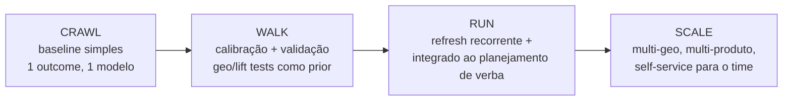

# Roadmap e referências — construindo a capacidade de MMM (crawl, walk, run)

> O plano em fases para a empresa sair do zero a uma capacidade de MMM operacional: comece com um baseline simples em Robyn ou Meridian sobre um único resultado, adicione calibração via geo/lift tests, operacionalize um refresh recorrente e integre ao planejamento de verba. Inclui modelo de maturidade, as armadilhas organizacionais (não as técnicas) mais comuns, uma trilha de aprendizado e a bibliografia consolidada com fontes oficiais verificadas.

## Filosofia: crawl, walk, run

Não tente entregar o MMM definitivo no primeiro trimestre. A capacidade amadurece em fases — cada uma entrega valor e financia a próxima.

### Fase 0 — Crawl (semanas 1–8): o baseline honesto

**Objetivo**: provar que dá para fazer, gerar o primeiro insight, ganhar confiança da liderança.

- Escolher **um** resultado (ex.: receita B2C self-service — ver [`05-caso-aplicado.md`](./05-caso-aplicado.md)).
- Montar a base unificada (2–3 anos semanais; o gargalo real é dado, não modelo).
- Rodar um baseline em **PyMC-Marketing** (aprender) ou **Meridian/Robyn** (produção).
- Entregar: decomposição + ROAS por canal + response curves + 1 cenário de realocação.
- Critério de sucesso: liderança toma **uma** decisão de verba baseada no modelo.

### Fase 1 — Walk (mês 3–6): calibração e confiança

**Objetivo**: sair de "correlação bonita" para "ancorado em causalidade".

- Rodar 1–2 **geo lift tests** (ou aproveitar experimentos já feitos pelo Google/Meta) e usar como **prior de calibração** (ver [`02-metodologia-estatistica.md`](./02-metodologia-estatistica.md)).
- Validação séria: holdout temporal, NRMSE/MAPE, estabilidade da decomposição entre refreshes.
- Triangular com a atribuição de plataforma (não competir — complementar, ver [`01-fundamentos-mmm.md`](./01-fundamentos-mmm.md)).
- Adicionar o segundo modelo (ex.: pipeline B2B).

### Fase 2 — Run (mês 6–12): operacionalizar

**Objetivo**: o MMM vira processo, não projeto.

- **Refresh recorrente**: trimestral é o padrão de mercado para MMM (mensal se o negócio for muito dinâmico). Pipeline de dados automatizado (ex.: BigQuery → Meridian).
- Integrar a saída ao **ciclo de planejamento de verba** — a recomendação de alocação entra no planejamento trimestral do Comercial + Marketing.
- Versionar modelos e decisões (rastreabilidade: qual modelo embasou qual corte de verba).

### Fase 3 — Scale (ano 2+): maturidade

- Modelos hierárquicos multi-geo / multi-produto (força do Meridian).
- Loop contínuo MMM ↔ experimentos (cada trimestre calibra o próximo).
- Camada self-service para o time de marketing rodar cenários sem depender de você.

## Modelo de maturidade

| Nível | Característica | Como mede mídia | Quem decide verba |
|---|---|---|---|
| 0 — Cego | Sem mensuração agregada | Last-click / "feeling" | Histórico + política interna |
| 1 — Crawl | 1 MMM baseline, sem calibração | MMM correlacional | MMM informa, humano decide |
| 2 — Walk | MMM calibrado com lift tests | MMM ancorado em causalidade | MMM + triangulação |
| 3 — Run | Refresh recorrente, integrado ao planejamento | MMM + MTA + incrementalidade | Planejamento orientado por marginal ROI |
| 4 — Scale | Multi-geo/produto, self-service, loop contínuo | Sistema unificado de mensuração | Decisão contínua data-driven |

## Armadilhas organizacionais (as que matam o projeto — não as técnicas)

As armadilhas **técnicas** estão em [`03-implementacao-pratica.md`](./03-implementacao-pratica.md). Estas são as **organizacionais**, que são as que de fato matam iniciativas de MMM:

| Armadilha | Sintoma | Antídoto |
|---|---|---|
| **Dados em silos** | Marketing tem mídia, Comercial tem receita, ninguém junta | O seu papel de pivô existe pra isso — seja o dono da base unificada |
| **Expectativa de causalidade perfeita** | Liderança trata MMM como verdade absoluta | Comunique incerteza sempre; explique o que o MMM **não** faz |
| **Esperar o modelo perfeito** | 6 meses sem entregar nada | Entregue o baseline imperfeito cedo; itere |
| **MMM que não vira decisão** | Lindo relatório, zero verba realocada | Toda entrega termina em **uma recomendação acionável** |
| **Sem calibração, ninguém confia** | "Esse ROI não bate com o que vejo" | Rode lift tests; ancore o modelo |
| **Refresh que nunca acontece** | Modelo de 2024 decidindo verba de 2026 | Automatize o pipeline; agende o refresh trimestral |
| **Bus factor = você** | Só você entende o modelo | Documente; eventualmente treine o time / self-service |

## Trilha de aprendizado sugerida (para você)

Ordem prática, do conceito ao código:

1. **Conceito**: leia este dossiê + o paper fundador do Google (Jin et al., 2017) para a base Bayesiana.
2. **Mão na massa Python**: faça o quickstart e o exemplo do **PyMC-Marketing** — é o caminho mais curto para um cientista de dados Python ver um MMM rodar.
3. **Produção**: siga o "Getting Started" do **Meridian** (pre-modeling → applied modeling → post-modeling). Bom para o resultado production-grade.
4. **Segunda opinião / didática**: o guia do analista do **Robyn** é excelente para entender automação de hiperparâmetros, DECOMP.RSSD e calibração — mesmo que você não use R.
5. **Aprofundar Bayesiano**: ArviZ para diagnóstico; revisar MCMC/NUTS (você já conhece de outros contextos).
6. **Comunidade**: PyMC Discourse, discussões do GitHub do Meridian, e os blogs práticos (Towards Data Science, Recast) para casos reais.

## Bibliografia consolidada (fontes verificadas)

### Documentação oficial das ferramentas
- **Google Meridian** — site de desenvolvedores: <https://developers.google.com/meridian/mmm>
- **Google Meridian** — MMM Unified Schema: <https://developers.google.com/meridian/docs/user-guide/mmm-unified-schema>
- **Google Meridian** — repositório oficial (Apache-2.0, Python, NUTS/TFP): <https://github.com/google/meridian>
- **Google Meridian** — guia de migração do LightweightMMM: <https://developers.google.com/meridian/docs/migrate>
- **Google Meridian** — saturação e lagging (fórmulas de adstock e Hill): <https://developers.google.com/meridian/docs/basics/media-saturation-lagging>
- **Meta Robyn** — repositório oficial: <https://github.com/facebookexperimental/Robyn>
- **Meta Robyn** — guia do analista (validação, DECOMP.RSSD, calibração): <https://facebookexperimental.github.io/Robyn/docs/analysts-guide-to-MMM/>
- **PyMC-Marketing** — documentação oficial: <https://www.pymc-marketing.io/>
- **PyMC-Marketing** — notebook de exemplo de MMM: <https://www.pymc-marketing.io/en/stable/notebooks/mmm/mmm_example.html>
- **PyMC-Marketing** — repositório: <https://github.com/pymc-labs/pymc-marketing>
- **LightweightMMM** (legado/descontinuado — referência histórica): <https://github.com/google/lightweight_mmm>

### Referências fundamentais de marketing science / metodologia
- Jin, Wang, Sun, Chan, Koehler — *Bayesian Methods for Media Mix Modeling with Carryover and Shape Effects* (Google, 2017): <https://research.google/pubs/bayesian-methods-for-media-mix-modeling-with-carryover-and-shape-effects/>
- *A Hierarchical Bayesian Approach to Improve Media Mix Models* (Google Research): <https://research.google.com/pubs/archive/45999.pdf>
- Marketing mix modeling — Wikipedia (história, 4 Ps, origens em CPG): <https://en.wikipedia.org/wiki/Marketing_mix_modeling>
- The History of Marketing Mix Modeling — Eliya: <https://www.eliya.io/blog/marketing-mix-modeling/history>

### Mensuração moderna, triangulação e contexto cookieless
- MMM vs MTA vs Incrementality — House of Martech: <https://houseofmartech.com/blog/marketing-measurement-evolution-2026-when-to-use-mmm-vs-mta-vs-incrementality-testing-vs-unified-approaches>
- What is Incrementality testing vs MMM vs MTA? — Measured: <https://www.measured.com/faq/what-are-the-pros-and-cons-of-incrementality-testing-versus-mmm-or-mta/>
- The iOS 14 Reckoning (impacto do ATT na atribuição): <https://www.penandpaper.ai/post/the-ios-14-reckoning-how-app-tracking-transparency-reshaped-ecommerce>

### Prática de implementação e otimização
- Practical Approaches to Optimizing Budget in MMM — Towards Data Science: <https://towardsdatascience.com/practical-approaches-to-optimizng-budget-in-marketing-mix-modeling-7816a27f2f71/>
- Media Mix Optimization / curvas de retorno decrescente — Measured: <https://www.measured.com/faq/media-mix-modeling-diminishing-return-curves-mmm-budget-decision/>
- The right way to cross-validate your MMM — Recast: <https://getrecast.com/cross-validation/>
- Data Required in Marketing Mix Modeling — MASS Analytics: <https://mass-analytics.com/marketing-mix-modeling-blogs/data-required-in-marketing-mix-modeling/>
- Panorama de ferramentas comerciais e open source — Sellforte: <https://sellforte.com/blog/marketing-mix-modeling-tools-for-accelerating-growth>

### Contexto Brasil
- MMM e Retail Media no Brasil — Retail Media News: <https://retailmedianews.com.br/artigos/marketing-mix-modeling-mmm-e-retail-media-o-caminho-para-a-mensuracao-e-otimizacao-de-alta-performance/>
- MMM e conformidade com a LGPD — Approach: <https://www.approach.com.br/blog/marketing-mix-modeling/>
- MMM (visão geral em PT-BR) — Ilumeo: <https://ilumeo.com.br/marketing-mix-modeling/>

## Mensagem final para você

Você chegou neste tema "ontem", mas o cruzamento que você ocupa — **publicitário que é cientista de dados, sentado entre Comercial e Marketing** — é exatamente o perfil que o MMM moderno exige e que quase nenhuma empresa tem. A ferramenta está madura e open source (Meridian, PyMC-Marketing). O dado está na sua empresa, espalhado entre áreas que só você consegue costurar. O renascimento do MMM (privacidade, fim do cookie, LGPD) tornou essa capacidade estratégica de novo. Comece pelo baseline simples, entregue uma decisão de verba, calibre, e vire o dono da capacidade. É a sua janela.
