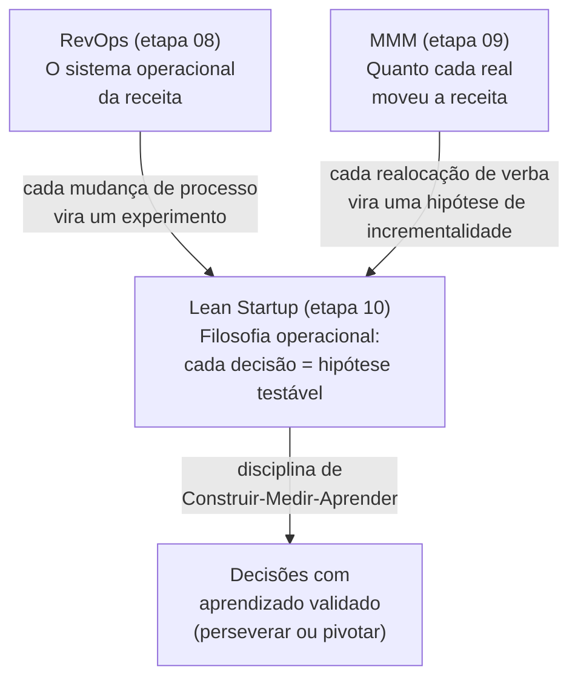

# Etapa 10 — Startup Enxuta (Lean Startup): a filosofia operacional que amarra RevOps e MMM

> Este dossiê não te apresenta o Lean Startup do zero — você já conhece e já tenta aplicar. Ele faz outra coisa: **afia** o método e o **conecta cirurgicamente à sua realidade** de cientista de dados + publicitário no pivô entre Comercial e Marketing, assumindo RevOps e construindo uma capacidade de MMM. A tese central é simples e forte: **toda mudança de processo de RevOps e toda realocação de verba derivada do MMM é uma hipótese a ser testada** via ciclo Construir-Medir-Aprender, com aprendizado validado em vez de opinião. Maio/2026.

## A sua mensagem, levada a sério

Você escreveu (traduzindo): _"Há mais um conhecimento que preciso que você pesquise: a metodologia Lean Startup. Eu conheço e estou tentando aplicar no meu trabalho, mas acho que ela encaixa muito bem nessa posição e cenário."_

Você está certo, e o encaixe é mais profundo do que parece à primeira vista. O Lean Startup costuma ser lido como "método para fundar startups". Mas o próprio Eric Ries define startup como **"uma instituição humana desenhada para criar um novo produto ou serviço sob condições de extrema incerteza"** — e isso inclui times dentro de empresas estabelecidas (o que ele chama de *intrapreneurship* no livro seguinte, *The Startup Way*). Você não está fundando uma empresa; você está **fundando duas capacidades novas dentro de uma empresa existente** (RevOps e MMM), e ambas operam exatamente sob a condição que o método ataca: incerteza alta sobre o que vai funcionar.

## O que é Lean Startup, afiado em uma frase

> Lean Startup é um método de gestão sob incerteza que substitui "executar um plano e torcer" por **ciclos rápidos de Construir-Medir-Aprender**, nos quais cada decisão vira uma **hipótese falsificável**, medida com **métricas acionáveis** (não de vaidade), gerando **aprendizado validado** que diz se você deve **perseverar ou pivotar**.

## A mensagem-chave em uma linha

> No seu novo cargo, você não "implementa processos" e "otimiza verba" — você **roda experimentos**: cada regra de roteamento de lead, cada mudança de SLA, cada realocação de budget é uma hipótese com métrica e critério de decisão, e o seu diferencial é que você sabe instrumentar e medir isso com rigor estatístico.

## Por que ele encaixa exatamente no seu cenário

| Sua frente | O problema clássico | O que o Lean Startup faz por você |
|---|---|---|
| **RevOps** (etapa 08) | Mudanças de processo são feitas "porque parece certo" e ninguém mede se melhoraram a receita | Trata cada mudança de processo (roteamento, SLA, cadência) como **experimento com hipótese e métrica** |
| **MMM** (etapa 09) | Verba é realocada por intuição ou por última-atribuição; ninguém testa se moveu mesmo a receita | Transforma cada realocação de verba numa **hipótese de incrementalidade**, validada por experimento geo/lift |
| **Pivô Comercial × Marketing** | As duas áreas operam por opinião e brigam por crédito | Dá um **vocabulário e um placar comuns** (hipótese → métrica → aprendizado) que despolitiza a decisão |

A conexão é dupla e usa exatamente as suas duas metades:

- Como **cientista de dados**, você é a pessoa que sabe fazer o "Medir" do ciclo direito: instrumentar métricas, desenhar A/B tests, calcular tamanho de amostra e significância, fazer análise de coorte, separar incrementalidade de correlação. A maioria dos times "faz Lean Startup" sem rigor de medição — você fecha essa lacuna.
- Como **publicitário**, você é a pessoa que sabe fazer o "Construir" do lado de mensagem e proposta de valor direito: formular hipóteses de valor, desenhar experimentos de mensagem, oferta e canal. Você sabe transformar uma hipótese em algo que o mercado consegue reagir.

## O que cada documento deste dossiê entrega

| Doc | Conteúdo | Para o seu lado... |
|-----|----------|--------------------|
| [`00-resumo-executivo.md`](./00-resumo-executivo.md) | Visão geral, mensagem-chave, por que encaixa, mapa, conexão com 08 e 09 | Agora (este doc) |
| [`01-fundamentos-lean-startup.md`](./01-fundamentos-lean-startup.md) | Origens (Ries, Steve Blank, Toyota, Agile), os 5 princípios, aprendizado validado vs execução de plano, e por que vale DENTRO de uma empresa (intraempreendedorismo) | Para realinhar os fundamentos com profundidade |
| [`02-build-measure-learn.md`](./02-build-measure-learn.md) | O ciclo Construir-Medir-Aprender a fundo: leaps of faith, hipótese de valor e de crescimento, tipos de MVP, pivotar vs perseverar e o catálogo de pivôs | O coração do método |
| [`03-metricas-experimentacao.md`](./03-metricas-experimentacao.md) | Contabilidade da inovação, métricas de vaidade vs acionáveis, os "três A's", coorte, A/B e rigor estatístico | Cientista de dados — aqui você é o diferencial |
| [`04-aplicacao-comercial-marketing-revops.md`](./04-aplicacao-comercial-marketing-revops.md) | O doc-ponte: como aplicar no seu dia a dia (RevOps, marketing, comercial, MMM), template de "experiment card" e 6 experimentos prontos | Você — leve direto para a sua rotina |
| [`05-roadmap-e-referencias.md`](./05-roadmap-e-referencias.md) | Operacionalizar em 90 dias, modelo de maturidade, armadilhas, trilha de aprendizado e bibliografia | Você como dono da capacidade |

## Como isso se conecta às etapas 08 e 09

Pense assim: a [etapa 08 (RevOps)](../08-revops/00-resumo-executivo.md) te dá o **sistema** (o funil, os processos, os dados), a [etapa 09 (MMM)](../09-marketing-mix-model/00-resumo-executivo.md) te dá um **instrumento de medição** poderoso (quanto cada canal moveu a receita), e o Lean Startup (esta etapa 10) te dá o **método de operar** os dois: nunca mudar nada sem transformar em hipótese, medir, e aprender. O MMM, em particular, casa com um princípio central deste dossiê — **incrementalidade > correlação** — que é o mesmo princípio que separa métrica acionável de métrica de vaidade (ver [`03-metricas-experimentacao.md`](./03-metricas-experimentacao.md)).

## Por onde começar

- Se você tem 15 minutos: leia este resumo + a tabela dos 5 princípios em [`01-fundamentos-lean-startup.md`](./01-fundamentos-lean-startup.md).
- Se você quer aplicar já na segunda-feira: pule para [`04-aplicacao-comercial-marketing-revops.md`](./04-aplicacao-comercial-marketing-revops.md) e use o template de experiment card.
- Se você quer montar isso no time ao longo do trimestre: vá para [`05-roadmap-e-referencias.md`](./05-roadmap-e-referencias.md).

## Referências

- The Lean Startup — Methodology / Principles (site oficial de Eric Ries): <https://theleanstartup.com/principles>
- The Lean Startup — The Book (site oficial): <https://theleanstartup.com/book>
- Eric Ries — *The Lean Startup* (página do livro, Amazon): <https://www.amazon.com/Lean-Startup-Entrepreneurs-Continuous-Innovation/dp/0307887898>
- Customer development — Wikipedia: <https://en.wikipedia.org/wiki/Customer_development>
- Etapa 08 — RevOps (este repositório): [`../08-revops/00-resumo-executivo.md`](../08-revops/00-resumo-executivo.md)
- Etapa 09 — Marketing Mix Modeling (este repositório): [`../09-marketing-mix-model/00-resumo-executivo.md`](../09-marketing-mix-model/00-resumo-executivo.md)
