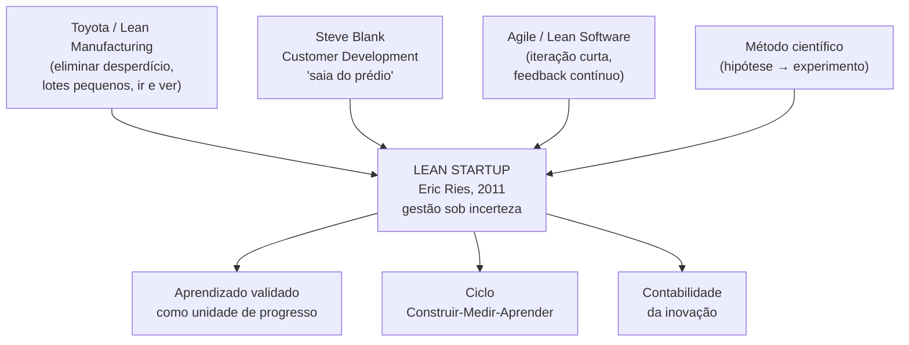

# 01 — Fundamentos: de onde vem e o que realmente é o Lean Startup

> Este documento recoloca os fundamentos com profundidade: a linhagem intelectual (Eric Ries, Steve Blank, Toyota/Lean Manufacturing, Agile), a definição de startup como gestão sob extrema incerteza, os cinco princípios, o conceito que sustenta tudo — **aprendizado validado** contra a velha "execução de um plano" — e, crucial para você, por que isso vale DENTRO de uma empresa estabelecida (intraempreendedorismo). Não é introdução para iniciante; é o realinhamento dos alicerces para quem já usa o método.

## A definição que muda tudo

Eric Ries define **startup** não pelo tamanho da empresa nem pela idade, mas pela condição:

> Uma startup é uma instituição humana desenhada para criar um novo produto ou serviço **sob condições de extrema incerteza**.

Repare no que essa definição libera: ela **não** exige que você seja um fundador de garagem. Um time dentro de uma empresa de 500 pessoas que está criando uma capacidade nova — digamos, **RevOps** ou um **MMM** — opera exatamente sob "extrema incerteza" e, portanto, é uma startup no sentido de Ries. É por isso que o método é seu, mesmo você sendo funcionário. Voltaremos a isso na seção de intraempreendedorismo.

A consequência prática da definição: quando a incerteza é extrema, **planejar com precisão é ilusão**. As ferramentas clássicas de gestão (plano detalhado, previsão de 12 meses, marcos fixos) foram desenhadas para ambientes de baixa incerteza. Sob alta incerteza, elas dão uma falsa sensação de controle. O Lean Startup substitui "executar o plano perfeito" por "aprender o mais rápido possível o que funciona".

## A linhagem intelectual

O Lean Startup não nasceu do nada. É a síntese de quatro tradições, e entender de onde cada peça veio ajuda a aplicar melhor.

| Origem | O que contribuiu | Como aparece no Lean Startup |
|---|---|---|
| **Toyota / Lean Manufacturing** (Taiichi Ohno, Shigeo Shingo) | Eliminação de **desperdício** (*muda*), produção puxada, *Genchi Genbutsu* ("vá e veja"), lotes pequenos | A obsessão por reduzir desperdício — só que aqui o maior desperdício é **construir algo que ninguém quer** |
| **Customer Development** (Steve Blank, *The Four Steps to the Epiphany*, 2005) | "Saia do prédio" — fatos estão fora, opiniões estão dentro; busca de um modelo de negócio repetível e escalável | A base do método; Ries foi aluno e investido de Blank. Customer Discovery → Validation → Creation → Building |
| **Desenvolvimento Ágil de Software** (Agile, Lean Software, XP) | Iteração curta, feedback contínuo, entregar incremento funcional cedo | O ritmo de ciclos curtos e a ideia de entregar o mínimo para aprender |
| **Método científico** | Hipótese → experimento → medição → conclusão | A espinha dorsal: tratar cada decisão de negócio como hipótese falsificável |

Steve Blank é o elo crítico. Sua sacada — que **uma startup não é uma versão menor de uma empresa grande** — é a fundação. Empresa grande **executa** um modelo de negócio conhecido; startup **busca** um modelo de negócio ainda desconhecido. São atividades diferentes, com ferramentas diferentes. Ries pegou o *Customer Development* de Blank, casou com Lean e Agile, e empacotou num método operacional em *The Lean Startup* (2011).

## Os cinco princípios

Ries condensa o método em cinco princípios (os mesmos que abrem o site oficial e o livro):

| # | Princípio | O que significa | Tradução para o seu cargo |
|---|---|---|---|
| 1 | **Empreendedores estão em todo lugar** | Você não precisa de uma garagem; qualquer um criando algo novo sob incerteza é empreendedor — inclusive dentro de empresas | Você, montando RevOps e MMM, é um intraempreendedor. O método é seu |
| 2 | **Empreender é gerir** | Startup é uma instituição que exige um **novo tipo de gestão**, calibrada para incerteza, não só "um produto" | RevOps e MMM precisam ser **geridos como experimentos**, não como entregas de projeto |
| 3 | **Aprendizado validado** | O propósito de uma startup não é fazer coisas nem ganhar dinheiro hoje, mas **aprender a construir um negócio sustentável** — e provar isso com dados | Cada processo/verba que você muda deve gerar aprendizado mensurável, não só "atividade" |
| 4 | **Construir-Medir-Aprender** | A atividade fundamental é transformar ideias em produtos, medir a reação e aprender se deve pivotar ou perseverar | É o seu loop operacional (ver [`02-build-measure-learn.md`](./02-build-measure-learn.md)) |
| 5 | **Contabilidade da inovação** | Para melhorar resultados de empreendedorismo e cobrar responsabilidade, é preciso uma forma de medir o progresso, definir marcos e priorizar — diferente da contabilidade tradicional | É onde o seu rigor de dados brilha (ver [`03-metricas-experimentacao.md`](./03-metricas-experimentacao.md)) |

## Aprendizado validado vs. execução de um plano

Este é o coração filosófico. Vale fixar a diferença com clareza, porque é aqui que a maioria erra — inclusive quem "acha que está fazendo Lean Startup".

| Dimensão | Mundo tradicional (executar o plano) | Lean Startup (aprendizado validado) |
|---|---|---|
| Unidade de progresso | Entregar o que estava no plano (features, milestones) | **Aprender algo verdadeiro** sobre o que move o negócio |
| Pergunta central | "Conseguimos construir isso?" | "**Devíamos** construir isso? Alguém quer? Move a receita?" |
| Sucesso de curto prazo | Cumprir cronograma e escopo | Validar ou refutar uma hipótese com dados |
| Reação a um número ruim | "Vamos nos esforçar mais para executar o plano" | "O plano (hipótese) estava errado; vamos pivotar" |
| Maior risco | Atrasar a entrega | **Entregar com sucesso algo que ninguém queria** |
| Evidência | Opinião do mais sênior, plano aprovado | Experimento com métrica acionável |

A frase que resume: **"sucesso na execução de um plano não é progresso se o plano estava errado"**. Você pode bater 100% das metas de implementação de um novo processo de RevOps e ainda assim não ter movido a receita — porque a hipótese por trás do processo estava errada. Aprendizado validado é a disciplina de descobrir isso **cedo e barato**, em vez de tarde e caro.

### Por que isso é tão difícil na prática

Porque "aprender que estávamos errados" parece fracasso para a cultura corporativa, que premia entrega. O Lean Startup reframa: **refutar uma hipótese ruim rapidamente é uma vitória** — você economizou meses de investimento numa direção morta. O trabalho de quem opera o método (você) é tornar esse reframe legível para a liderança, e a [contabilidade da inovação](./03-metricas-experimentacao.md) é a ferramenta para isso.

## Por que isso vale DENTRO de uma empresa: intraempreendedorismo

Este é o ponto que torna o dossiê inteiro relevante para você. Em *The Startup Way* (2017), Ries leva o método para dentro de organizações estabelecidas (GE, Toyota, governo dos EUA) e mostra que os mesmos princípios funcionam — com adaptações.

| O que muda dentro da empresa | Implicação para você |
|---|---|
| Há mais recursos, mas também mais burocracia e silos | RevOps já é, em parte, a quebra desses silos (ver [`../08-revops/00-resumo-executivo.md`](../08-revops/00-resumo-executivo.md)); o Lean Startup é o método de operá-la |
| Existem "stakeholders" que querem plano e previsibilidade | Você precisa traduzir experimentos em linguagem de marcos e de contabilidade da inovação |
| O "produto" muitas vezes é um **processo interno** ou uma **decisão de verba**, não um app | Perfeito: um novo SLA, uma regra de roteamento, uma realocação de budget são todos "produtos" testáveis |
| Falha tem custo político | Por isso experimentos baratos e reversíveis (MVPs) importam ainda mais — você arrisca pouco para aprender muito |

A tradução literal para você: **você é um empreendedor operando sob extrema incerteza dentro de uma empresa**. As capacidades que você está criando (RevOps, MMM) são startups internas. O método que reduz o risco delas é o Lean Startup. Os próximos documentos descem ao operacional: o [ciclo Construir-Medir-Aprender](./02-build-measure-learn.md), as [métricas e a experimentação](./03-metricas-experimentacao.md), e a [aplicação no seu dia a dia](./04-aplicacao-comercial-marketing-revops.md).

## Referências

- The Lean Startup — Principles (site oficial de Eric Ries): <https://theleanstartup.com/principles>
- The Lean Startup — The Book (site oficial): <https://theleanstartup.com/book>
- Customer development — Wikipedia: <https://en.wikipedia.org/wiki/Customer_development>
- Steve Blank — Wikipedia: <https://en.wikipedia.org/wiki/Steve_Blank>
- Steve Blank — Customer Development (artigos do próprio autor): <https://steveblank.com/tag/customer-development/>
- The Lean Startup and Customer Development (relação Lean/Toyota/Customer Dev): <https://6sigma.com/the-lean-startup-and-customer-development/>
- Eric Ries — *The Lean Startup* (Amazon): <https://www.amazon.com/Lean-Startup-Entrepreneurs-Continuous-Innovation/dp/0307887898>
