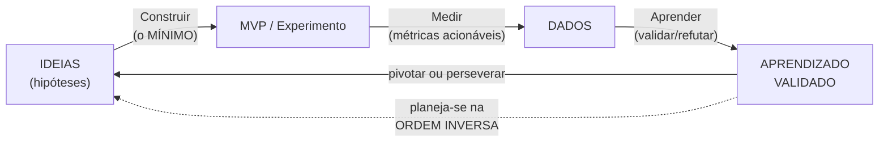

# 02 — O ciclo Construir-Medir-Aprender a fundo

> Aqui o método vira motor. Este documento abre o ciclo **Construir-Medir-Aprender** em detalhe: as suposições de salto de fé (*leap-of-faith assumptions*) — hipótese de valor e hipótese de crescimento —, como transformar uma suposição numa hipótese falsificável com métrica e limiar, os tipos de **MVP** (concierge, Mágico de Oz, smoke test/landing page, single-feature) e o objetivo verdadeiro do ciclo (minimizar o tempo total de volta), e a decisão **pivotar vs. perseverar** com o catálogo completo de pivôs. Termina com um exemplo trabalhado de hipótese.

## O ciclo, e o erro de lê-lo na ordem dos nomes

O ciclo se chama Construir → Medir → Aprender, mas você o **planeja na ordem inversa**: primeiro decide **o que precisa aprender**, daí **qual métrica** revela isso, e só então **o que construir** (o mínimo) para gerar essa métrica.

O objetivo do método **não** é "construir um MVP". É **minimizar o tempo total de uma volta completa do ciclo** — da ideia ao aprendizado. Tudo o que acelera a volta (construir menos, medir melhor, decidir mais rápido) é bom; tudo o que infla a volta (construir demais antes de medir, métricas que não ensinam) é desperdício.

## Suposições de salto de fé (leap-of-faith assumptions)

Toda iniciativa nova repousa sobre duas crenças que, se forem falsas, derrubam tudo. Ries as chama de *leap-of-faith assumptions* e as separa em duas:

| Suposição | Pergunta que ela responde | Exemplo no seu mundo (RevOps/MMM) |
|---|---|---|
| **Hipótese de valor** | Quando o cliente usa, isso entrega valor real? | "Se SDRs receberem leads roteados por score preditivo, eles fecham mais — porque o score identifica leads de fato mais propensos" |
| **Hipótese de crescimento** | Como novos clientes/usuários descobrem e adotam isso, e como ele se espalha/escala? | "Se realocarmos verba do canal X para o canal Y, o pipeline incremental cresce de forma escalável, não pontual" |

A regra: **identifique as suposições de salto de fé mais arriscadas e teste-as primeiro**. Não comece pelo que é fácil de construir; comece pelo que, se for falso, mata a iniciativa. No jargão de Steve Blank e da Strategyzer, isso é mapear as suposições e atacar as de **maior risco × maior incerteza** primeiro.

## De suposição a hipótese falsificável

Uma suposição vira testável quando você a escreve no formato:

> **Acreditamos que** [ação/mudança] **vai gerar** [resultado mensurável] **para** [segmento], **e saberemos que estamos certos quando** [métrica] **atingir** [limiar] **em** [janela de tempo].

Os quatro elementos que tornam a hipótese honesta:
- **Métrica acionável** (não de vaidade — ver [`03-metricas-experimentacao.md`](./03-metricas-experimentacao.md)).
- **Limiar numérico explícito** definido **antes** do experimento (senão você racionaliza qualquer resultado depois).
- **Janela de tempo** (senão o experimento nunca "termina").
- **Critério de decisão** pré-acordado: o que você faz se passar, e o que faz se falhar.

Se você não consegue escrever a hipótese de forma que ela possa ser **refutada** por um número, ela ainda não é uma hipótese — é uma opinião disfarçada.

## O MVP: produto mínimo viável (e o que ele NÃO é)

O MVP é a versão do experimento que permite uma volta completa do ciclo **com o mínimo de esforço**. O propósito é **aprender ao menor custo possível** — não lançar uma versão pequena e bonita do produto. Erro clássico: tratar "MVP" como "produto 1.0 enxuto". MVP é um **instrumento de aprendizado**; pode nem ser um produto.

| Tipo de MVP | Como funciona | Quando usar | Equivalente no seu mundo |
|---|---|---|---|
| **Smoke test / Landing page** | Página que descreve a oferta com um CTA (lista de espera, agendar demo, comprar); mede interesse antes de construir | Validar **demanda/interesse** por uma proposta de valor | Landing + tráfego pago para testar uma nova oferta comercial antes de o time de Vendas vendê-la |
| **Concierge** | Você entrega o serviço **manualmente**, e o cliente **sabe** que é manual | Validar a **hipótese de valor** com poucos clientes, alta proximidade | Operar manualmente um novo processo de qualificação de lead para 10 contas antes de automatizar no CRM |
| **Mágico de Oz** (*Wizard of Oz*) | A interface parece automatizada, mas há gente fazendo o trabalho por trás; o cliente **não sabe** | Validar valor de algo que parece automatizado sem construir a automação | Simular um "lead scoring automático" rodando o score na mão antes de produtizar o modelo |
| **Single-feature** (uma funcionalidade) | Entrega só a função central, nada mais | Já há demanda; falta validar **se a função resolve** | Lançar só a regra de roteamento nova, sem mexer em todo o fluxo de RevOps |
| **Sell before you build** (pré-venda) | Vender/coletar compromisso antes de construir | Validar disposição a pagar/adotar | Conseguir compromisso da liderança de Vendas de adotar uma cadência antes de configurá-la inteira |

Princípio operacional: **escolha o MVP mais barato que ainda gere a métrica que decide a hipótese**. Se uma planilha e três ligações respondem à pergunta, não construa um pipeline de dados.

## Pivotar ou perseverar

Após algumas voltas do ciclo, chega o momento da decisão estratégica: os experimentos estão validando a direção (**perseverar**) ou indicando que a hipótese fundamental está errada (**pivotar**)?

> **Pivô** = uma correção de rota estruturada, desenhada para testar uma **nova hipótese fundamental** sobre o produto, a estratégia ou o motor de crescimento. Não é desistir; é mudar de hipótese mantendo o aprendizado acumulado.

O sinal típico para pivotar: os números estão estagnados apesar da otimização, e as métricas acionáveis não melhoram entre coortes. O risco oposto, igualmente comum, é a **"terra dos mortos-vivos"** — números medíocres porém não terríveis, que não justificam nem celebrar nem matar, e que prendem o time por tempo demais. Um critério de decisão pré-definido evita isso.

### Catálogo de pivôs (Eric Ries)

| Pivô | O que muda | Exemplo aplicado ao seu contexto |
|---|---|---|
| **Zoom-in** | Uma única feature vira o produto inteiro | O sub-relatório de incrementalidade do MMM vira a entrega principal para a liderança |
| **Zoom-out** | O que era o produto vira só uma feature de algo maior | O lead scoring deixa de ser entregável isolado e vira parte de um motor de roteamento completo |
| **Segmento de cliente** | Mesma solução, **outro público** | Processo desenhado para SMB se mostra melhor para mid-market |
| **Necessidade do cliente** | Mesmo público, **outro problema** | O time de Vendas tinha outra dor (forecast) maior que a que você atacava (roteamento) |
| **Plataforma** | De aplicação para plataforma (ou vice-versa) | De um dashboard pontual para uma camada de dados reutilizável de RevOps |
| **Arquitetura de negócio** | Alto-valor/baixo-volume ↔ baixo-valor/alto-volume | Realocar mídia mudando o foco de aquisição para um modelo mais transacional |
| **Captura de valor** | Como se monetiza/precifica | Mudar a lógica de quota/comissão atrelada a um novo processo |
| **Motor de crescimento** | Viral ↔ pago ↔ recorrente | MMM revela que o crescimento real vem de pago, não de orgânico — muda-se o motor |
| **Canal** | Outro canal de venda/entrega | Pivotar de inbound para outbound com base no resultado do experimento |
| **Tecnologia** | Mesma solução, outra tecnologia | Trocar a ferramenta/modelo que entrega o score mantendo o objetivo |

## Exemplo trabalhado: uma hipótese honesta de RevOps

Veja a diferença entre uma intenção vaga e uma hipótese testável.

**Versão fraca (opinião):** "Acho que se a gente rotear os leads melhor, as vendas melhoram."

**Versão Lean Startup (hipótese falsificável):**

> **Acreditamos que** rotear os leads inbound por um score preditivo (em vez de round-robin) **vai aumentar** a taxa de conversão de MQL→SQL **para os SDRs do time de inbound**, **e saberemos que estamos certos quando** a conversão MQL→SQL da coorte exposta ao novo roteamento for **pelo menos 6 pontos percentuais maior** que a do grupo de controle, **com significância de 95%**, **em 6 semanas**.
>
> - **Suposição de salto de fé testada:** hipótese de valor (o score realmente separa lead bom de ruim).
> - **MVP:** Mágico de Oz — você calcula o score na mão/num notebook e injeta o roteamento manualmente, sem produtizar nada no CRM ainda.
> - **Métrica acionável:** conversão MQL→SQL por coorte (não "número de leads roteados", que seria vaidade).
> - **Critério de decisão:** se ≥ 6 pp e significante → **perseverar** (produtizar no CRM). Se < 6 pp ou não significante → **pivotar** (testar outra variável: talvez o problema não seja roteamento, mas tempo de resposta — *necessidade do cliente*).

Esse formato é exatamente o que o template de **experiment card** em [`04-aplicacao-comercial-marketing-revops.md`](./04-aplicacao-comercial-marketing-revops.md) operacionaliza, e o rigor estatístico do limiar ("6 pp, 95%, 6 semanas") é o que [`03-metricas-experimentacao.md`](./03-metricas-experimentacao.md) detalha.

## Referências

- The Lean Startup — Principles (site oficial): <https://theleanstartup.com/principles>
- The Lean Startup — The Book (site oficial): <https://theleanstartup.com/book>
- The Taxonomy of the Lean Startup Pivot (Kromatic): <https://kromatic.com/blog/the-taxonomy-of-the-lean-startup-pivot/>
- Lessons from The Lean Startup, Chapter 8 — Pivot or Persevere (Teamly): <https://www.teamly.com/blog/lessons-from-the-lean-startup-by-eric-ries-chapter-8/>
- 5 examples of MVP to help you choose the right type (Greenice): <https://greenice.net/type-mvp-right-startup/>
- Major Types of Minimum Viable Products (Upsilon): <https://www.upsilonit.com/blog/what-are-the-main-types-of-mvps>
- Testing Business Ideas — Strategyzer (mapeamento de suposições/experimentos): <https://www.strategyzer.com/library/testing-business-ideas-book>
