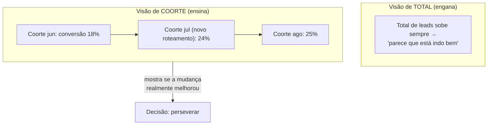

# 03 — Métricas, contabilidade da inovação e experimentação com rigor

> Este é o documento onde o seu perfil de cientista de dados é o diferencial, então ele desce ao técnico. Cobre a **contabilidade da inovação**, a distinção entre métricas **acionáveis** e **de vaidade**, os **três A's** de uma boa métrica (acionável, acessível, auditável), **análise de coorte**, **A/B / split testing** e o rigor estatístico que separa um experimento real de teatro de dados (tamanho de amostra, significância, intervalo de confiança, poder). E amarra explicitamente ao mindset do MMM: **incrementalidade > correlação**.

## Contabilidade da inovação (innovation accounting)

A contabilidade tradicional mede uma empresa madura: receita, margem, fluxo de caixa. Ela é inútil para julgar uma iniciativa nova, porque no início os números absolutos são minúsculos e ainda assim a iniciativa pode estar no caminho certo (ou errado). Ries propõe a **contabilidade da inovação**: um jeito de medir progresso quando a "receita" ainda não conta a história.

Ela funciona em três passos:

1. **Estabelecer a linha de base (baseline):** rode um MVP para medir onde a métrica acionável está hoje, em dados reais, sem otimização.
2. **Sintonizar o motor (tuning):** faça experimentos para mover a métrica da linha de base em direção ao ideal. Cada ciclo Construir-Medir-Aprender deve mover o número.
3. **Pivotar ou perseverar:** se os experimentos não conseguem mais mover a métrica, a hipótese fundamental provavelmente está errada — hora de pivotar.

A pergunta que a contabilidade da inovação responde para a sua liderança não é "quanta receita isso gerou este mês?", mas **"estamos aprendendo a construir algo que vai gerar receita sustentável, e a que ritmo?"**. É a forma de prestar contas de uma iniciativa nova sem ser injusto com ela nem ser leniente.

## Métricas de vaidade vs. métricas acionáveis

A distinção mais importante de toda esta etapa, e a que mais se conecta ao seu trabalho de marketing e MMM.

> **Métrica de vaidade**: número que sobe, faz você se sentir bem, mas **não orienta nenhuma decisão** e não tem relação causal clara com o resultado de negócio.
>
> **Métrica acionável**: número que liga uma **ação específica** a um **resultado**, de forma que você consegue dizer "se eu mudar X, este número se move — e ele importa para a receita".

| Métrica de vaidade | Por que engana | Métrica acionável equivalente |
|---|---|---|
| Impressões / alcance | Sobe com verba, não com eficácia; não diz se moveu negócio | Pipeline incremental gerado / conversão por coorte exposta |
| Likes, seguidores, engajamento | Sentem-se bem; raramente ligados a receita | Taxa de conversão de visitante → lead qualificado |
| Total acumulado de leads | Só cresce (é cumulativo); esconde se a qualidade caiu | Conversão MQL→SQL **por coorte** (não acumulada) |
| Cliques / CTR isolado | Mede o topo, não o fundo | CAC e ROI por canal (ver MMM, etapa 09) |
| "Número de processos implementados" no RevOps | Mede atividade, não efeito | Variação no win rate / no ciclo de venda após a mudança |
| Total de receita acumulada da empresa | Sobe por inércia; mascara desempenho da iniciativa nova | Receita incremental atribuível ao experimento, por coorte |

Regra prática: se um número **só pode subir** (é acumulado) ou **sobe quando você gasta mais** sem dizer se foi eficaz, desconfie — é provavelmente vaidade. Métricas acionáveis costumam ser **taxas, razões e medidas por coorte**, não totais.

### A conexão direta com o MMM (etapa 09)

Esse é o mesmo princípio que move o [MMM](../09-marketing-mix-model/00-resumo-executivo.md): **incrementalidade > correlação**. Impressões correlacionam com vendas porque você compra mais impressões quando vende mais — mas isso não prova que as impressões **causaram** as vendas. O MMM e o experimento Lean Startup atacam a mesma pergunta: **quanto de resultado é incremental** (não teria acontecido sem a ação)? Métrica de vaidade vive no mundo da correlação; métrica acionável vive no mundo da causalidade/incrementalidade. Você já entende isso pela ótica do MMM — o Lean Startup é a versão "por experimento controlado" do mesmo princípio.

## Os três A's de uma boa métrica

Ries dá um filtro de três critérios para julgar se uma métrica presta:

| A | Significa | Teste prático |
|---|---|---|
| **Acionável** (*actionable*) | Demonstra causa e efeito claros: "fizemos X, o número moveu por causa de X" | Você consegue apontar qual ação muda a métrica? Se não, é vaidade |
| **Acessível** (*accessible*) | Todos entendem o que a métrica significa e por que importa — relatórios simples, em unidades de pessoas/ações, não jargão | Um vendedor e um diretor leem o mesmo dashboard e concordam no significado? |
| **Auditável** (*auditable*) | Dá para rastrear o número até o dado bruto; a fonte é documentada e crível | Você consegue abrir o caminho do número até a linha do CRM/log que o originou? |

Como cientista de dados, o "auditável" é onde você impõe disciplina que pouca gente impõe: **fonte única de verdade, definição documentada, query reproduzível**. Isso conversa diretamente com a "fonte única de verdade" do RevOps (ver [`../08-revops/00-resumo-executivo.md`](../08-revops/00-resumo-executivo.md)).

## Análise de coorte: por que totais mentem

Uma **coorte** é um grupo de pessoas (ou contas, ou leads) que compartilham um marco no mesmo período — por exemplo, "todos os leads que entraram em junho/2026". Em vez de olhar o total acumulado (que só cresce e mistura tudo), você compara **coortes entre si ao longo do ciclo de vida delas**.

Por que isso é superior para o seu trabalho:

- Isola o efeito de uma mudança: se você muda a regra de roteamento em julho, a coorte de julho mostra o efeito **sem** ser contaminada pelas coortes antigas.
- Revela tendência de qualidade: o total de leads pode subir enquanto a conversão **por coorte** despenca — sinal que o crescimento é vazio.
- É a base natural de um experimento Lean Startup: a coorte exposta ao MVP vs. a coorte de controle.

## A/B / split testing e o rigor estatístico

O experimento controlado é o instrumento mais limpo para gerar aprendizado validado: divida a população em **controle** (sem a mudança) e **tratamento** (com a mudança), e meça a diferença na métrica acionável. Mas um A/B mal feito é pior que nenhum, porque dá falsa confiança. Aqui o seu background é decisivo:

| Conceito estatístico | O que é | Por que importa no experimento | Erro comum a evitar |
|---|---|---|---|
| **Hipótese nula / alternativa** | H0: "a mudança não tem efeito"; H1: "tem" | Você precisa de algo falsificável antes de coletar dado | Definir a hipótese depois de ver o resultado |
| **Tamanho de amostra** | Quantos por grupo para detectar o efeito desejado | B2B tem volume baixo; talvez você não tenha amostra para detectar efeitos pequenos | Rodar com n minúsculo e "concluir" qualquer coisa |
| **Effect size mínimo (MDE)** | A menor diferença que vale a pena detectar | Define se o teste é viável no seu volume | Achar que detecta 1pp com 50 leads |
| **Significância (p-valor, α)** | Probabilidade de ver esse resultado se H0 for verdadeira (α típico = 5%) | Separa sinal de ruído | "Ganhou por 2%" sem teste de significância |
| **Poder estatístico (1−β)** | Chance de detectar um efeito que existe (alvo ~80%) | Evita concluir "não funciona" só por falta de amostra | Ignorar o falso negativo |
| **Intervalo de confiança** | Faixa plausível para o efeito real | Comunica incerteza melhor que um número seco | Reportar só a média pontual |
| **Peeking / parada antecipada** | Olhar o resultado e parar quando "deu" | Infla drasticamente o falso positivo | Encerrar o teste no dia que o número agrada |

Tradução honesta para o seu contexto B2B: **muitas vezes você não terá volume para um A/B clássico estatisticamente potente** (poucos leads/contas grandes). Nesses casos, as alternativas válidas são experimentos **geo/lift** (split por região/território), **switchback** (liga/desliga no tempo) ou comparação de **coortes pareadas** — exatamente as técnicas que o MMM usa para calibrar incrementalidade (ver [`../09-marketing-mix-model/00-resumo-executivo.md`](../09-marketing-mix-model/00-resumo-executivo.md)). O ponto é: você escolhe o desenho experimental compatível com o volume que tem, e é transparente sobre o poder do teste.

## Checklist de uma métrica/experimento que presta

- [ ] A métrica é uma taxa ou medida por coorte, não um total acumulado?
- [ ] Ela passa nos três A's (acionável, acessível, auditável)?
- [ ] A hipótese, o limiar e a janela foram definidos **antes** de coletar dado?
- [ ] Há grupo de controle (ou desenho geo/switchback se A/B não for viável)?
- [ ] O tamanho de amostra suporta detectar o efeito que importa?
- [ ] Existe critério de decisão pré-acordado (perseverar/pivotar)?
- [ ] A fonte do número é rastreável até o dado bruto?

Com isso fixado, o próximo documento ([`04-aplicacao-comercial-marketing-revops.md`](./04-aplicacao-comercial-marketing-revops.md)) leva tudo para a sua rotina: o template de experiment card e exemplos prontos.

## Referências

- The Lean Startup — Principles (innovation accounting): <https://theleanstartup.com/principles>
- Innovation Accounting: What It Is and How to Get Started (IDEO U): <https://www.ideou.com/blogs/inspiration/innovation-accounting-what-it-is-and-how-to-get-started>
- Innovation Accounting — Examples From Lean Startup (Shortform): <https://www.shortform.com/blog/innovation-accounting-in-lean-startup-examples/>
- Lean Analytics — Alistair Croll & Benjamin Yoskovitz (O'Reilly): <https://www.oreilly.com/library/view/lean-analytics/9781449335687/>
- Lean Analytics — Use Data to Build a Better Startup Faster (Google Books): <https://books.google.com/books/about/Lean_Analytics.html?id=5RT3EAAAQBAJ>
- Etapa 09 — Marketing Mix Modeling (este repositório): [`../09-marketing-mix-model/00-resumo-executivo.md`](../09-marketing-mix-model/00-resumo-executivo.md)
