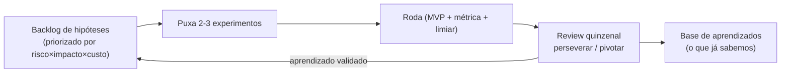

# 04 — Aplicação: Lean Startup no seu dia a dia (RevOps, Marketing, Comercial e MMM)

> Este é o documento-ponte. Ele traduz tudo dos docs anteriores para a sua rotina concreta: como tratar **mudanças de processo de RevOps como experimentos**, **experimentos de marketing/crescimento** (mensagem, canal, oferta), **realocações de verba do MMM como hipóteses de incrementalidade**, e como rodar um **backlog de experimentos** com cadência disciplinada. Traz um **template de experiment card** reutilizável e seis experimentos prontos cobrindo RevOps, marketing e comercial — cada um com hipótese, MVP, métrica e regra de decisão.

## A mudança de postura

No seu cargo, a tentação é "implementar o processo certo" e "alocar a verba certa". O Lean Startup substitui isso por uma postura: **você não sabe qual é o certo — você descobre rodando experimentos baratos**. Cada decisão vira um item testável. Isso muda três coisas no seu dia a dia:

1. Você para de defender ideias com retórica e passa a defender com **resultado de experimento**.
2. Você despolitiza a briga Comercial × Marketing: o placar é a métrica acionável, não a opinião do mais sênior.
3. Você cria um ativo cumulativo de **aprendizado validado** — um histórico de "o que já testamos e o que descobrimos".

## (a) Mudanças de RevOps como experimentos

Toda mudança de processo de RevOps (ver [`../08-revops/00-resumo-executivo.md`](../08-revops/00-resumo-executivo.md)) é uma hipótese sobre como mover a receita. Em vez de fazer um rollout big-bang para a empresa inteira, você roda como experimento.

| Mudança de processo | Hipótese (resumida) | Métrica acionável | MVP |
|---|---|---|---|
| Nova regra de roteamento de lead | Roteamento por score eleva conversão MQL→SQL | Conversão MQL→SQL por coorte | Mágico de Oz (score na mão) |
| Mudança de SLA de tempo de resposta | Responder em < 5 min eleva taxa de contato e conversão | Taxa de contato e win rate por coorte | Single-feature (só o time de inbound) |
| Nova cadência de vendas | Cadência de 8 toques bate a de 4 em taxa de reunião | Reuniões agendadas / lead trabalhado | Piloto com 2 SDRs |
| Novo critério de saída de estágio | Critérios mais rígidos melhoram acurácia de forecast | Erro de forecast por coorte de deal | Aplicar manualmente em 1 segmento |

## (b) Experimentos de marketing e crescimento

Aqui sua veia de publicitário entra: formular **hipóteses de valor** (qual mensagem ressoa) e testá-las. As variáveis típicas são **mensagem**, **canal** e **oferta**.

- **Mensagem:** qual proposta de valor converte mais? (A/B de headline na landing, de assunto de e-mail, de pitch.)
- **Canal:** qual canal traz lead que converte e retém melhor — não qual traz mais lead (vaidade)?
- **Oferta:** trial vs. demo vs. diagnóstico gratuito — qual gera mais pipeline qualificado?

O cuidado-chave: medir **fundo de funil por coorte**, não topo. "Canal X trouxe 3x mais leads" é vaidade se esses leads convertem 5x pior. Você já sabe disso pelo MMM; aqui é a versão por experimento.

## (c) Realocações de verba do MMM como hipóteses de incrementalidade

O MMM (etapa 09) te dá uma recomendação: "tire R$ X de OOH, ponha em Google Ads". No espírito Lean Startup, essa recomendação **não é uma verdade — é uma hipótese**. Você a valida com um experimento de incrementalidade antes de comprometer a verba inteira.

> **Hipótese:** "Realocar 20% da verba de OOH para Search aumenta o pipeline incremental, porque o MMM indica ROI marginal maior em Search."
> **Validação:** experimento **geo/lift** — em metade das praças você faz a realocação, na outra metade mantém; mede-se o pipeline incremental entre os grupos. Isso **calibra** o MMM com causalidade real (a melhor prática de MMM moderno).

Esse loop fecha bonito: o MMM gera a hipótese, o experimento geo a valida, e o resultado **recalibra o próprio MMM** — Construir-Medir-Aprender aplicado a verba. Tudo conectado à ideia de **incrementalidade > correlação** de [`03-metricas-experimentacao.md`](./03-metricas-experimentacao.md).

## (d) Backlog e cadência de experimentos

Experimento solto não vira capacidade. Você precisa de um **backlog priorizado** e de uma **cadência de revisão**.

- **Backlog de hipóteses:** uma lista única (planilha ou board) com toda hipótese candidata, priorizada por **risco × impacto potencial × custo de testar**. Ataque primeiro o que, se falso, muda mais a estratégia (as suposições de salto de fé).
- **Cadência:** um ritual fixo (quinzenal ou mensal) onde o time revisa experimentos em curso, decide perseverar/pivotar nos concluídos, e puxa os próximos do backlog. É o "review de Construir-Medir-Aprender".
- **Limite de experimentos simultâneos:** poucos e bem medidos batem muitos e mal medidos (e ainda evita contaminação entre testes).

## Template de experiment card (reutilizável)

Copie esta tabela para cada experimento. É o formato mínimo que força honestidade (hipótese falsificável + limiar + decisão pré-acordada).

| Campo | Preencha com |
|---|---|
| **ID / Nome** | Identificador curto e data |
| **Dono** | Quem conduz |
| **Frente** | RevOps / Marketing / Comercial / Verba (MMM) |
| **Suposição de salto de fé** | Valor ou Crescimento — qual está sendo testada |
| **Hipótese** | "Acreditamos que [X] vai gerar [resultado] para [segmento]" |
| **Métrica acionável** | A taxa/coorte que decide (não vaidade) |
| **Linha de base** | Valor atual da métrica |
| **Limiar de sucesso** | Número + significância + janela (ex.: +6pp, 95%, 6 sem) |
| **MVP / desenho** | Concierge / Mágico de Oz / smoke test / single-feature / geo-lift |
| **Grupo de controle** | Como será o controle (ou desenho switchback/geo) |
| **Tamanho de amostra** | n por grupo e poder estimado |
| **Regra de decisão** | Se passar → ___ ; se falhar → ___ (pivô provável) |
| **Resultado** | Número observado + IC |
| **Aprendizado validado** | O que aprendemos de verdade |
| **Decisão** | Perseverar / Pivotar (qual tipo) |

## Seis experimentos prontos (use como ponto de partida)

### 1. RevOps — Roteamento por score preditivo
- **Hipótese:** rotear inbound por score eleva conversão MQL→SQL.
- **MVP:** Mágico de Oz (score calculado fora do CRM, roteamento manual).
- **Métrica:** conversão MQL→SQL por coorte.
- **Limiar:** +6 pp, 95%, 6 semanas.
- **Decisão:** passar → produtizar no CRM; falhar → pivotar para *necessidade* (testar tempo de resposta).

### 2. RevOps — SLA de tempo de resposta
- **Hipótese:** responder lead inbound em < 5 min eleva taxa de contato e win rate.
- **MVP:** single-feature, só time de inbound, por 30 dias.
- **Métrica:** taxa de contato e win rate por coorte.
- **Limiar:** +10 pp de taxa de contato, 90%, 4 semanas.
- **Decisão:** passar → SLA para toda a operação; falhar → o gargalo é outro.

### 3. Marketing — Hipótese de mensagem (publicitário no comando)
- **Hipótese:** uma proposta de valor focada em "redução de CAC" converte melhor que "aumento de receita" para mid-market.
- **MVP:** A/B de landing page + tráfego pago.
- **Métrica:** conversão visitante → lead qualificado.
- **Limiar:** diferença significante a 95% com amostra suficiente.
- **Decisão:** vencedora vira mensagem padrão; empate → testar terceira variante.

### 4. Marketing — Qualidade de canal (não volume)
- **Hipótese:** o canal A traz lead que converte e retém melhor que o canal B, apesar de menor volume.
- **MVP:** comparação de coortes por canal de origem ao longo do ciclo de vida.
- **Métrica:** conversão a SQL e receita incremental por coorte de canal.
- **Limiar:** A supera B em conversão a SQL com IC que não cruza zero.
- **Decisão:** realocar esforço para A (conecta com o experimento 6).

### 5. Comercial — Cadência de vendas
- **Hipótese:** cadência de 8 toques multicanal bate a de 4 toques em reuniões agendadas.
- **MVP:** piloto com 2 SDRs vs. 2 de controle.
- **Métrica:** reuniões agendadas / lead trabalhado.
- **Limiar:** +15%, 90%, 4 semanas.
- **Decisão:** passar → padronizar; falhar → pivotar (talvez o problema seja segmentação, não cadência).

### 6. Verba/MMM — Realocação validada por geo-lift
- **Hipótese:** mover 20% da verba de OOH para Search aumenta o pipeline incremental (recomendação do MMM).
- **MVP:** experimento geo — realoca em metade das praças, mantém na outra.
- **Métrica:** pipeline incremental por grupo geográfico.
- **Limiar:** lift incremental significante a 90% em 8 semanas.
- **Decisão:** passar → realocar no nacional e **recalibrar o MMM** com o resultado; falhar → manter mix e revisar o modelo.

Para operacionalizar tudo isso no time ao longo de um trimestre — backlog, cadência, métricas, armadilhas e maturidade — vá para [`05-roadmap-e-referencias.md`](./05-roadmap-e-referencias.md).

## Referências

- The Lean Startup — Principles (site oficial): <https://theleanstartup.com/principles>
- Testing Business Ideas — Strategyzer (catálogo de experimentos / experiment cards): <https://www.strategyzer.com/library/testing-business-ideas-book>
- Innovation Accounting: What It Is and How to Get Started (IDEO U): <https://www.ideou.com/blogs/inspiration/innovation-accounting-what-it-is-and-how-to-get-started>
- Etapa 08 — RevOps (este repositório): [`../08-revops/00-resumo-executivo.md`](../08-revops/00-resumo-executivo.md)
- Etapa 09 — Marketing Mix Modeling (este repositório): [`../09-marketing-mix-model/00-resumo-executivo.md`](../09-marketing-mix-model/00-resumo-executivo.md)
