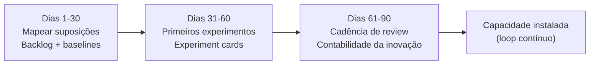

# 05 — Roadmap de 90 dias, maturidade, armadilhas e bibliografia

> Como tirar o Lean Startup do papel e instalá-lo no seu time em um trimestre: estabelecer o backlog de hipóteses, definir métricas acionáveis, rodar os primeiros experimentos e fixar uma cadência de Construir-Medir-Aprender. Inclui um **modelo de maturidade**, as **armadilhas** mais comuns (vaidade, "MVP" que é só um produtinho, ausência de regra de decisão, viés de confirmação) e uma **trilha de aprendizado** com bibliografia consolidada e verificada — incluindo o que é mais aderente ao seu perfil de dados (Lean Analytics) e ao contexto brasileiro.

## Roadmap de 90 dias

A sequência espelha o "ouvir → ganhos rápidos → construir" do RevOps (ver [`../08-revops/00-resumo-executivo.md`](../08-revops/00-resumo-executivo.md)), mas com a lente de experimentação.

### Dias 1–30 — Fundação e linha de base
- **Mapear as suposições de salto de fé** das suas frentes (RevOps, MMM, marketing/comercial). Pergunta-guia: "qual crença, se for falsa, mata a iniciativa?"
- **Criar o backlog de hipóteses**: uma planilha/board único, com cada hipótese priorizada por risco × impacto × custo de testar.
- **Definir 3–5 métricas acionáveis** por frente, validadas pelos três A's (acionável, acessível, auditável). Documentar fonte e query — fonte única de verdade.
- **Estabelecer linhas de base**: medir onde cada métrica está hoje, sem otimização.
- **Entregável que prova valor:** um "mapa de hipóteses" + dashboard de baselines apresentado à liderança.

### Dias 31–60 — Primeiros experimentos
- **Rodar 2–3 experimentos** do backlog (use os prontos em [`04-aplicacao-comercial-marketing-revops.md`](./04-aplicacao-comercial-marketing-revops.md)), começando pelos de maior risco e menor custo.
- **Usar o experiment card** para cada um: hipótese, limiar, MVP, controle, regra de decisão — tudo pré-acordado.
- **Preferir MVPs baratos** (concierge, Mágico de Oz, geo-lift) a construir nada definitivo.
- **Entregável:** o primeiro ciclo concluído com decisão explícita de perseverar/pivotar e o aprendizado documentado.

### Dias 61–90 — Cadência e institucionalização
- **Instalar a cadência de review** (quinzenal): revisar experimentos em curso, decidir os concluídos, puxar os próximos.
- **Iniciar a contabilidade da inovação**: reportar progresso por movimento de métrica acionável, não por atividade.
- **Construir a base de aprendizados** ("o que já testamos e descobrimos") — vira ativo do time.
- **Entregável:** ritual de experimentação rodando sozinho + um relatório de contabilidade da inovação para a liderança.

## Modelo de maturidade

| Nível | Como é | Sinal de que você está aqui |
|---|---|---|
| **0 — Opinião** | Decisões por intuição/hierarquia; nada é medido | "Vamos fazer assim porque o diretor acha" |
| **1 — Métrica** | Mede-se, mas com métricas de vaidade e sem hipótese prévia | Dashboards bonitos, decisões iguais às de antes |
| **2 — Experimento avulso** | Roda A/B esporádico, mas sem backlog nem cadência | "Fizemos um teste mês passado" (e parou aí) |
| **3 — Sistema** | Backlog priorizado + cadência + métricas acionáveis + regra de decisão | Review quinzenal, perseverar/pivotar viram rotina |
| **4 — Contabilidade da inovação** | Progresso reportado por aprendizado validado; liderança fala a língua | "Refutamos 3 hipóteses e validamos 2 — economizamos X" |

Meta realista para o seu primeiro trimestre: sair do nível 0–1 e cravar o nível 3, com o embrião do 4.

## Armadilhas mais comuns (e como evitar)

| Armadilha | Como ela se manifesta | Antídoto |
|---|---|---|
| **Métricas de vaidade** | Comemorar impressões, leads acumulados, "processos implementados" | Exigir taxa/coorte + três A's (ver [`03-metricas-experimentacao.md`](./03-metricas-experimentacao.md)) |
| **"MVP" que é só um produtinho** | Construir uma versão pequena e polida em vez de um instrumento de aprendizado | Perguntar "qual o experimento mais barato que responde à pergunta?" |
| **Sem regra de decisão** | Olhar o resultado e racionalizar qualquer desfecho | Definir limiar + decisão **antes** de coletar dado |
| **Viés de confirmação** | Desenhar o teste para confirmar o que já se quer | Escrever a hipótese nula; pedir revisão de outra pessoa; pré-registrar |
| **Peeking / parada antecipada** | Encerrar o teste no dia em que o número agrada | Fixar a janela e o tamanho de amostra de antemão |
| **Vanity de execução** | Achar que bater o cronograma = progresso | Lembrar: executar bem um plano errado não é progresso |
| **Experimentos demais ao mesmo tempo** | Testes se contaminam, ninguém conclui nada | Limitar simultâneos; isolar populações |
| **Terra dos mortos-vivos** | Resultado medíocre que não justifica nem manter nem matar | Critério de pivô pré-definido força a decisão |

## Trilha de aprendizado (na ordem que faz sentido para você)

1. **Eric Ries — *The Lean Startup* (2011)**: a base. Leia pelos conceitos de aprendizado validado, MVP, contabilidade da inovação e pivô.
2. **Alistair Croll & Benjamin Yoskovitz — *Lean Analytics* (2013)**: o mais aderente ao seu perfil de **cientista de dados** — métricas por estágio, vaidade vs. acionável, OMTM (*One Metric That Matters*), coorte. Comece por aqui se quiser ir direto à parte de dados.
3. **Ash Maurya — *Running Lean* (3ª ed., 2022) e o *Lean Canvas***: o mais prático para estruturar hipóteses e modelo de negócio numa página; ótimo para enquadrar suas iniciativas internas.
4. **Steve Blank — *The Four Steps to the Epiphany***: a raiz do Customer Development; "saia do prédio".
5. **David Bland & Alexander Osterwalder — *Testing Business Ideas* (Strategyzer)**: 44 experimentos catalogados e mapeamento de suposições — sua caixa de ferramentas de experimentos.
6. **Eric Ries — *The Startup Way* (2017)**: para o seu caso de **intraempreendedorismo** — aplicar o método dentro de empresa estabelecida.

| Livro | Autor(es) | Para o seu lado... | Quando ler |
|---|---|---|---|
| The Lean Startup | Eric Ries | Fundamentos | Primeiro |
| Lean Analytics | Croll & Yoskovitz | Cientista de dados | Logo em seguida |
| Running Lean (3ª ed.) | Ash Maurya | Estruturar hipóteses (Lean Canvas) | Para botar a mão na massa |
| The Four Steps to the Epiphany | Steve Blank | Raiz / Customer Development | Para profundidade histórica |
| Testing Business Ideas | Bland & Osterwalder | Catálogo de experimentos | Como referência de bancada |
| The Startup Way | Eric Ries | Intraempreendedorismo (seu caso) | Quando for escalar no time |

## Comunidades e recursos

- **theleanstartup.com** e **thestartupway.com** — sites oficiais de Eric Ries.
- **LEANSTACK (leanstack.com)** — Ash Maurya, ferramentas de Lean Canvas e cursos.
- **Strategyzer (strategyzer.com)** — biblioteca de experimentos, *Testing Business Ideas*.
- **steveblank.com** — artigos do próprio Steve Blank sobre Customer Development.

### Contexto brasileiro

O ecossistema brasileiro de startups absorveu o Lean Startup principalmente via aceleradoras, programas universitários (ex.: cursos de empreendedorismo do Sebrae e de universidades) e comunidades de produto. Sebrae e ABStartups discutem o método em conteúdos de validação de ideias e MVP. *The Lean Startup* tem edição em português ("A Startup Enxuta", Editora Sextante/LeYa, conforme a tiragem), o que facilita a adoção pelo time. Observação honesta: as fontes brasileiras tendem a ser introdutórias; para a profundidade técnica de experimentação e métricas (que é o seu diferencial), as referências em inglês acima — sobretudo *Lean Analytics* — continuam sendo as mais fortes.

## Fechamento

O Lean Startup não é mais uma metodologia na sua lista — é o **modo de operar** as outras duas (RevOps e MMM). Quando você junta o sistema da receita (etapa 08), o instrumento de medição de mídia (etapa 09) e a disciplina de transformar toda decisão em hipótese testável (esta etapa 10), você deixa de ser quem "implementa processos e otimiza verba" e passa a ser quem **prova, com aprendizado validado, o que move a receita**. Esse é o profissional raro no cruzamento Comercial × Marketing — e é exatamente onde o seu perfil de publicitário + cientista de dados se torna decisivo.

## Referências

- The Lean Startup (site oficial): <https://theleanstartup.com/>
- The Startup Way (site oficial): <https://www.thestartupway.com/>
- Eric Ries — *The Startup Way* (Penguin Random House): <https://www.penguinrandomhouse.com/books/250646/the-startup-way-by-eric-ries/>
- Lean Analytics — Alistair Croll & Benjamin Yoskovitz (O'Reilly): <https://www.oreilly.com/library/view/lean-analytics/9781449335687/>
- Ash Maurya — *Running Lean*, 3ª ed. (O'Reilly): <https://www.oreilly.com/library/view/running-lean-3rd/9781098108762/>
- LEANSTACK / Ash Maurya (Lean Canvas): <https://leanstack.com/about>
- Testing Business Ideas — David Bland & Alexander Osterwalder (Strategyzer): <https://www.strategyzer.com/library/testing-business-ideas-book>
- Steve Blank — Customer Development (artigos do autor): <https://steveblank.com/tag/customer-development/>
- Etapa 08 — RevOps (este repositório): [`../08-revops/00-resumo-executivo.md`](../08-revops/00-resumo-executivo.md)
- Etapa 09 — Marketing Mix Modeling (este repositório): [`../09-marketing-mix-model/00-resumo-executivo.md`](../09-marketing-mix-model/00-resumo-executivo.md)
