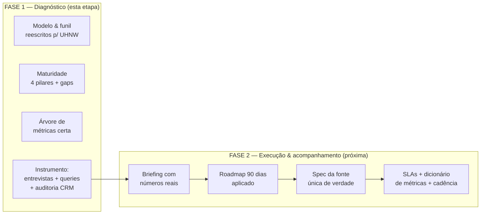

# Etapa 11 — RevOps aplicado à gestora UHNW: diagnóstico

> Esta etapa sai da teoria (Etapas 8–10) e aplica RevOps à **sua** operação: uma **gestora de investimentos e patrimônio para clientes ultra ricos (UHNW, liquidez de R$ 10 M+)**, com gestão de imóveis e investimentos, vendas consultivas de ciclo de 30–90 dias e o funil **Marketing (alcance) → SDR (filtro) → Executivos (relacionamento e fechamento)**. Trabalhamos em **duas fases**: esta é a **Fase 1 — diagnóstico**. A Fase 2 (plano de execução e acompanhamento) vem depois, ancorada nos números reais que este diagnóstico instrumenta. Maio/2026.

## Por que este diagnóstico é diferente do RevOps "de manual"

O material de RevOps de mercado (e boa parte da Etapa 8) é calibrado para **B2B SaaS**: muitos leads, ticket recorrente médio, foco em volume de MQL e velocidade de pipeline. **O seu negócio é o oposto em quase tudo**, e por isso o diagnóstico precisa de outra lente:

| Dimensão | RevOps SaaS clássico | A sua gestora UHNW |
|----------|----------------------|--------------------|
| Unidade de receita | ARR por contrato | **Fee % sobre AUM**, recorrente e multi-ano |
| Valor de um cliente novo | Deal value pontual | **NPV de anos de fee** + potencial de share-of-wallet |
| Volume vs. valor | Alto volume, ticket médio | **Baixíssimo volume, valor altíssimo** |
| O que qualifica um lead | Fit de ICP + engajamento | **Tier de patrimônio (R$ 10 M+ de liquidez)** + intenção + confiança |
| Maior alavanca de crescimento | Aquisição + win rate | **Retenção de AUM + expansão (share-of-wallet)** |
| Papel do marketing | Gerar volume de demanda | **Reputação, indicação, acesso** a um público fechado |
| Restrição dominante | Capacidade de vendas | **Confiança, discrição e compliance (CVM/suitability)** |

> **A consequência prática:** otimizar "número de MQLs" pode ser o KPI errado para você. O jogo é **precisão de qualificação** (não desperdiçar tempo de executivo sênior com quem não é UHNW) e **valor capturado por cliente ao longo do tempo** (AUM inicial → expansão → retenção). Este diagnóstico é construído em torno disso.

## A hipótese central do seu cenário

Você se descreveu como **data-rich, insight-poor**: tem pipelines extraindo RD Marketing + CRM + todos os canais, mas "não consegue estruturar isso em ações", o CRM é "OK mas não super bem usado", e não há processos definidos. Isso é um padrão clássico e tem um diagnóstico específico:

> **Você não tem um problema de coleta de dados — tem um problema de (1) modelo de dados de receita compartilhado, (2) definições de processo, e (3) a camada que transforma dado em decisão (a "fonte única de verdade").** Dado sem definição e sem dono vira pântano; e nenhum modelo preditivo (sua zona de conforto) sobrevive a um CRM com campos-chave vazios.

A boa notícia: isso é exatamente o que RevOps existe para resolver, e a metade "dados" do trabalho é o que você já domina. A metade que falta — processo, higiene de CRM, vocabulário comercial — é o que esta etapa estrutura.

## O que a Fase 1 (diagnóstico) entrega

| Doc | Conteúdo | Para quê |
|-----|----------|----------|
| [`00-resumo-executivo.md`](./00-resumo-executivo.md) | Este documento: tese, escopo, plano de duas fases | Visão geral |
| [`01-contexto-e-modelo-de-negocio.md`](./01-contexto-e-modelo-de-negocio.md) | Modelo de receita (fee sobre AUM), o funil real reescrito para UHNW, as implicações | Alinhar a lente |
| [`02-diagnostico-maturidade-e-gaps.md`](./02-diagnostico-maturidade-e-gaps.md) | Avaliação dos 4 pilares (pessoas/processo/tecnologia/dados), nível de maturidade, hipóteses de gargalo | O diagnóstico em si |
| [`03-metricas-do-modelo.md`](./03-metricas-do-modelo.md) | A árvore de métricas certa para gestão patrimonial (não a de SaaS): net new AUM, share-of-wallet, CAC por R$ de AUM, retenção de AUM | O que medir |
| [`04-instrumento-de-diagnostico.md`](./04-instrumento-de-diagnostico.md) | O instrumento acionável: roteiro de entrevistas, auditoria de higiene de CRM, a lista de queries/números a extrair do CRM+RD, o data request | Como fechar o diagnóstico com dados reais |

## As 5 hipóteses de gargalo que vamos testar

Com base no que você descreveu, estas são as apostas do diagnóstico — cada uma vira uma pergunta mensurável no documento [`04`](./04-instrumento-de-diagnostico.md):

1. **Não há definição compartilhada do que é um "lead qualificado" UHNW** → SDR e executivos divergem, e tempo de executivo sênior é gasto com quem não tem fit de patrimônio.
2. **O handoff SDR → Executivo não é instrumentado** → você não sabe a taxa de aceite nem onde o funil vaza entre filtro e relacionamento.
3. **Marketing e RD não estão conciliados com AUM fechado** → você sabe quais canais geram *leads*, mas não quais geram *patrimônio sob gestão* (a única métrica que paga a conta).
4. **Não há fonte única de verdade** → cada área olha um número; o dado existe, mas espalhado e sem dono, então não vira decisão.
5. **Retenção e expansão de AUM (share-of-wallet) não são geridas como processo** → a maior alavanca de receita de uma gestora está provavelmente sub-instrumentada.

## O plano das duas fases

**Fase 1 (agora):** entender o estado real e montar o instrumento que produz os números. Saída: este diagnóstico + a lista de dados a extrair.

**Fase 2 (depois):** com os números reais na mão, um briefing com plano de execução priorizado (o que atacar primeiro, por impacto na receita), a especificação da fonte única de verdade, os SLAs e o dicionário de métricas, e a cadência de acompanhamento. É aqui que a Etapa 8 (roadmap 90 dias), a Etapa 9 (MMM, para decisão de mídia UHNW) e a Etapa 10 (Lean Startup, para experimentação) entram aplicadas.

## Como ler

Se você tem 10 minutos: este documento + [`02-diagnostico-maturidade-e-gaps.md`](./02-diagnostico-maturidade-e-gaps.md).
Se vai colocar a mão na massa esta semana: vá direto ao [`04-instrumento-de-diagnostico.md`](./04-instrumento-de-diagnostico.md) e comece a puxar os números.

## Conexão com as etapas anteriores

| Esta etapa usa… | …de |
|-----------------|-----|
| Funil lead-to-cash, MQL/SAL/SQL, SLAs, forecast, cadência | [`08-revops/05-processos-e-frameworks.md`](../08-revops/05-processos-e-frameworks.md) |
| Roadmap 30/60/90 e armadilhas | [`08-revops/06-roadmap-90-dias.md`](../08-revops/06-roadmap-90-dias.md) |
| Atribuição de mídia e decisão de budget (canais UHNW) | [`09-marketing-mix-model/`](../09-marketing-mix-model/) |
| Método de experimentação (hipótese → experimento → aprendizado) | [`10-startup-enxuta/`](../10-startup-enxuta/) |

## Mensagem-chave em uma linha

> **Você não precisa de mais dados; precisa de definições, de uma fonte única de verdade e de conectar marketing → SDR → executivo → AUM. O diagnóstico abaixo mapeia onde isso está quebrado e entrega o instrumento para medir, antes de qualquer mudança.**
