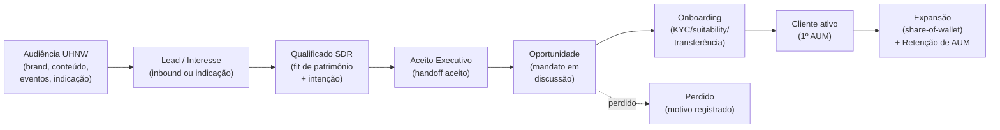

# Contexto e modelo de negócio — RevOps para uma gestora UHNW

> Antes de diagnosticar, é preciso fixar a lente certa. Este documento descreve o **modelo de receita** de uma gestora de investimentos e patrimônio para clientes ultra ricos e **reescreve o funil** Marketing → SDR → Executivo na linguagem do seu negócio, com as implicações que isso tem para o que se mede e se otimiza. Sem isso, aplicaríamos métricas de SaaS a um negócio que não é SaaS — o erro mais comum em RevOps de serviços financeiros.

## O modelo de receita: você vende relação, fatura sobre AUM

Numa gestora UHNW, a receita raramente é um "fechamento" pontual. Ela é uma **anuidade**:

```
Receita ≈ AUM (ativos sob gestão) × fee médio (% a.a.)  [+ performance fee, + fee de gestão de imóveis]
```

Isso tem cinco consequências que reorientam todo o RevOps:

| Fato do modelo | Consequência para RevOps |
|----------------|--------------------------|
| Fee é recorrente e multi-ano | O valor de um cliente novo é o **NPV de anos de fee**, não o ticket inicial. LTV é altíssimo e justifica CAC alto e ciclo longo. |
| AUM cresce dentro do cliente | **Share-of-wallet** (capturar mais do patrimônio total do cliente ao longo do tempo) é uma alavanca tão grande quanto aquisição — frequentemente maior. |
| Sai dinheiro = some receita | "Churn" é **saída de AUM** (resgate, transferência). A métrica-rainha de retenção é **retenção de AUM / fluxo líquido**, não logo-churn. |
| Público é minúsculo e fechado | Não há "gerar mil leads". Há **acessar e converter dezenas de prospects certos** — e a indicação domina. |
| Confiança e compliance são o produto | Velocidade não pode atropelar discrição e suitability (CVM). O processo precisa ser preciso, não apenas rápido. |

> **Implicação número 1 do diagnóstico:** se hoje vocês medem sucesso de marketing/comercial por **volume** (leads, MQLs, reuniões), provavelmente estão medindo a coisa errada. A unidade de valor é **R$ de AUM líquido novo** (aquisição) e **R$ de AUM expandido/retido** (carteira). Tudo no diagnóstico aponta para conectar o funil a essas duas unidades.

## O funil real, reescrito para UHNW

Você descreveu o ciclo como: **alcançar o público (Marketing) → filtrar (SDR) → encaminhar para os executivos**. Vamos detalhar cada transição com **dono, critério de entrada, critério de saída e o evento que o sistema precisa registrar** — porque é a ausência desses critérios que torna o funil invisível.



| Estágio | Dono | Critério de entrada | Critério de saída (evidência p/ avançar) | Evento no sistema |
|---------|------|---------------------|------------------------------------------|-------------------|
| **Audiência** | Marketing | Pertence ao público-alvo (perfil patrimonial/segmento) | Demonstrou interesse (engajou, pediu contato, foi indicado) | Fonte/canal de origem capturado |
| **Lead/Interesse** | Marketing | Contato capturado (form, evento, indicação) | Roteado para SDR | Lead criado com origem |
| **Qualificado SDR** | SDR | SDR contatou e conversou | **Fit de patrimônio confirmado** (tier de liquidez) + intenção/timing + autoridade sobre o patrimônio | Campos de qualificação preenchidos |
| **Aceito Executivo** | Executivo | SDR encaminhou | Executivo **aceitou** o handoff como digno de tempo | Aceite (ou rejeição com motivo) registrado |
| **Oportunidade** | Executivo | Reunião de diagnóstico feita | Patrimônio mapeado, dor/objetivo claro, proposta de alocação reconhecida | Oportunidade com AUM estimado e data |
| **Onboarding** | Executivo → Ops/Compliance | Mandato aceito verbalmente | KYC/suitability OK, contrato assinado, **primeira transferência de ativos** | Closed-won + AUM real inicial |
| **Cliente ativo** | Executivo/Relacionamento | Primeiro AUM custodiado | — | AUM sob gestão |
| **Expansão/Retenção** | Relacionamento | Cliente em adoção | Mais ativos trazidos / mandato renovado | Fluxo líquido de AUM por cliente |

> O estágio que quase toda gestora **pula** é o **"Aceito Executivo"** — o equivalente ao SAL (Sales Accepted Lead) do [`08-revops/05`](../08-revops/05-processos-e-frameworks.md). É exatamente ele que transforma a eterna discussão "o SDR manda lead ruim" × "o executivo não trabalha o que recebe" em um **número auditável**: de cada 100 prospects que o SDR qualifica, quantos o executivo aceita? Se for baixo, ou a régua do SDR está frouxa ou o aceite é negligente. Sem esse registro, o gargalo mais caro do seu funil (tempo de executivo sênior) fica invisível.

## As duas perguntas que o funil precisa responder — e hoje provavelmente não responde

1. **Onde vaza?** Em qual transição o funil perde mais valor — não em número de leads, mas ponderado pelo AUM potencial? (Ex.: se a maioria dos prospects de R$ 30 M+ trava no handoff SDR→Executivo, isso é catastrófico mesmo que o volume total pareça saudável.)
2. **De onde vêm os bons?** Quais fontes/canais originaram os clientes que de fato trouxeram mais AUM — e não apenas mais leads? (Indicação, evento, conteúdo, mídia paga, parceria?) Esta é a ponte para o Marketing Mix Model da [Etapa 9](../09-marketing-mix-model/).

## O marketing UHNW é outro animal

Vale registrar no diagnóstico porque muda o que se mede e como se atribui:

| Característica | Implicação |
|----------------|------------|
| Público fechado, alcançável por **reputação, indicação, eventos, conteúdo de autoridade e parcerias** (private banking, advogados, family offices) | Mídia paga de performance tem papel limitado; **indicação e eventos costumam ter o maior ROI em AUM**. A atribuição precisa capturar isso, não só o último clique. |
| Decisão de alto envolvimento, baseada em confiança | O "lead" muitas vezes nasce frio e amadurece por meses; **nurturing e relacionamento** importam mais que conversão imediata. |
| Discrição e compliance | Não dá para tratar o dado do prospect como um lead comum; há sensibilidade e regulação (CVM, LGPD). |
| Volume baixo demais para alguns métodos estatísticos | Atribuição multi-touch e MMM exigem cuidado — pouca observação, muito ruído. Comece simples (decomposição por fonte) antes de modelar. |

> **Implicação número 2 do diagnóstico:** a pergunta de marketing que mais vale dinheiro para você não é "qual canal traz mais leads?", e sim **"qual canal/evento/indicador traz mais R$ de AUM por real investido?"**. Hoje, com RD e CRM não conciliados ao AUM fechado, essa pergunta provavelmente está sem resposta. Resolver isso é um dos primeiros entregáveis da Fase 2.

## Resumo

- Você fatura sobre **AUM**, de forma **recorrente**; logo o RevOps gira em torno de **R$ de AUM novo, expandido e retido** — não de volume de leads.
- O funil tem um estágio crítico e provavelmente ausente: o **aceite do executivo** (handoff SDR→Executivo instrumentado).
- O marketing UHNW vive de **reputação e indicação**; a atribuição precisa ligar canal → **AUM**, não canal → lead.
- Próximo documento: a avaliação de **maturidade e os gaps** ([`02`](./02-diagnostico-maturidade-e-gaps.md)).
