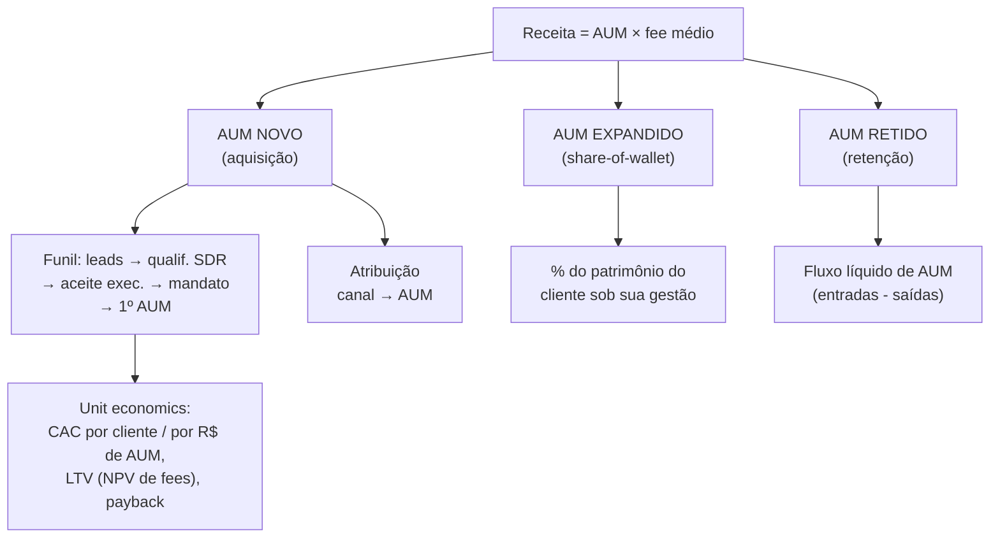

# A árvore de métricas certa — gestão patrimonial, não SaaS

> A Etapa 8 ([`08-revops/03`](../08-revops/03-metricas-e-kpis.md)) traz o catálogo geral de métricas de RevOps, calibrado para B2B. Este documento **seleciona e adapta** o que faz sentido para uma gestora UHNW e **adiciona** o que o manual de SaaS não tem: as métricas baseadas em **AUM**. A regra de ouro: a unidade de valor é **R$ de AUM** (novo, expandido, retido), não volume de leads. Tudo aqui converge para isso.

## A árvore: da audiência ao AUM retido

## Bloco 1 — Topo e meio de funil (aquisição)

Métricas de **eficiência do funil**, sempre que possível ponderadas por AUM potencial, não só por contagem.

| Métrica | Definição | Por que importa no seu caso | Quem instrumenta bem |
|---------|-----------|------------------------------|----------------------|
| **Prospects qualificados UHNW / período** | Leads com fit de patrimônio confirmado | A contagem certa de "topo" — fit, não volume bruto | SDR + você (definição) |
| **Taxa de qualificação (Lead→Qualificado SDR)** | % de leads que passam no filtro de fit | Mede a pontaria do marketing no público certo | Marketing + SDR |
| **Speed-to-lead** | Tempo mediano lead → 1º contato do SDR | Para inbound de alta intenção, resposta rápida ainda ganha; mas equilibre com discrição | SDR (instrumentação sua) |
| **Taxa de aceite do executivo (SDR→Aceito)** | % de qualificados que o executivo aceita | **A métrica de handoff que quase ninguém mede** — calibra o filtro e protege o tempo sênior | Você (árbitro neutro) |
| **Motivos de rejeição** | Distribuição dos motivos de não-aceite | Vira feedback loop para o scoring/filtro | Você |

> Benchmarks de SaaS (MQL→SQL ~13–15%, aceite 30–50%) **não se aplicam diretamente** a você — volume e dinâmica são outros. **Estabeleça a sua própria baseline** com 12–24 meses de histórico e meça melhora contra ela. A régua é interna.

## Bloco 2 — Pipeline e fechamento (do executivo ao 1º AUM)

| Métrica | Definição | Nuance UHNW |
|---------|-----------|-------------|
| **Win rate (oportunidade→cliente)** | % de mandatos que fecham | Em volume baixo, olhe também o **win rate ponderado por AUM** |
| **Ciclo de vendas** | Dias de oportunidade→1º AUM | Você estimou 30–90 dias; **meça a distribuição real** e segmente por origem/tier |
| **Ticket de entrada (1º AUM por cliente)** | AUM médio na entrada | Entrada pequena pode ser pé na porta para expansão — não descarte |
| **Pipeline coverage** | Pipeline ponderado ÷ meta de AUM novo | Mostra se há funil suficiente para a meta do trimestre |
| **Forecast vs. realizado (AUM novo)** | Acurácia da previsão | Comece com pipeline ponderado como baseline; melhore depois (ver [`08-revops/05`](../08-revops/05-processos-e-frameworks.md)) |

## Bloco 3 — Carteira: as métricas que o manual de SaaS não tem

**Aqui mora a maior parte do valor de uma gestora** — e é onde a instrumentação costuma ser mais fraca.

| Métrica | Definição | Por que é alavanca |
|---------|-----------|--------------------|
| **Net new AUM (fluxo líquido)** | Entradas − saídas de AUM no período | A métrica-rainha. Crescimento real da base de receita |
| **Retenção de AUM** | AUM retido ÷ AUM no início do período | "Churn" de verdade é saída de ativos, não de logos |
| **Share-of-wallet** | AUM sob sua gestão ÷ patrimônio total estimado do cliente | Quanto do cliente você tem — e quanto ainda dá para crescer **sem novo cliente** |
| **Net Revenue Retention (base AUM)** | (AUM retido + expandido) ÷ AUM inicial da coorte | O análogo correto do NRR para o seu negócio |
| **Expansão por cliente / por executivo** | AUM adicional trazido | Mede o trabalho de relacionamento, não só de aquisição |
| **Concentração** | % do AUM nos top N clientes | Risco: perder um cliente UHNW move o ponteiro inteiro |

> **Implicação:** se a Fase 2 só atacar aquisição (Mkt→SDR→Exec), pode estar otimizando a parte menor. Quase sempre, **expandir share-of-wallet em clientes existentes tem CAC marginal próximo de zero** e ROI maior que conquistar um cliente novo. O diagnóstico precisa medir se isso é gerido como processo (hoje, hipótese: não).

## Bloco 4 — Unit economics e atribuição (onde dados encontra marketing)

| Métrica | Definição | Sua leitura |
|---------|-----------|-------------|
| **CAC por cliente** | Custo de Mkt+Vendas ÷ clientes novos | Em UHNW pode ser alto e ainda assim ótimo — o LTV é enorme |
| **CAC por R$ de AUM** | Custo de aquisição ÷ AUM novo captado | **Mais útil que CAC por cliente**: normaliza pelo tamanho do cliente |
| **LTV** | NPV dos fees ao longo da relação (anos × fee × AUM, descontado) | Justifica o investimento e o ciclo longo |
| **LTV/CAC e payback** | Razão e meses para recuperar o CAC | Saúde econômica da máquina de crescimento |
| **Atribuição canal → AUM** | AUM novo por canal/origem ÷ investimento no canal | **A pergunta que mais vale dinheiro.** Ponte para o [MMM (Etapa 9)](../09-marketing-mix-model/) |
| **Taxa e valor de indicação** | % do AUM novo originado de indicação + quem indica | Em UHNW, indicação costuma ter o melhor ROI — capture-a explicitamente |

> **Atenção estatística:** seu volume é baixo. Atribuição multi-touch sofisticada e MMM completo exigem cuidado com ruído (ver [`09-marketing-mix-model/02`](../09-marketing-mix-model/02-metodologia-estatistica.md) e [`10-startup-enxuta/03`](../10-startup-enxuta/03-metricas-experimentacao.md)). **Comece simples:** decomposição de AUM novo por fonte primária, ao longo de 12–24 meses. Sofisticação vem depois que a chave RD→CRM→AUM existir.

## O painel mínimo (8–12 KPIs) que a Fase 2 vai especificar

Não construa 40 métricas. A fonte única de verdade nasce enxuta. Sugestão de núcleo:

1. **Net new AUM** (mês/trimestre) — a métrica-rainha
2. **Pipeline ponderado de AUM** + coverage vs. meta
3. **Taxa de aceite do executivo** (handoff SDR→Exec) + motivos de rejeição
4. **Speed-to-lead** (mediana)
5. **Win rate** (ponderado por AUM) e **ciclo de vendas** (mediana)
6. **AUM novo por canal/origem** (decomposição de atribuição)
7. **CAC por R$ de AUM** (onde houver custo atribuível)
8. **Retenção de AUM / fluxo líquido**
9. **Share-of-wallet** médio e expansão do período
10. **Higiene do CRM**: % de oportunidades com campos-chave preenchidos

> Cada um desses precisa de **definição exata, fórmula, fonte e dono** — esse é o "dicionário de métricas", entregável da Fase 2. Sem definição compartilhada, dashboard bonito só gera uma nova rodada de "esse número está errado".

## Resumo

- A unidade é **R$ de AUM** (novo, expandido, retido) — não volume de leads.
- O manual de SaaS cobre o funil de aquisição; o que **diferencia a sua gestora** é a **carteira**: net new AUM, retenção de AUM, share-of-wallet.
- A métrica de marketing que mais importa é **AUM por canal**, não lead por canal.
- O painel nasce com **8–12 KPIs** e definições compartilhadas — não mais.
- Próximo: o **instrumento** que extrai esses números do CRM+RD ([`04`](./04-instrumento-de-diagnostico.md)).
