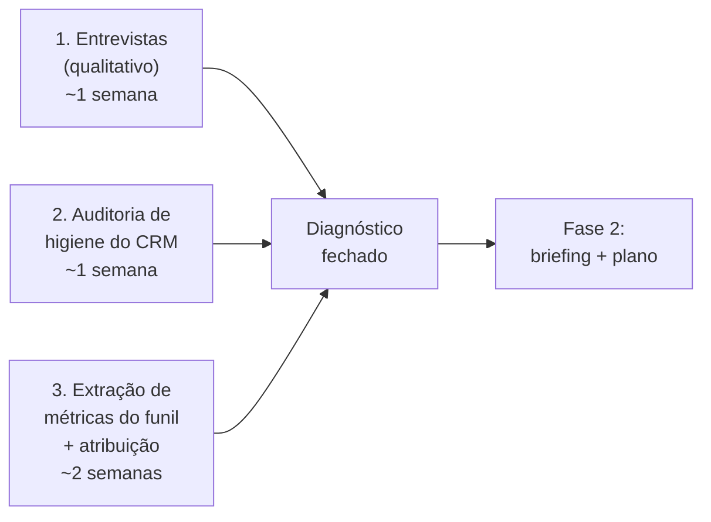

# Instrumento de diagnóstico — como fechar o diagnóstico com dados reais

> Os documentos anteriores deram o modelo e as hipóteses. **Este é o documento de campo.** Ele contém o que você executa para transformar hipótese em número: o **roteiro de entrevistas** com stakeholders, a **auditoria de higiene do CRM**, a **lista de queries / números a extrair** do CRM + RD, e o **data request** consolidado. Quando estiver preenchido, o diagnóstico está fechado e entramos na Fase 2 (plano de execução). Tempo estimado: 2–4 semanas, em paralelo ao seu dia a dia.

## Como usar este instrumento

Trabalhe em três frentes paralelas, na ordem de credibilidade — ouvir antes de medir, medir antes de mudar:



> **Regra de ouro (da [`08-revops/06`](../08-revops/06-roadmap-90-dias.md)):** não chegue mudando o CRM. Sua autoridade vem de **mostrar o número que ninguém tinha**. Ouça, audite, meça — e só então proponha.

---

## Frente 1 — Roteiro de entrevistas com stakeholders

Objetivo: capturar o processo real (não o do organograma), as definições que cada um usa (vão divergir — isso é o achado), e as dores. Faça 30–45 min com cada grupo.

### Com a liderança (sócio / head comercial)
- Qual é a meta de receita e como ela se traduz em **meta de AUM novo**?
- Quem é o **dono da jornada de receita ponta a ponta** hoje?
- Qual é o meu **mandato** em RevOps — escopo e a quem reporto?
- Qual decisão de marketing/comercial você gostaria de tomar com dados e hoje toma no feeling?

### Com Marketing
- Como você define um **lead bom**? Como mede sucesso hoje (leads? reuniões? AUM?)?
- Quais **canais** usamos (eventos, conteúdo, indicação, mídia, parcerias)? Qual você *acha* que traz os melhores clientes?
- A **origem** do lead é registrada de forma confiável? Indicação captura *quem* indicou?
- O que do RD chega ao CRM? Você consegue ver o que aconteceu com seus leads depois do handoff?

### Com SDR
- O que você verifica para **qualificar** um prospect? Como confirma o **tier de patrimônio** (R$ 10 M+)?
- O que você registra no CRM quando qualifica? E quando descarta?
- Quando você encaminha ao executivo, ele **aceita ou devolve**? Com que frequência devolve e por quê?
- O que mais te trava / te faz perder tempo?

### Com os Executivos
- O que faz você **aceitar ou recusar** um prospect que o SDR encaminha?
- Quanto do seu tempo vai para prospects que **não eram fit** ou não fecham?
- Como você decide os **estágios** de uma oportunidade? O que significa "vai fechar"?
- Como funciona hoje a **expansão** (trazer mais ativos de um cliente) e a **retenção**? É processo ou é informal?

> **Entregável da Frente 1:** uma página com (a) as definições divergentes de "lead qualificado" lado a lado, (b) o funil real desenhado, (c) as 3 dores mais citadas por área. As divergências de definição são, por si só, metade do diagnóstico.

---

## Frente 2 — Auditoria de higiene do CRM

Objetivo: quantificar a "sujeira" — vira munição e baseline. Para cada item, gere **um número**.

| Check de higiene | O número a produzir | Por que importa |
|------------------|---------------------|-----------------|
| Preenchimento de campos-chave | % de oportunidades **com**: origem, tier de patrimônio, AUM estimado, data prevista, estágio, dono | Sem isso, não há scoring, forecast nem atribuição |
| Motivo de perda | % de oportunidades perdidas **sem** motivo registrado | Sem motivo, não há aprendizado de win/loss |
| Oportunidades paradas | Nº sem atividade há > 30/60/90 dias | Pipeline fantasma infla o forecast |
| Duplicatas | Nº de contatos/contas duplicados | Distorce qualquer contagem e relacionamento |
| Registros órfãos | Nº de oportunidades sem dono | Vazam pelo funil |
| Atividade registrada | % de interações (reuniões, ligações) logadas no CRM | Mede a adoção real do CRM |
| Chave de ligação | Existe um ID que liga **lead RD → contato CRM → AUM em custódia**? | É o que permite a atribuição canal→AUM |

> **Entregável da Frente 2:** o "boletim de higiene" — ex.: *"X% das oportunidades estão sem tier de patrimônio e Y% sem origem confiável, o que hoje inviabiliza scoring e atribuição."* Esse número justifica o primeiro projeto de governança da Fase 2.

---

## Frente 3 — Extração de métricas (as queries do diagnóstico)

Objetivo: preencher a árvore de métricas do [`03-metricas-do-modelo.md`](./03-metricas-do-modelo.md) com 12–24 meses de histórico. Abaixo, **o que perguntar aos dados** — adapte ao schema do seu CRM/RD/warehouse. (Em SQL genérico; ajuste nomes de tabela/coluna.)

### 3.1 — Conversão do funil (a foto do vazamento)
> Contagem e taxa de conversão por estágio, idealmente também **ponderada por AUM potencial**.
```sql
-- Volume por estágio nos últimos 18 meses
SELECT estagio, COUNT(*) AS qtd, SUM(aum_estimado) AS aum_potencial
FROM oportunidades
WHERE criado_em >= DATEADD(month, -18, CURRENT_DATE)
GROUP BY estagio
ORDER BY MIN(ordem_estagio);
```
Calcule as taxas: Lead→Qualificado SDR, **Qualificado→Aceito Executivo** (o handoff!), Oportunidade→Cliente. Compare a taxa por **contagem** vs. por **AUM** — divergências revelam onde o valor (não o volume) vaza.

### 3.2 — De onde vêm os clientes (decomposição de atribuição)
> A pergunta que mais vale dinheiro: **AUM novo por origem**, não leads por origem.
```sql
-- AUM novo fechado por canal/origem
SELECT origem_primaria,
       COUNT(*) AS clientes_novos,
       SUM(aum_inicial) AS aum_novo,
       AVG(dias_ciclo) AS ciclo_medio
FROM clientes
WHERE data_primeiro_aum >= DATEADD(month, -24, CURRENT_DATE)
GROUP BY origem_primaria
ORDER BY aum_novo DESC;
```
Cruze com o **investimento por canal** (do RD / financeiro de marketing) para obter **CAC por R$ de AUM** por canal. Marque separadamente o que veio de **indicação** e *quem* indicou.

### 3.3 — Speed-to-lead
```sql
SELECT PERCENTILE_CONT(0.5) WITHIN GROUP (ORDER BY horas_ate_1o_contato) AS mediana_horas,
       AVG(horas_ate_1o_contato) AS media_horas
FROM leads
WHERE criado_em >= DATEADD(month, -6, CURRENT_DATE);
```

### 3.4 — Handoff SDR → Executivo (taxa de aceite + motivos)
```sql
SELECT resultado_handoff, COUNT(*) AS qtd, STRING_AGG(motivo_rejeicao, ', ')
FROM handoffs
WHERE data_handoff >= DATEADD(month, -12, CURRENT_DATE)
GROUP BY resultado_handoff;
```
> Se esses campos **não existem**, esse já é um achado central: o handoff mais caro do funil não é instrumentado. (Vira prioridade na Fase 2.)

### 3.5 — Carteira: net new AUM, retenção e expansão
```sql
-- Fluxo líquido de AUM por mês
SELECT mes, SUM(entradas) AS entradas, SUM(saidas) AS saidas,
       SUM(entradas) - SUM(saidas) AS net_new_aum
FROM fluxos_aum
WHERE mes >= DATEADD(month, -24, CURRENT_DATE)
GROUP BY mes ORDER BY mes;

-- Coorte: AUM por safra de aquisição ao longo do tempo (expansão/retenção)
SELECT safra_aquisicao, meses_desde_entrada, SUM(aum) AS aum_total
FROM aum_por_cliente_mensal
GROUP BY safra_aquisicao, meses_desde_entrada
ORDER BY safra_aquisicao, meses_desde_entrada;
```
A análise de **coorte** mostra se a base cresce dentro de si (expansão) ou sangra (saída) — provavelmente o achado mais valioso e o menos olhado hoje.

### 3.6 — Forecast baseline
> Pipeline ponderado (valor × probabilidade do estágio) vs. AUM novo realizado, mês a mês. Estabeleça a **baseline de acurácia** antes de prometer qualquer modelo. (Ver [`08-revops/05`](../08-revops/05-processos-e-frameworks.md).)

---

## O data request consolidado (checklist)

Para fechar o diagnóstico, reúna:

- [ ] **Entrevistas** com liderança, Marketing, SDR e ≥2 Executivos — definições e dores
- [ ] **Boletim de higiene do CRM** — todos os números da Frente 2
- [ ] **Tabela de conversão do funil** (contagem e ponderada por AUM), 18 meses
- [ ] **AUM novo por origem/canal** (24 meses) + investimento por canal → CAC por R$ de AUM
- [ ] **% de AUM novo originado por indicação** + mapa de quem indica
- [ ] **Speed-to-lead** (mediana e distribuição)
- [ ] **Taxa de aceite do handoff** SDR→Executivo + motivos (ou a constatação de que não existe)
- [ ] **Win rate** (contagem e ponderado por AUM) e **ciclo de vendas** real (distribuição)
- [ ] **Net new AUM** mensal (24 meses) + análise de **coorte** de AUM por safra
- [ ] **Share-of-wallet** estimado (onde houver dado de patrimônio total do cliente)
- [ ] **Forecast baseline**: previsto vs. realizado de AUM novo

## Saída da Fase 1 → entrada da Fase 2

Quando o checklist estiver preenchido, você terá o diagnóstico fechado: **nível de maturidade confirmado, os gargalos rankeados por impacto em AUM, e a baseline de cada métrica.** Com isso, a Fase 2 monta:

1. **Briefing executivo** com os achados (1 página, sem jargão) — para alinhar a liderança.
2. **Roadmap 90 dias aplicado** — o que atacar primeiro, priorizado por impacto em AUM e baixo atrito (adaptando [`08-revops/06`](../08-revops/06-roadmap-90-dias.md)).
3. **Spec da fonte única de verdade** — os 8–12 KPIs do [`03`](./03-metricas-do-modelo.md), com layout e fontes.
4. **Dicionário de métricas + SLAs + cadência** — a fundação do Nível 3 de maturidade.

> **Próximo passo prático:** rode as três frentes (ou comece pela que tiver menos atrito — geralmente a auditoria de higiene, que você faz sozinho com seus pipelines). Quando tiver os números, me traga que montamos a Fase 2 em cima deles. Se algum dado não existir, isso **também é resultado** — aponta exatamente o que instrumentar primeiro.
