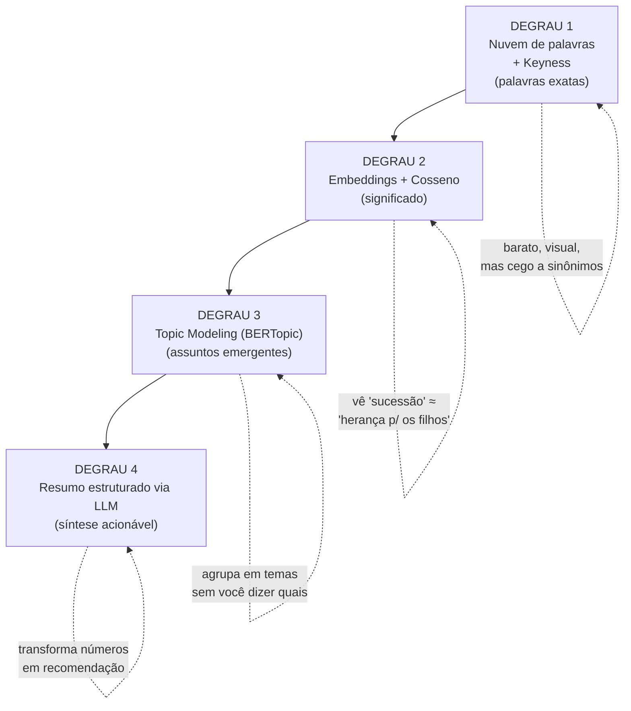

# A escada de técnicas — o que cada uma mede (e o que não mede)

> Este documento explica, sem enrolação e sem virar aula de álgebra linear, cada técnica que você vai usar. A ordem é uma **escada**: começa no que é simples e visual (e enganoso se usado sozinho) e sobe até o que captura significado de verdade. Para cada degrau: o que ele responde, a intuição, **o que ele NÃO vê** (a armadilha), e quando usar. O código está no [`03-metodos-e-codigo.md`](./03-metodos-e-codigo.md).

## Visão geral da escada

---

## Degrau 1 — Nuvem de palavras e keyness

### Nuvem de palavras
**O que é:** uma imagem em que o tamanho de cada palavra é proporcional à sua frequência. É a forma mais rápida de "sentir" sobre o que um conjunto de textos fala.

**Para que serve no seu caso:** uma primeira foto — "do que os leads falam" vs. "do que nós publicamos", lado a lado. Boa para apresentação e para gerar hipóteses.

**O que ela NÃO vê (as armadilhas, e são sérias):**
- **Frequência ≠ relevância.** "investimento" pode aparecer muito nos dois lados e não dizer nada distintivo. Palavra comum infla.
- **Não compara.** Uma nuvem mostra um corpus; ela não te diz *o que é mais característico de A do que de B*.
- **Cega a sinônimos e contexto.** "imóvel", "propriedade" e "real estate" viram três palavras diferentes; ironia e negação passam batido.

> **Conclusão do degrau 1:** ótima para começar a conversa, perigosa para concluir. Quase nunca pare aqui.

### Keyness (a versão que realmente compara dois corpora)
**O que é:** uma estatística que responde *"quais palavras são desproporcionalmente mais frequentes no corpus A (leads) do que no corpus B (nossos posts)?"*. As medidas usuais são **log-likelihood** (significância) e **log ratio / odds ratio** (tamanho do efeito). É o upgrade honesto da nuvem de palavras.

**Por que é melhor que a nuvem:** em vez de "palavras grandes", você obtém **palavras distintivas** — exatamente o que separa o vocabulário do público do seu. É assim que se enxerga "os leads falam muito mais de *'proteção'* e *'filhos'* do que nós" de forma quantificada.

**O que ainda NÃO vê:** continua no nível da *palavra*, não do *significado*. Sinônimos seguem separados. Por isso subimos ao degrau 2.

> Visualização recomendada: **Scattertext** — um gráfico que põe cada palavra num plano "frequência nos leads × frequência nos seus posts", destacando os termos característicos de cada lado. É a nuvem de palavras feita direito.

---

## Degrau 2 — Embeddings e similaridade de cosseno

Este é o degrau que você intuiu ("vetores para entender cosseno") e o mais importante.

### Embedding: texto vira vetor
**O que é:** um modelo de IA (de embedding) lê um texto e devolve uma lista de números — um **vetor** — tipicamente de algumas centenas a poucos milhares de dimensões. A propriedade mágica: **textos com significado parecido geram vetores próximos no espaço**, mesmo que usem palavras diferentes.

**Intuição:** imagine um mapa gigante onde cada post é um ponto. "Planejamento sucessório" e "como deixar o patrimônio organizado para os filhos" caem **quase no mesmo lugar**, apesar de não compartilharem palavras. Esse mapa é o espaço de embeddings.

### Cosseno: medindo a proximidade
**O que é:** a **similaridade de cosseno** mede o ângulo entre dois vetores. Resultado entre -1 e 1 (na prática, 0 a 1 para texto):
- **≈ 1** → mesmo assunto/significado.
- **≈ 0** → assuntos não relacionados.

Por que o ângulo e não a distância reta? Porque o cosseno ignora o "tamanho" do texto e foca na *direção* — ou seja, no *tema*. Um tweet curto e um artigo longo sobre o mesmo assunto têm cosseno alto.

**O que isso destrava no seu caso:**
- **Alinhamento médio:** o quão perto, em média, o seu conteúdo está do interesse do público (um número, o "placar de alinhamento").
- **Gap reverso:** posts de leads que estão *longe* de qualquer post seu → assuntos do público que você não cobre.
- **Conteúdo órfão:** posts seus longe de qualquer interesse do público → conteúdo que talvez não engaje.
- **Recomendação:** para um interesse do público, qual dos seus conteúdos é o mais próximo (e se o mais próximo ainda está longe, é um gap).

**O que NÃO vê / armadilhas:**
- **"Lixo entra, lixo sai":** embeddings ruins (modelo fraco em PT-BR) dão cossenos sem sentido. Escolha do modelo importa (ver [`05`](./05-stack-e-roadmap.md)).
- **Cosseno alto ≠ concordância.** Dois textos podem ser sobre o mesmo tema com opiniões opostas; o cosseno vê o *tema*, não o *sentimento*. (Para sentimento, é outra análise.)
- **Cosseno é relativo.** "0,7 é alto?" depende do modelo e do domínio. Calibre com exemplos conhecidos antes de cravar limiares.

> **Este é o coração da etapa.** Os degraus 1, 3 e 4 orbitam em torno deste. Se você só puder dominar uma técnica, domine embeddings + cosseno.

---

## Degrau 3 — Topic modeling (descobrir os assuntos sozinho)

**O problema que resolve:** você não quer ler 5.000 posts para descobrir os temas. Topic modeling **agrupa automaticamente** os textos em assuntos (clusters), sem você definir os temas de antemão.

**As duas gerações de técnica:**

| Abordagem | Como funciona | Veredito 2026 |
|-----------|---------------|---------------|
| **LDA** (clássico) | Modelo probabilístico sobre contagem de palavras; assume textos longos | Exige muito pré-processamento e tuning; ruim em textos curtos (posts) |
| **BERTopic** (moderno) | Usa **embeddings** (degrau 2) → reduz dimensão (UMAP) → agrupa (HDBSCAN) → nomeia o tópico pelas palavras mais distintivas (c-TF-IDF) | **Recomendado.** Melhor em texto curto, tópicos mais coerentes, menos pré-processamento |

**O que você ganha:** dois conjuntos de tópicos — os **temas que emergem dos leads** e os **temas que emergem dos seus posts** — cada um com rótulo e exemplos. Aí dá para cruzar: "tema X aparece forte nos leads e quase ausente em nós" = gap de conteúdo, agora no nível de *assunto*, não de palavra.

**Armadilhas (importantes):**
- **HDBSCAN descarta outliers** — em alguns estudos, boa parte dos documentos vira "sem tópico". Em volume baixo isso machuca; há ajustes (forçar atribuição, reduzir nº mínimo de cluster).
- **Volume baixo = tópicos instáveis.** Com poucas centenas de posts, os clusters podem não fazer sentido. Regra prática: dezenas de tópicos só com milhares de documentos. Abaixo disso, prefira o degrau 2 (cosseno direto) + leitura humana.
- **Rótulo automático ≠ rótulo bom.** O nome do tópico (palavras-chave) precisa de revisão humana; às vezes um LLM resume melhor (degrau 4).

---

## Degrau 4 — Resumo estruturado via LLM

**O que é:** depois de agrupar (degrau 3), você pede a um LLM para **ler os posts de cada cluster e devolver um resumo em formato fixo (JSON)** — por exemplo: `{tema, dores_implícitas, perguntas_frequentes, vocabulário_do_público, ângulos_de_conteúdo_sugeridos}`. É a técnica da [Etapa 1, Caso 7](../01-casos-de-uso/07-extracao-estruturada.md) (extração estruturada) aplicada a marketing.

**Por que fechar com isso:** números e clusters não viram ação sozinhos. O LLM transforma "cluster 4: {herança, filhos, exterior, imposto}" em *"O público demonstra preocupação com sucessão patrimonial internacional e carga tributária na transferência aos herdeiros; sugestão de pauta: 'Como estruturar a sucessão de patrimônio no exterior'."* — uma recomendação editorial pronta.

**Armadilhas:**
- **Alucinação:** o LLM pode inventar. Sempre peça que ele cite/baseie-se nos posts do cluster e revise amostras.
- **Privacidade:** se os posts contêm PII, use LLM **local** (ver [Etapa 4/6](../06-mcp-claude-code/)) ou anonimize antes (ver [`02`](./02-coleta-e-preparacao.md)).
- **Não é estatística:** o resumo é qualitativo; ele *interpreta*, não *prova*. Use-o para gerar hipóteses, valide com dados.

---

## Resumo: qual degrau usar quando

| Sua situação | Use |
|--------------|-----|
| "Quero uma primeira foto rápida para uma reunião" | Degrau 1 (nuvem + keyness/Scattertext) |
| "Quero medir o quanto meu conteúdo casa com o interesse" | **Degrau 2 (embeddings + cosseno)** — o número-chave |
| "Quero descobrir os temas sem ler tudo" e tenho **milhares** de posts | Degrau 3 (BERTopic) |
| "Quero transformar os clusters em pauta acionável" | Degrau 4 (resumo via LLM) |
| "Tenho poucos dados (dezenas/baixas centenas)" | Fique nos degraus 1–2; pule o 3 |

> **A combinação vencedora** para o seu caso, detalhada no [`04-workflow-aplicado.md`](./04-workflow-aplicado.md): **degrau 2 como espinha dorsal** (placar de alinhamento + gaps por cosseno), com degrau 1 para comunicar e degraus 3–4 quando o volume permitir aprofundar em temas.
