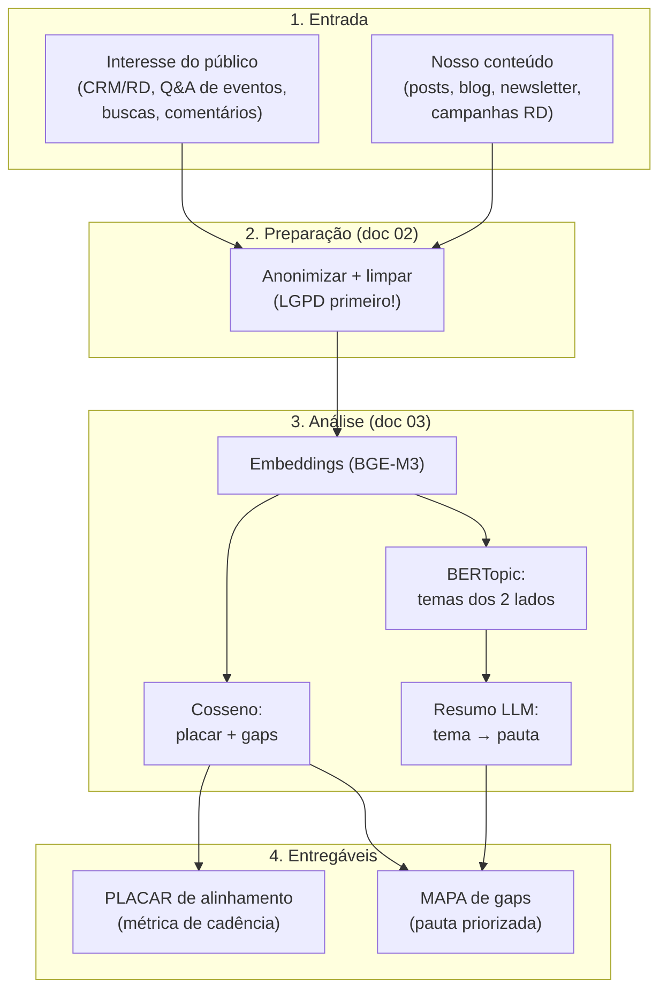
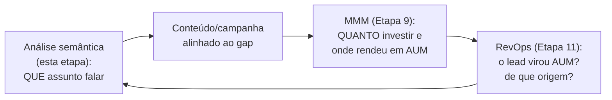

# Workflow aplicado — do dado bruto ao mapa de gaps

> Os documentos anteriores deram as técnicas ([`01`](./01-escada-de-tecnicas.md)) e o código ([`03`](./03-metodos-e-codigo.md)). Este amarra tudo num **pipeline de ponta a ponta** desenhado para a sua gestora UHNW, produzindo dois entregáveis: o **placar de alinhamento** (um número que entra na cadência de RevOps) e o **mapa de gaps de conteúdo** (a lista priorizada de pautas). É o "como rodar isso de verdade".

## O pipeline em uma imagem

## Passo a passo, com decisão em cada bifurcação

### Passo 0 — Aval de privacidade
Sem o de-para de finalidade/base legal com o DPO (ver [`02`](./02-coleta-e-preparacao.md)), **não comece**. Este é um gate, não uma sugestão.

### Passo 1 — Montar os dois corpora
Comece pelo **CRM/RD** (o ouro consentido): anotações de SDR sobre dores, motivos de contato, respostas de formulário, perguntas de evento. Para o seu conteúdo, exporte posts + canal + data + engajamento.

> **Quanto dado preciso?** Para o degrau 2 (cosseno), dezenas a centenas de itens já dão sinal. Para o degrau 3 (BERTopic), você quer **milhares**. Se está abaixo disso, rode só o degrau 2 + leitura humana — e isso já é muito.

### Passo 2 — Preparar (limpar leve para embeddings, pesado para nuvem)
Rode a anonimização (Presidio/NER), dedup, filtro de textos curtos. Gere as duas versões (doc 02).

### Passo 3 — Rodar o núcleo (degrau 2 sempre; 3–4 se houver volume)
1. Gerar embeddings dos dois corpora.
2. Calcular o **placar de alinhamento** e as **três listas de gap** (interesses órfãos, conteúdo órfão, melhor-resposta).
3. Se volume permitir: BERTopic nos dois lados + cruzamento de centroides → **gaps por tema**.
4. Resumo via LLM dos temas com gap → **ângulos de pauta**.

### Passo 4 — Produzir os entregáveis (abaixo).

---

## Entregável 1 — O placar de alinhamento

Um único número (0–1) que responde *"o quanto nosso conteúdo cobre o interesse do público?"*. O valor de transformá-lo em **métrica recorrente**:

- Entra na **cadência mensal de RevOps** ([`08-revops/05`](../08-revops/05-processos-e-frameworks.md)) ao lado dos KPIs de AUM.
- Vira **baseline de experimento** (estilo [Etapa 10](../10-startup-enxuta/)): "ajustamos a pauta para cobrir o gap de sucessão internacional → o placar subiu de 0,52 para 0,64 e o engajamento do público-alvo cresceu?".

> **Importante (calibragem):** o número absoluto importa menos que a **tendência**. "0,52" não significa nada isolado; "subiu de 0,52 para 0,64 em 3 meses" significa tudo. Calibre o limiar com 10–20 pares que você sabe que combinam/divergem.

## Entregável 2 — O mapa de gaps de conteúdo

Uma tabela priorizada — o produto mais acionável do projeto:

| Tema do público (gap) | Cobertura atual (cosseno) | Volume/intensidade no público | Vocabulário deles | Pauta sugerida (LLM) | Prioridade |
|-----------------------|---------------------------|-------------------------------|-------------------|----------------------|------------|
| Sucessão patrimonial internacional | 0,38 (baixa) | Alto | offshore, herdeiros, blindagem | "Guia: estruturar sucessão com ativos no exterior" | **Alta** |
| Proteção contra inflação/câmbio | 0,41 | Médio | dólar, hedge, preservar | "Como proteger o patrimônio da desvalorização" | Alta |
| Gestão de imóveis de alto padrão | 0,72 (boa) | Médio | — | (já bem coberto) | Baixa |

**Priorização** = combinar **gap grande** (cosseno baixo) × **interesse intenso** (volume/recorrência no público) × **fit com o seu negócio**. Gap em tema que você não atende não é prioridade.

> **O espelho:** a mesma análise revela o **conteúdo órfão** — o que você publica e o público não demanda. Isso libera esforço editorial para realocar nos gaps. Dois lados da mesma moeda.

---

## Como isso fecha o loop com RevOps e MMM

- **Esta etapa** responde *o que dizer* (assunto que casa com o interesse).
- **O MMM** responde *quanto e onde investir* e *o que moveu AUM*.
- **O RevOps** responde *se virou cliente/AUM e de onde veio*.
- O ciclo se realimenta: o resultado de AUM por tema/origem informa a próxima rodada de pauta.

> É a versão "conteúdo" do método Lean ([Etapa 10](../10-startup-enxuta/)): hipótese ("o público quer X e não cobrimos") → experimento (publicar sobre X) → medir (placar sobe? engajamento do público-alvo? leads qualificados? AUM?) → aprender.

---

## Cronograma realista (primeira rodada)

| Semana | Atividade | Saída |
|--------|-----------|-------|
| 1 | Aval de privacidade + montar corpora (começar pelo CRM/RD) | Dois CSVs limpos |
| 2 | Degrau 1 (nuvem + keyness) e degrau 2 (embeddings + cosseno) | Placar v1 + 3 listas de gap |
| 3 | Degrau 3–4 se houver volume; senão, leitura humana dos gaps | Mapa de gaps + pautas |
| 4 | Apresentar à liderança/marketing; definir 2–3 pautas-piloto | Decisão editorial + baseline para experimento |

> **Comece pequeno e útil:** uma primeira rodada só com CRM/RD + degrau 2 já entrega o placar e o mapa de gaps. Sofisticação (raspagem de redes, BERTopic, automação) vem depois que o valor estiver provado — exatamente a lógica crawl/walk/run do [`05`](./05-stack-e-roadmap.md).

Próximo: **stack, modelos e roadmap** ([`05`](./05-stack-e-roadmap.md)).
