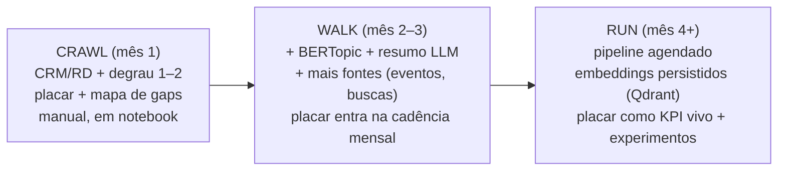

# Stack, modelos e roadmap

> Que ferramentas usar, qual modelo de embedding escolher (com atenção a PT-BR e à sensibilidade dos seus dados), como faseiar a adoção (crawl/walk/run), as armadilhas que descarrilam projetos assim, e as referências. Fecha a Etapa 12.

## A decisão central: local vs. API

Como você lida com dado de clientes UHNW (sensível, regulado), essa decisão não é só técnica — é de compliance. A mesma tensão da [`05-roi-e-proposta/02-comparativo-alternativas.md`](../05-roi-e-proposta/02-comparativo-alternativas.md) vale aqui.

| Critério | Embedding/LLM **local** | Embedding/LLM via **API** |
|----------|--------------------------|----------------------------|
| Privacidade | Dado não sai do perímetro — **ideal para PII** | Texto vai a terceiro; exige DPA, cuidado LGPD |
| Custo | CAPEX (GPU) ou roda em CPU para volume baixo | Pay-per-use; barato para começar |
| Qualidade PT-BR | BGE-M3 é excelente e aberto | OpenAI/Voyage/Cohere fortes, mas dado sai |
| Esforço | Subir `sentence-transformers` | Uma chamada de API |
| **Recomendação p/ você** | **Default para qualquer texto com PII** (posts de leads, notas de CRM) | Só para texto já anonimizado/público, ou protótipo |

> **Regra prática:** se o texto passou pela anonimização do [`02`](./02-coleta-e-preparacao.md) e está agregado, API é aceitável para prototipar. Para qualquer coisa com resíduo de PII, **rode local** — e felizmente o melhor modelo aberto (BGE-M3) é mais que suficiente.

## Modelos de embedding (junho 2026)

| Modelo | Tipo | PT-BR | Nota |
|--------|------|-------|------|
| **BGE-M3** (BAAI) | Aberto, ~568M params | Forte (100+ línguas, 8k contexto) | **Recomendado.** Denso+esparso+multi-vetor; roda local; já é o default da [`02-tecnologias/05`](../02-tecnologias/05-rag-vector-stores.md) |
| **multilingual-e5-large** | Aberto | Bom | Alternativa leve e popular |
| **Cohere Embed v3** | API | Líder multilíngue | Bom se for via API e dado anonimizado |
| **OpenAI text-embedding-3-large** | API | Bom | Forte, mas dado sai do perímetro |
| **Voyage-3** | API | Bom | Forte em retrieval; idem ressalva de API |

> Para **reranking** (refinar "qual conteúdo nosso responde melhor a este interesse"), o **BGE-Reranker v2-m3** complementa, como na [`02-tecnologias/05`](../02-tecnologias/05-rag-vector-stores.md).

## Stack completa sugerida

| Camada | Ferramenta | Por quê |
|--------|-----------|---------|
| Limpeza/NLP PT | **spaCy** (`pt_core_news_lg`), NLTK | Tokenização, lematização, NER |
| Anonimização PII | **Presidio** | Detectar/remover nomes, docs — gate de LGPD |
| Embeddings | **sentence-transformers** + BGE-M3 | Local, PT-BR forte |
| Similaridade | **scikit-learn** / numpy | Cosseno, simples |
| Topic modeling | **BERTopic** | Melhor para texto curto (doc 01) |
| Visualização | **Scattertext** (keyness), matplotlib, **wordcloud** | Comunicar à liderança |
| Resumo/pauta | LLM local (ver [`06-mcp-claude-code/`](../06-mcp-claude-code/)) ou API se anonimizado | Tema → pauta acionável |
| Persistência (opcional) | **Qdrant**/pgvector | Se quiser guardar embeddings e fazer busca recorrente ([`02-tecnologias/05`](../02-tecnologias/05-rag-vector-stores.md)) |
| Orquestração (opcional) | Notebook → script → agendado (cron/Airflow) | Recorrência mensal na cadência RevOps |

## Roadmap crawl / walk / run

| Fase | Foco | Entregável | Não faça ainda |
|------|------|------------|----------------|
| **Crawl** | Provar valor com o que já tem | Placar v1 + mapa de gaps, em notebook, só CRM/RD | Raspagem de redes, automação, ML pesado |
| **Walk** | Aprofundar e dar ritmo | Temas (BERTopic) + pautas (LLM); placar mensal na reunião | Infra dedicada |
| **Run** | Industrializar | Pipeline agendado, embeddings persistidos, placar como KPI vivo, experimentos de pauta | — |

> A lógica é a mesma da Etapa 11: **valor cedo e visível antes de construir o duradouro**. Um notebook que mostra "estes 5 temas o público quer e nós ignoramos" já justifica o projeto inteiro.

## Armadilhas que descarrilam projetos assim

| Armadilha | Por que acontece | Como evitar |
|-----------|------------------|-------------|
| **Pular a LGPD** | Empolgação técnica | Aval do DPO é gate. No seu setor, um incidente custa mais que o projeto inteiro |
| **Concluir pela nuvem de palavras** | É bonita e fácil | Nuvem gera hipótese; conclua com keyness/cosseno (doc 01) |
| **Topic modeling com pouco dado** | Querer o "avançado" cedo | Abaixo de milhares de posts, fique no cosseno + leitura humana |
| **Cravar limiar de cosseno sem calibrar** | "0,5 parece bom" | Calibre com pares conhecidos; olhe tendência, não valor absoluto |
| **Tratar o output como verdade** | Número impressiona | É holofote, não piloto: o insight gera hipótese, você decide a pauta |
| **Modelo de embedding fraco em PT** | Pegar o primeiro da prateleira | Use BGE-M3 ou e5 multilingual; teste em exemplos do seu domínio |
| **Confundir tema com sentimento** | Cosseno alto parece "concordância" | Cosseno vê assunto, não opinião; sentimento é outra análise |
| **Criar perfil individual** | "Dá para personalizar!" | Trabalhe no agregado; perfil invasivo é risco reputacional grave |

## Como cada técnica responde ao seu pedido original

| Você pediu | Documento/técnica que entrega |
|------------|-------------------------------|
| "nuvem de palavras pra identificar assuntos" | Degrau 1 — nuvem + keyness ([`03`](./03-metodos-e-codigo.md)) |
| "vetores pra entender cosseno" | Degrau 2 — embeddings + similaridade de cosseno (o coração) |
| "um resumo estruturado" | Degrau 4 — resumo via LLM em JSON ([`03`](./03-metodos-e-codigo.md)) |
| "analisar publicação de leads p/ entender interesse" | Corpus A + topic modeling ([`02`](./02-coleta-e-preparacao.md), [`03`](./03-metodos-e-codigo.md)) |
| "comparar com as nossas publicações" | Placar de alinhamento + mapa de gaps ([`04`](./04-workflow-aplicado.md)) |
| "juntar parâmetros sobre o público" | Temas + vocabulário + dores (BERTopic + LLM) |
| "como fazer com DS, IA ou scripts" | Toda a etapa, do conceito ao código |

## Referências

- ShadeCoder — *Semantic Similarity: A Comprehensive Guide for 2025* — https://www.shadecoder.com/topics/semantic-similarity-a-comprehensive-guide-for-2025
- IBM — *What Is Cosine Similarity?* — https://www.ibm.com/think/topics/cosine-similarity
- Sitebulb — *Beyond Cosine Similarity: Testing Advanced Algorithms for SEO Content Analysis* — https://sitebulb.com/resources/guides/beyond-cosine-similarity-testing-advanced-algorithms-for-seo-content-analysis/
- arXiv — *Semantic-Driven Topic Modeling Using Transformer-Based Embeddings and Clustering Algorithms* — https://arxiv.org/html/2410.00134v1
- arXiv — *Is Cosine-Similarity of Embeddings Really About Similarity?* — https://arxiv.org/pdf/2403.05440
- Frontiers — *A Topic Modeling Comparison Between LDA, NMF, Top2Vec, and BERTopic to Demystify Twitter Posts* — https://www.frontiersin.org/journals/sociology/articles/10.3389/fsoc.2022.886498/full
- Sage — *Comparative Analysis of BERTopic Versus LDA: Topic Modelling in Marketing Research* — https://journals.sagepub.com/doi/10.1177/14413582251399667
- Scattertext — *A Browser-Based Tool for Visualizing how Corpora Differ* — https://arxiv.org/pdf/1703.00565
- De Gruyter — *Log-likelihood and odds ratio: Keyness statistics for different purposes of keyword analysis* — https://www.degruyterbrill.com/document/doi/10.1515/cllt-2015-0030/html
- Programming Historian — *Analyzing Documents with TF-IDF* — https://programminghistorian.org/en/lessons/analyzing-documents-with-tfidf
- InfraNodus — *Content Gap Analysis Using AI-Powered Knowledge Graphs and LLMs* — https://infranodus.com/docs/content-gap-analysis
- Search Engine Land — *How to measure intent gaps using Google Search Console data* — https://searchengineland.com/measure-intent-gaps-google-search-console-data-473367
- FutureAGI — *Best Embedding Models 2026: NV-Embed, BGE, E5 & OpenAI Compared* — https://futureagi.com/blog/best-embedding-models-2025/
- BentoML — *The Best Open-Source Embedding Models in 2026* — https://www.bentoml.com/blog/a-guide-to-open-source-embedding-models
- BERTopic (documentação) — https://maartengr.github.io/BERTopic/
- Microsoft Presidio (anonimização PII) — https://microsoft.github.io/presidio/
